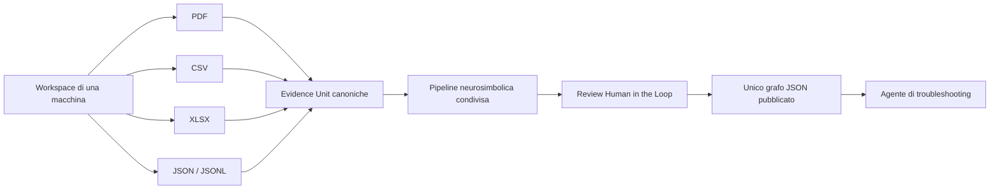

# Maintenance Knowledge Graph Builder — Specifica MVP

## 1. Controllo del documento

| Campo | Valore |
|---|---|
| Versione | `1.2` |
| Data | `2026-07-29` |
| Stato | Remediation e semantic review completate; in attesa di owner approval |
| Prodotto | Maintenance Knowledge Graph Builder |
| Esecuzione | Locale |
| Backend | FastAPI |
| Persistenza del grafo | JSON versionato |
| Ontologia | `Core_Ontology` `2.0`, invariata |

Questa specifica definisce **che cosa** deve fare l'MVP. Non è un piano di
sviluppo e non stabilisce l'ordine di implementazione.

Il pacchetto normativo è composto da:

1. questo documento, per obiettivi, perimetro e requisiti;
2. [Registro delle decisioni](docs/specs/DECISION_REGISTER.md);
3. [Specifica UX](docs/specs/UX_SPECIFICATION.md);
4. [Contratti di dominio e dati](docs/specs/DATA_CONTRACTS.md);
5. [Baseline e implicazioni della codebase](docs/specs/BASELINE_AND_CODEBASE_IMPACT.md);
6. [Criteri di accettazione](docs/specs/ACCEPTANCE_CRITERIA.md);
7. [Matrice di tracciabilità](docs/specs/TRACEABILITY_MATRIX.md).
8. [Indice normativo machine-readable](docs/specs/SPEC_INDEX.json).

L'esito dell'audit è documentato nel
[Readiness Report](docs/specs/SPEC_READINESS_REPORT.md) e nel
[Registro di chiusura audit](docs/specs/AUDIT_REMEDIATION_REPORT.md).

In caso di conflitto vale il seguente ordine:

1. `ontology_schema.JSON`;
2. questo documento;
3. `UX_SPECIFICATION.md`, per il comportamento dell'interfaccia;
4. `DATA_CONTRACTS.md`;
5. `ACCEPTANCE_CRITERIA.md`;
6. `DECISION_REGISTER.md`;
7. `BASELINE_AND_CODEBASE_IMPACT.md`.

I termini **DEVE**, **NON DEVE**, **DOVREBBE** e **PUÒ** sono normativi:

- **DEVE/NON DEVE**: requisito obbligatorio per l'MVP;
- **DOVREBBE**: requisito atteso, derogabile solo con motivazione documentata;
- **PUÒ**: comportamento opzionale.

## 2. Obiettivo del prodotto

L'applicazione deve trasformare più fonti eterogenee riferite alla **stessa
macchina** in un **unico knowledge graph di manutenzione e troubleshooting**,
conforme all'ontologia centrale e utilizzabile successivamente da un agente
diagnostico.

Il risultato deve rappresentare conoscenza generalizzata e supportata da
evidenze, non una semplice collezione di documenti o un nodo per ogni riga di
log.



## 3. Invarianti non negoziabili

### INV-001 — Ontologia invariata

`ontology_schema.JSON` è il contratto ontologico centrale e non deve essere
modificato, esteso, ridotto o adattato per cliente durante l'MVP.

La pipeline:

- deve caricare l'ontologia a runtime;
- deve registrarne versione e SHA-256 in ogni run e pubblicazione;
- non deve creare tipi di nodo, proprietà o relazioni non dichiarati;
- non deve disabilitare tipi o relazioni dichiarati;
- deve impedire la pubblicazione di un grafo non conforme.

Il checksum di riferimento della baseline è:

```text
81f2d894e8b4c3c0ba3bb2e7149941ae91b704ebd8a8b8dedef91b79bd1508db
```

### INV-002 — Una macchina per workspace

Ogni workspace deve rappresentare una sola macchina e deve produrre un solo
nodo `Asset` centrale.

I `Component` rappresentano parti, moduli o sottosistemi della macchina e
restano pienamente supportati:

- `Asset HAS_COMPONENT Component`;
- `FailureMode AFFECTS Component`.

Un componente non è un secondo `Asset`. Celle e linee multi-macchina sono fuori
dal perimetro del primo MVP.

Se una catena diagnostica non contiene né un componente né un error code, può
non essere topologicamente collegata all'`Asset`: il workspace mono-macchina ne
definisce comunque il contesto. La pipeline non deve inventare una relazione
Asset-Symptom o Asset-FailureMode non prevista dall'ontologia.

### INV-003 — Molte fonti, un solo grafo

Tutti i PDF, CSV, XLSX e JSON approvati nello stesso workspace devono contribuire
allo stesso candidate graph e alla stessa sequenza di versioni pubblicate.

Il sistema non deve creare automaticamente:

- un grafo per documento;
- un grafo per tabella;
- un grafo per batch;
- un'ontologia per cliente.

### INV-004 — Separazione tra evidenza e conoscenza

File, pagine, righe, celle, timestamp, confidence, decisioni umane e output raw
dei modelli non devono diventare nuovi tipi ontologici.

Devono rimanere nello storage operativo, nell'evidence index e nel manifest.

### INV-005 — Nessuna perdita silenziosa

Ogni unità sorgente deve risultare:

- processata;
- duplicata;
- esclusa esplicitamente;
- in quarantena;
- oppure fallita con errore tracciato.

L'unità da contabilizzare è definita per formato in `DC-DISPOSITION-001`.
Una riga logica, un blocco documentale o una struttura selezionata non deve
scomparire senza stato terminale, reason code e locator. Limiti, pruning e
filtri devono essere applicati soltanto dopo la creazione della disposition.

### INV-006 — Pubblicazione esplicita e rigorosa

Il candidate graph può essere incompleto durante la lavorazione. Il grafo con
stato `published` deve invece:

- superare il validatore ontologico;
- avere integrità referenziale completa;
- avere tutte le decisioni bloccanti risolte;
- essere approvato esplicitamente dall'operatore;
- essere immutabile e versionato.

Un export best-effort con warning non equivale a una pubblicazione.

### INV-007 — Una sola pipeline semantica

PDF e dati strutturati devono usare adapter di ingestion differenti ma devono
convergere nello stesso contratto `EvidenceUnit` e nello stesso core
neurosimbolico.

Non devono esistere pipeline semantiche indipendenti per PDF, CSV, Excel o JSON.

### INV-008 — Tracciabilità

Ogni nodo, relazione, proprietà, merge, split e withdrawal pubblicato deve
essere riconducibile a:

- una o più evidence unit;
- tutti i record partecipanti, anche dopo un join;
- la sorgente e i locator originali;
- la versione dell'ontologia;
- modello, provider e prompt;
- regole e soglie applicate;
- eventuali decisioni umane.

## 4. Perimetro dell'MVP

### 4.1 Incluso

- applicazione locale con backend FastAPI e frontend web;
- un workspace locale attivo;
- una macchina per workspace;
- caricamento multiplo e incrementale di fonti;
- PDF testuali e PDF scansionati;
- estrazione testo, tabelle e OCR selettivo dai PDF;
- CSV;
- XLSX multi-foglio;
- JSON e JSON Lines;
- profiling e mapping assistito dei dati strutturati;
- scoping assistito dei PDF;
- join espliciti tra tabelle;
- canonical evidence model indipendente dal formato;
- deduplica, clustering, entity linking e merge cross-source;
- estrazione neurosimbolica;
- validazione simbolica sull'ontologia invariata;
- review Human in the Loop;
- grafo JSON versionato;
- evidence index e run manifest separati;
- explorer read-only del grafo pubblicato;
- chat diagnostica read-only minima;
- provider OpenAI predefinito;
- astrazione per modelli alternativi e locali;
- test offline deterministici e golden evaluation.

### 4.2 Fuori perimetro

- DOCX e altri file Word;
- e-mail native `.msg` e `.eml`;
- collegamento a mailbox;
- immagini standalone;
- celle o linee con più macchine;
- più workspace amministrabili dalla UI;
- Neo4j o altri database a grafo;
- utenti, login, ruoli, organizzazioni e multi-tenancy;
- integrazioni live con CMMS, ERP, PLC o SCADA;
- streaming real-time;
- addestramento o fine-tuning di modelli;
- modifica autonoma del grafo da parte della chat;
- editor libero del grafo e API generiche di graph mutation;
- creazione, eliminazione o collegamento arbitrario di nodi e relazioni;
- agente diagnostico completo di produzione;
- esecuzione di azioni sulla macchina;
- migrazione automatica dei dati runtime della codebase di backup.

### 4.3 Predisposizioni senza obbligo di release

Il design non deve impedire:

- supporto qualificato a italiano e tedesco;
- nuovi adapter documentali, inclusi Word ed e-mail;
- più workspace;
- un backend a grafo futuro;
- nuovi provider o endpoint locali;
- estensione futura a cella o linea.

Queste predisposizioni non autorizzano funzionalità aggiuntive nell'MVP.

## 5. Attori e casi d'uso

### ACT-001 — Operatore tecnico

L'operatore locale deve poter:

1. definire la macchina;
2. caricare più fonti;
3. verificare scoping, profiling e mapping;
4. avviare e riprendere l'elaborazione;
5. revisionare ambiguità e conflitti;
6. ispezionare evidenze e provenienza;
7. pubblicare una nuova versione del grafo;
8. verificare il grafo con explorer e chat.

### UC-001 — Costruzione iniziale

Dato un workspace vuoto e un insieme misto di fonti riferite alla stessa
macchina, il sistema deve produrre un candidate graph revisionabile e quindi
una prima versione pubblicata.

### UC-002 — Aggiornamento incrementale

Dato un grafo già pubblicato, nuove fonti devono produrre un delta candidato.
La versione pubblicata precedente deve restare immutata fino al nuovo gate di
pubblicazione.

### UC-003 — Troubleshooting

Dato un testo come “la macchina si è fermata e produce un rumore anomalo”,
la chat deve cercare sintomi e codici nel grafo pubblicato, navigare soltanto
relazioni ontologiche e mostrare failure mode, componenti, azioni correttive ed
evidenze. Se il grafo è insufficiente deve dichiararlo.

## 6. Modello operativo

### FR-001 — Machine onboarding

Prima del processamento deve esistere una scheda macchina con:

- `asset_id`;
- nome;
- descrizione;
- brand;
- model;
- `asset_type` opzionale;
- alias o identificativi sorgente conservati nel sidecar.

I campi obbligatori derivano esclusivamente dall'ontologia.

Una fonte apparentemente relativa a un'altra macchina deve essere posta in
quarantena e non può creare un secondo `Asset`.

### FR-WS-IDENTITY-001 — Appartenenza fonte–macchina

Ogni fonte deve avere un `SourceAssetAssessment` prima di profiling, scoping o
estrazione semantica. Gli esiti ammessi sono:

- `compatible`: può contribuire al candidate graph;
- `uncertain`: resta in quarantena finché l'operatore non registra una
  decisione supportata;
- `incompatible`: non può contribuire e deve essere riassegnata o esclusa.

Seriale, equipment tag e asset ID nello stesso namespace sono segnali forti.
Brand, modello, serie, linea, sito, componenti e similarità testuale sono
segnali contestuali e, da soli, non dimostrano l'identità fisica. Ogni segnale
osservato deve avere un locator. Un conflitto fra identificativi forti produce
`incompatible`; assenza di segnali forti o presenza dei soli segnali
contestuali produce `uncertain`.

L'operatore può risolvere `uncertain` soltanto tramite `OperatorAssertion` con
motivazione ed evidenze viste. Non può trasformare un conflitto forte in
`compatible`: deve correggere l'attribuzione o la scheda sorgente e generare
un nuovo assessment.

### FR-002 — Source set

Una `Source` è un file immutabile identificato da hash del contenuto.

Lo stesso file:

- non deve essere duplicato fisicamente;
- può partecipare a run differenti;
- deve riutilizzare risultati compatibili presenti in cache;
- deve essere riprocessato quando cambiano input logici rilevanti.

### FR-003 — Batch e run

Un batch raggruppa fonti caricate insieme. Un run elabora una configurazione
immutabile di:

- workspace;
- fonti;
- mapping e scoping;
- assessment di appartenenza, join e lingua;
- ontologia;
- provider, modelli e policy di data egress;
- prompt;
- soglie, profili di calibrazione e regole;
- versione base del grafo candidato.

Il batch non è il confine del grafo.

### FR-004 — Stati minimi del run

Source, preparazione, run e workspace sono quattro state machine distinte; il
mapping completo e le transizioni ammesse sono definiti in
`DC-STATE-001`. Lo stato del run deve distinguere almeno:

```text
ready
processing
pausing
paused
awaiting_review
ready_to_publish
published
failed_resumable
failed_terminal
cancelled
```

Lo stato deve essere persistito. `Riprendi` continua lo stesso run e la stessa
configurazione dall'ultimo checkpoint `committed`; `Riprova` riesegue soltanto
l'unità atomica fallita. Una modifica di input logici, mapping, prompt,
provider, modello, lingua, soglie o ontologia crea un nuovo run. Dopo un
riavvio non devono andare perse decisioni né essere ripetute chiamate provider
la cui risposta è già persistita per lo stesso request hash.

## 7. Ingestion documentale

### FR-PDF-001 — Capacità

Per ogni PDF il sistema deve:

- preservare il file originale e il relativo hash;
- estrarre il testo nativo mantenendo la numerazione fisica delle pagine;
- applicare OCR soltanto alle pagine che ne hanno bisogno;
- estrarre le tabelle quando tecnicamente possibile;
- individuare le sezioni rilevanti per manutenzione e troubleshooting;
- creare evidence unit con documento, pagina, sezione e citazione;
- segnalare pagine illeggibili o a bassa qualità.

### FR-PDF-002 — Gate di scoping

L'operatore deve poter:

- vedere pagine e sezioni proposte;
- includere o escludere pagine;
- ispezionare testo e tabelle estratti;
- verificare che il documento appartenga alla macchina;
- approvare lo scope prima dell'estrazione semantica.

Un nuovo PDF non deve generare un grafo separato.

### FR-PDF-003 — Limiti

Non è richiesta la comprensione affidabile di disegni o schemi tecnici privi
di testo. Il sistema deve conservarli e segnalarli, senza inventarne il
contenuto.

## 8. Ingestion strutturata

### FR-TAB-001 — CSV

Il parser deve:

- rilevare encoding e separatore;
- supportare almeno virgola, punto e virgola, tab e pipe;
- gestire quote e newline nei campi;
- preservare il numero di riga;
- segnalare righe corte, lunghe o semanticamente disallineate;
- permettere override manuale di encoding, separatore e header.

### FR-TAB-002 — XLSX

Il parser deve:

- elencare tutti i fogli;
- permettere inclusione ed esclusione;
- rilevare la possibile riga header;
- preservare foglio, riga e cella;
- leggere il valore disponibile delle formule;
- segnalare formule senza valore calcolato.

Macro, grafici e formattazione non devono essere interpretati.

### FR-TAB-003 — JSON

Devono essere supportati:

- array di oggetti;
- JSON Lines;
- oggetti contenenti array omogenei;
- path annidati selezionati esplicitamente.

Il sistema non deve esplodere implicitamente array uno-a-molti.

### FR-TAB-004 — Profiling

Per ogni tabella il sistema deve produrre almeno:

- numero di righe e colonne;
- tipo inferito, null rate e cardinalità per colonna;
- esempi e distribuzioni utili;
- possibili identificativi, timestamp, codici errore e testi;
- anomalie di tipo, valori spostati e possibili chiavi;
- lingua prevalente stimata.

### FR-TAB-005 — Mapping e join

Per ogni nuovo schema l'operatore deve poter:

- includere o escludere colonne;
- correggere tipi;
- associare campi al canonical evidence model;
- definire il testo semantico;
- impostare costanti e lingua;
- definire chiavi e join espliciti;
- vedere l'anteprima dell'evidence unit risultante;
- salvare un mapping profile versionato.

Un mapping può essere riutilizzato automaticamente soltanto con fingerprint
compatibile.

Tabelle, fogli e array sono elaborati indipendentemente per default. Un join è
ammesso soltanto con un `JoinSpec` approvato che dichiari:

- struttura primary e lookup;
- chiavi e normalizzazioni applicate;
- cardinalità attesa;
- policy per chiavi mancanti e match multipli;
- fan-out massimo;
- campi importati e ruolo di ogni struttura.

Join uno-a-molti o molti-a-molti non possono essere auto-approvati. Ogni output
deve conservare `provenance_refs[]` per tutti i record partecipanti; un limite
o un match ambiguo produce una disposition, non la duplicazione o la perdita
silenziosa del record principale.

### FR-NORM-001 — Normalizzazione

La normalizzazione deve essere deterministica, configurabile e tracciata.

- il valore raw deve essere sempre preservato;
- date ambigue non ricevono timezone o formato inventati;
- testo non interpretabile in un campo numerico non diventa zero;
- unità vengono convertite soltanto quando dimensione e mapping sono certi;
- unità incompatibili producono un flag e non vengono confrontate;
- valori nulli equivalenti vengono normalizzati soltanto tramite regole
  esplicite;
- severità e outcome sorgente devono usare mapping visibili.

### FR-NORM-002 — Semantic text

Il sistema non deve usare automaticamente l'intera riga come semantic text.

Il mapping deve costruire `semantic_texts`, una mappa di testi distinti per:

- `symptom`;
- `failure_mode`;
- `corrective_action`;
- `component`;
- `error_code_context`.

Timestamp, ID, chiavi tecniche e misure restano feature strutturate. Possono
entrare nel testo soltanto tramite template espliciti e versionati.
Un unico testo concatenato non può sostituire le rappresentazioni
role-specific e non può condividere la stessa cache fra ruoli.

## 9. Canonical Evidence Model

### FR-EV-001 — Contratto comune

Ogni adapter deve emettere `EvidenceUnit` conformi a
[DATA_CONTRACTS.md](docs/specs/DATA_CONTRACTS.md).

Ogni evidence unit deve contenere almeno:

- identificativo stabile;
- source ID primario e tipo di sorgente;
- uno o più `provenance_refs` con locator tipizzato;
- lingua;
- testi role-specific e campi strutturati rilevanti;
- riferimento alla macchina;
- raw payload o riferimento immutabile al raw;
- quality flags;
- classe di autorità.

### FR-EV-002 — Locator

Il locator deve permettere di tornare senza ambiguità alla fonte:

- PDF: documento, pagina, eventuale sezione e quote;
- CSV: tabella, riga e colonne;
- XLSX: foglio, riga e celle;
- JSON: JSONPath o locator equivalente deterministico.

Dopo join, merge o split il claim deve mantenere tutti i locator partecipanti.
`source_id` e un singolo `raw_ref` non costituiscono lineage sufficiente.

### FR-EV-003 — Autorità

Le evidenze devono essere classificate come:

- `normative`: manuale o procedura ufficiale;
- `observational`: log o telemetria;
- `operational`: rapporto di intervento;
- `informal`: futura comunicazione tecnica.

Una fonte osservazionale non deve sovrascrivere silenziosamente una fonte
normativa. Le contraddizioni devono rimanere visibili e revisionabili.

L'ordine deterministico è: applicabilità al contesto; supersessione esplicita;
revisione più recente nella stessa famiglia documentale; classe di autorità.
La recency da sola non sceglie fra editori o famiglie normative differenti.
In assenza di un vincitore univoco, le evidenze coesistono in un `Conflict` e
la risoluzione è `coexist`, `superseded` oppure `operator_selected`.

## 10. Pipeline neurosimbolica

### FR-NS-001 — Responsabilità neurali

I modelli possono:

- estrarre candidati esclusivamente per i tipi ontologici;
- proporre proprietà e relazioni ammesse;
- normalizzare formulazioni;
- recuperare entità esistenti;
- proporre merge;
- indicare evidence span e confidence.

I modelli non possono:

- modificare l'ontologia;
- pubblicare;
- sovrascrivere il raw;
- creare tipi o relazioni arbitrarie;
- trasformare un'ipotesi in fatto non tracciato.

### FR-NS-002 — Responsabilità simboliche

Le regole deterministiche devono:

- validare schema e structured output;
- verificare proprietà obbligatorie;
- verificare ID, domain, range e integrità referenziale;
- applicare vocabolari controllati;
- bloccare evidenze o candidati incompatibili;
- calcolare stato di review e pubblicabilità.

### FR-NS-003 — Structured output

Ogni risposta modello destinata alla pipeline deve essere validata contro uno
schema. Dopo un numero configurato e limitato di repair falliti, l'elemento
deve essere messo in quarantena.

Parsing fragile di testo libero non deve alimentare direttamente il grafo.

### FR-NS-004 — Grounding

Ogni candidato deve avere evidenza verificabile. La motivazione del modello non
costituisce evidenza.

Una relazione causale o risolutiva priva di supporto non deve essere pubblicata.

`MAY_INDICATE` richiede linguaggio causale esplicito nella fonte oppure una
decisione umana su un'inferenza dichiarata; una semplice co-occorrenza non
basta. `INDICATES` richiede una mappatura esplicita e applicabile fra codice e
failure mode. `RESOLVED_BY` richiede un'istruzione restaurativa applicabile o
un `OutcomeAssessment` approvato e legato alla specifica azione. Passi di sola
ispezione, stato ticket e outcome `failed`, `monitoring`, `partially_resolved`,
`recurred`, `unknown` o assente non autorizzano `RESOLVED_BY`.

## 11. Deduplica, entity linking e merge

### FR-MERGE-001 — Deduplica esatta

Duplicati deterministici possono essere consolidati automaticamente usando:

- hash del contenuto;
- source system più record ID;
- hash del payload canonico;
- locator identico nella stessa sorgente.

La deduplica deve essere reversibile e non deve cancellare la provenienza.

### FR-MERGE-002 — Entity linking

Il matching deve considerare almeno:

- tipo ontologico;
- nome e descrizione normalizzati;
- macchina e modello;
- componente;
- error code;
- contesto materiale;
- alias;
- similarità semantica;
- vincoli simbolici.

Per `Component` e `ErrorCode` deve inoltre considerare il contesto identitario
definito in `DC-CONTEXT-001`: component path o subsystem, namespace del codice,
modello, firmware e periodo di validità. Alias o codice uguali non autorizzano
un auto-link quando i contesti sono incompatibili. Un qualificatore ignoto è
un wildcard soltanto se non esistono definizioni concorrenti; altrimenti il
caso va in review.

### FR-MERGE-003 — Soglie iniziali

I punteggi sono confidence score configurabili, non probabilità dichiarate se
non calibrate.

Per il merge di evidenze o entità:

| Score | Azione |
|---:|---|
| `>= 0.98` | auto-stage solo senza conflitti simbolici |
| `>= 0.80` e `< 0.98` | review obbligatoria |
| `< 0.80` | nessun merge automatico |

Per il linking verso un'entità già pubblicata:

| Score | Azione |
|---:|---|
| `>= 0.95` | auto-stage solo senza conflitti simbolici |
| `>= 0.70` e `< 0.95` | review obbligatoria |
| `< 0.70` | nessun link automatico |

Queste sono soglie conservative iniziali. Devono essere centralizzate,
versionate e validate sul golden set. Un cambio di modello le invalida finché
non vengono ricalibrate.

Ogni soglia automatica deve appartenere a un `CalibrationProfile` valido per
operazione, feature version, provider/modello e lingua. Il relativo gate misura
sia precisione sia copertura: zero elementi auto-staged o copertura inferiore
alla soglia approvata non dimostrano automazione valida. Un'operazione senza
campione sufficiente deve dichiararsi `review_only`.

`auto-stage` non significa pubblicazione: il gate umano finale resta
obbligatorio.

### FR-MERGE-004 — Conflitti

Devono impedire l'auto-stage almeno:

- macchina incompatibile;
- tipi ontologici differenti;
- codici incompatibili;
- componenti distinti;
- proprietà chiave contraddittorie;
- evidenze normative in conflitto;
- relazioni con domain o range errati.

L'operatore deve poter accettare, rifiutare, modificare, unire o separare una
proposta e vedere le feature principali che hanno prodotto il punteggio.

### FR-MERGE-005 — Incrementalità

Una nuova fonte deve produrre un delta rispetto all'ultima versione pubblicata:

- nuovi nodi;
- nodi collegati a entità esistenti;
- nuove evidenze;
- nuove relazioni;
- withdrawal proposti;
- conflitti;
- candidati rifiutati o invariati.

Ogni revisione deve dichiarare `base_graph_version`. Nessuna nuova fonte deve
sovrascrivere direttamente il grafo pubblicato. Un nodo, proprietà o relazione
presente nella base può mancare dalla nuova versione soltanto in presenza di
un withdrawal approvato o di lineage approvato di merge/split; in caso
contrario il publish deve fallire come degradazione non spiegata.

### FR-EMB-001 — Contenuto da embeddare

Gli embedding devono essere calcolati su rappresentazioni canoniche
role-specific, non sul raw record completo.

Devono essere esclusi di default:

- timestamp;
- row ID e chiavi di join;
- hash;
- valori tecnici non descrittivi;
- payload non selezionati dal mapping.

Error code e identificativi esatti devono usare anche matching deterministico:
l'embedding non può essere l'unico criterio.

La UI deve mostrare il testo effettivamente inviato al modello di embedding.

### FR-EMB-002 — Versionamento e cache

Ogni embedding deve essere identificato almeno da:

- hash del testo canonico;
- ruolo semantico;
- lingua;
- provider;
- modello e versione;
- versione del template;
- versione del normalizzatore.

Cambiare uno di questi elementi deve invalidare la cache dipendente senza
modificare il raw o gli ID pubblicati.

## 12. Regole ontologiche

### FR-ONTO-001 — Asset

Ogni versione pubblicata deve contenere esattamente un `Asset` con tutte le
proprietà obbligatorie.

`name`, `description`, `brand` e `model` possono essere attestati
dall'operatore durante l'onboarding soltanto tramite `OperatorAssertion`.
L'attestazione è provenance, non autorizza la pipeline a inventare un valore.

### FR-ONTO-002 — Component

Un `Component` deve rappresentare una parte fisica, software o un sottosistema.
Sintomi, azioni, misure e frasi di evento non devono diventare componenti.

Quando pubblicato, deve essere collegato alla macchina tramite
`HAS_COMPONENT`. Un failure mode può collegarsi al componente tramite
`AFFECTS` soltanto con evidenza sufficiente.

Se `category` non è presente nella fonte può essere attestata da un operatore
che registra evidenze viste e motivazione; in assenza di tale attestazione il
componente resta un knowledge gap e non viene pubblicato incompleto.

### FR-ONTO-003 — Symptom

Un `Symptom` deve essere una manifestazione osservabile. Non deve essere usato
per rappresentare una causa tecnica.

`severity` deve usare il vocabolario canonico previsto dall'applicazione e deve
essere mappato esplicitamente dai valori sorgente:

- `Low`;
- `Medium`;
- `High`;
- `Critical`.

In assenza di un mapping affidabile, l'operatore può attestare la severità; non
esiste un valore di default e il nodo incompleto non è pubblicabile.

### FR-ONTO-004 — FailureMode

Un `FailureMode` deve rappresentare una causa o un meccanismo plausibile, non
la semplice ripetizione del sintomo.

`material_context` è obbligatorio e usa un solo vocabolario: l'ID di un
`Component` applicabile oppure `asset_level`. `not_applicable`, stringhe vuote
e categorie inventate non sono valori ammessi. Se il contesto non è
determinabile, il failure mode resta candidato incompleto o knowledge gap.

### FR-ONTO-005 — CorrectiveAction

Un'azione osservata non diventa automaticamente una soluzione.

- outcome positivo esplicito: candidata;
- outcome fallito: non collegabile con `RESOLVED_BY`;
- outcome vuoto, `monitoring` o ambiguo: review obbligatoria;
- istruzione pericolosa o incompleta: review obbligatoria;
- escalation e procedure devono restare distinguibili.

Le proprietà `source_type`, `source_title` e `source_reference` devono essere
derivate dai record di provenance. Per una fonte `operator_input`,
`source_reference` deve essere esattamente `operator_input:<decision_id>` e
l'assertion deve essere esplicita. Una sola attestazione umana non trasforma
una correlazione o un controllo diagnostico in rimedio.

### FR-ONTO-006 — ErrorCode

Codici, prefissi, zeri iniziali e separatori significativi devono essere
preservati esattamente. Lo stesso codice può avere significati diversi su
macchine o modelli differenti.

Namespace/issuer, subsystem o component path, modello, intervallo firmware e
periodo di validità devono essere conservati nel sidecar quando disponibili.
Un codice senza contesto sufficiente non viene auto-collegato a una definizione
concorrente.

## 13. Human in the Loop

### FR-HITL-001 — Gate 1: identità, scope e mapping

Il gate è obbligatorio per:

- conferma della macchina;
- nuovo PDF o scoping modificato;
- nuovo schema tabellare;
- join;
- ricostruzione del semantic text;
- imputazioni o correzioni di tipo.

Mapping e scoping già approvati possono essere riutilizzati quando il
fingerprint e la configurazione sono compatibili.

L'operatore può delegare l'esecuzione di scope, mapping e inclusioni proposte.
In tal caso il gate deve registrare la delega e l'esito automatico. Conferma
della macchina, anomalie bloccanti, join rischiosi e valori non inferibili
richiedono comunque intervento umano.

### FR-HITL-002 — Gate 2: review semantica

La review queue deve contenere almeno:

- match e merge ambigui;
- conflitti tra fonti;
- proprietà obbligatorie mancanti;
- relazioni non sufficientemente supportate;
- azioni con outcome incerto;
- elementi in quarantena;
- inferenze sotto soglia;
- gap strutturali bloccanti.

Gli elementi ad alta confidence possono essere auto-staged e presentati in
forma aggregata. Non è richiesta l'approvazione individuale di migliaia di
elementi non ambigui.

### FR-HITL-003 — Decisioni

Ogni decisione deve registrare:

- oggetto e versione;
- azione;
- valore precedente e nuovo;
- evidenze viste;
- nota opzionale;
- operatore locale;
- timestamp;
- configurazione di riferimento.

Le decisioni sono eventi append-only e possono essere riutilizzate soltanto
con lo stesso `context_hash`. `Riapri` non cancella né modifica la decisione
precedente: crea un evento che la supera, riporta il candidato in review e
inverte il delta staged nella stessa transazione. `Riapri` è disponibile
soltanto prima del publish. Se il fatto è già pubblicato, serve un nuovo run
basato su quella versione con candidate `withdraw`, `supersede` o `update`;
la versione pubblicata non viene riaperta, revertita o modificata in-place.

Validazione, persistenza della decisione, aggiornamento del candidato e delta
devono essere atomici. Un errore in uno di questi passi non può lasciare una
mutazione senza decisione o una decisione senza effetto dichiarato.

### FR-HITL-004 — Gate 3: pubblicazione

Prima della pubblicazione la UI deve mostrare:

- delta rispetto alla versione precedente;
- nuovi nodi e relazioni;
- merge;
- conflitti risolti;
- elementi esclusi o in quarantena;
- metriche di qualità;
- errori bloccanti;
- fonti e configurazione.

La pubblicazione richiede conferma esplicita.

La pipeline può creare candidate e auto-staged candidate. Ogni correzione
iniziata dall'operatore deve invece passare da una `ReviewDecision`. La matrice
normativa fra stato, blocking status e pubblicabilità è definita in
`DC-PUBLISH-001`.

### FR-HITL-005 — Delega, revoca ed eccezioni

Ogni scelta `manual`, `automatic` o `exceptions_only` deve essere un
`DelegationDecision` append-only riferito a uno step del catalogo stabile, allo
scope, alla configurazione e al checkpoint dal quale diventa efficace.

Un cambio mid-run vale soltanto dalle unità non ancora preparate dopo il
checkpoint successivo; non riscrive lavoro committed. Le eccezioni si
accumulano fino al limite di backpressure configurato e fermano soltanto la
source o partizione coinvolta. Identità macchina, conflitti globali bloccanti,
guard ontologiche e publish sono global stop. Revoca e supersessione devono
restare nella storia.

## 14. Output e versionamento

### FR-OUT-001 — Artifact

La prima versione logica è `V001`; il file stem canonico è `v001`. Ogni
pubblicazione deve produrre esattamente:

```text
knowledge_graph_v001.json
evidence_index_v001.json
run_manifest_v001.json
```

I contratti esatti sono in [DATA_CONTRACTS.md](docs/specs/DATA_CONTRACTS.md).
I tre file costituiscono un unico bundle: vengono costruiti in staging,
validati e resi visibili con commit atomico sotto lock del workspace. Il
manifest contiene gli hash di graph ed evidence index. Reader, explorer e chat
devono aprire soltanto bundle committed e verificare gli hash prima dell'uso.

### FR-OUT-002 — Immutabilità

Una versione pubblicata non deve essere sovrascritta. Una versione precedente
deve restare selezionabile e scaricabile.

### FR-OUT-003 — Candidate versus published

Gli artifact incompleti possono esistere soltanto come draft interni. Il
downstream agent deve usare esclusivamente una versione `published`.

### FR-OUT-004 — Mutazioni controllate

Il candidate graph può cambiare soltanto attraverso la pipeline o una
decisione HITL riferita a un candidato, conflitto o evidenza. Ogni decisione
deve essere validata, evidence-backed e registrata.

Non deve esistere un editor libero. Nessuna API, route, pagina o tool della
chat deve consentire graph mutation generiche. Le versioni pubblicate sono
immutabili e disponibili soltanto in lettura.

## 15. Provider e modelli

### FR-LLM-001 — Configurazione

La configurazione deve distinguere provider, endpoint e modello per generation
ed embedding. Le variabili canoniche sono:

- `KG_GENERATION_PROVIDER`;
- `KG_GENERATION_MODEL`;
- `KG_GENERATION_BASE_URL`, quando applicabile;
- `KG_EMBEDDING_PROVIDER`;
- `KG_EMBEDDING_MODEL`;
- `KG_EMBEDDING_BASE_URL`, quando applicabile;
- la secret specifica del provider, per OpenAI `OPENAI_API_KEY`.

`MODEL_NAME` è accettato soltanto come fallback legacy per
`KG_GENERATION_MODEL` quando la variabile canonica è assente. Non governa gli
embedding. La precedenza è: override esplicito del run, environment,
configurazione applicativa, default sicuro. La precedenza risolve valori
presenti a livelli diversi; valori canonici discordanti allo stesso livello
sono un errore da mostrare e risolvere.

`ProviderConfig` registra endpoint, capabilities, modelli e policy di egress
senza segreti. Nessun nome modello deve essere hard-coded nella logica di
dominio.

La chiave non deve essere inviata al frontend, salvata nei manifest o scritta
nei log.

### FR-LLM-002 — Adapter

Il core deve dipendere da un'interfaccia di provider che esponga:

- structured generation;
- embedding;
- timeout e retry;
- identificazione di provider e modello;
- usage reporting;
- capability check.

L'MVP deve implementare:

- OpenAI come provider predefinito;
- fake deterministico per i test;
- endpoint locale generico compatibile con il contratto, se dichiara le
  capacità richieste.

Il cambio provider non deve modificare i contratti di dominio o il formato del
grafo.

### FR-LLM-003 — Preflight

Prima di un run il sistema deve verificare:

- configurazione presente;
- raggiungibilità del provider;
- disponibilità del modello;
- structured output;
- embedding quando richiesto;
- limiti di contesto necessari.

Un preflight fallito deve bloccare il run prima di elaborazioni costose.

Il preflight non invia contenuto sorgente. Per ogni stage remoto la UI deve
mostrare provider, destinazione e payload effettivo. Sono ammessi soltanto:

- schema/prompt versionati e il chunk o semantic text esplicitamente
  selezionato per la generation;
- testo role-specific e ID opaco per gli embedding;
- contesto asset minimo necessario e locator privi di path locali.

Non sono ammessi file raw completi, colonne escluse, segreti, path locali o
altre fonti del workspace non appartenenti all'unità elaborata.

## 16. Lingue

### FR-LANG-001 — Release MVP

- lingua canonica del grafo: inglese;
- lingua di input con quality gate completo: inglese;
- codici, ID, valori e unità: mai tradotti.

### FR-LANG-002 — Italiano e tedesco

Italiano e tedesco devono essere rappresentabili nei contratti e non
hard-coded fuori dalla pipeline, ma non devono essere dichiarati pienamente
supportati finché non esistono:

- golden set dedicato;
- embedding e modello validati;
- calibrazione delle soglie;
- test di equivalenza cross-lingua.

Un input non qualificato deve essere preservato, inventariato e segnalato.
Non contribuisce automaticamente ai campi canonici inglesi. Una traduzione è
un valore derivato con testo originale, provider/modello/prompt e locator; per
IT/DE non qualificato resta `review_required`, non può essere auto-staged e può
contribuire soltanto dopo approvazione puntuale dell'operatore. Questo non
costituisce qualifica della lingua: l'automazione futura richiede i gate
elencati sopra. Raw, quote, codici, ID, numeri e unità non vengono mai tradotti.

## 17. Persistenza, sicurezza e osservabilità

### NFR-001 — Storage locale

L'MVP deve usare:

- filesystem per raw, cache e artifact;
- SQLite o storage locale equivalente per stato operativo;
- JSON per il grafo pubblicato.

SQLite non è il knowledge graph pubblico.

### NFR-002 — Privacy

I file originali restano locali. Se viene usato un provider remoto, devono
essere inviati soltanto i contenuti autorizzati dalla policy dello step e la UI
deve mostrare un preview identico al payload. Un fake provider deve poter
registrare il payload per il test di non-egress.

### NFR-003 — Audit

Ogni run deve registrare:

- stato e checkpoint;
- input e hash;
- prompt hash;
- provider e modelli;
- retry e cache;
- token o usage;
- errori;
- decisioni umane;
- durata e contatori per stage.

### NFR-004 — Error handling

Ogni errore deve includere:

- stage;
- oggetto coinvolto;
- messaggio comprensibile;
- dettaglio tecnico;
- azione suggerita;
- indicazione di riprendibilità.

### NFR-005 — Confine locale browser-safe

L'applicazione resta trusted-local ma deve:

- accettare file soltanto tramite inventory o upload server-side con path
  canonicalizzato e containment nella directory autorizzata;
- rifiutare traversal, symlink escape e nomi fuori inventario;
- usare CORS same-origin esplicito, non `*`;
- fare bind a loopback per default;
- applicare limiti documentati a dimensione upload, body e richieste.

## 18. Performance e scala

### NFR-PERF-001 — Dataset strutturati

L'accettazione deve includere almeno 10.000 righe riferite alla stessa macchina.
Il gate MVP è di capacità funzionale, non promette un tempo assoluto su
hardware non specificato. La pipeline deve:

- processare in chunk;
- fare deduplica prima delle chiamate modello;
- usare per la generation batch effettivi di almeno 20 unità compatibili,
  salvo elementi isolati da limiti di contesto o errori tracciati;
- mantenere le chiamate generation entro
  `ceil(unique_semantic_units / 20)` sul DS-004; retry non serviti dalla cache
  sono conteggiati separatamente e devono essere giustificati nel report;
- usare cache e batching;
- mantenere contatori completi;
- restare entro `2 GiB` di peak RSS sul dataset DS-004;
- poter riprendere dopo interruzione.

### NFR-PERF-002 — Documenti

Il workspace di accettazione deve contenere più PDF. Il numero e la dimensione
del corpus di riferimento sono definiti in `ACCEPTANCE_CRITERIA.md`.

### NFR-PERF-003 — Misurazione

Ogni benchmark deve registrare hardware, provider, modelli, dataset, durata,
memoria, chiamate e cache hit rate. In assenza di tali dati non deve essere
dichiarato un tempo assoluto di performance.

Il report deve separare gate funzionali e misure descrittive. Recovery,
contatori e limiti di chiamate sono gate; durata wall-clock è informativa
finché non viene congelato un reference hardware.

## 19. Frontend

### FR-UI-001 — Schermate

Il frontend deve implementare un unico percorso:

```text
Macchina → Fonti → Preparazione → Elaborazione → Revisione → Pubblicazione
```

`Preparazione` deve adattarsi al formato senza creare pipeline o esperienze
separate. Dopo il publish devono essere disponibili `Esplora`, in sola lettura,
e la chat diagnostica di test.

Per ogni passo delegabile l'operatore deve poter scegliere se verificarlo
manualmente o farlo eseguire automaticamente con default, soglie e
configurazioni tracciate. `Saltare` un passo significa delegarne l'esecuzione,
non ometterlo. Identità macchina, conflitti bloccanti e publish finale restano
gate umani obbligatori.

Schermate, stati, azioni, progressive disclosure, gestione degli errori e
vincoli sulla modifica sono definiti in
[UX_SPECIFICATION.md](docs/specs/UX_SPECIFICATION.md).

Non devono esistere schermate per account, organizzazioni o permessi.

## 20. Chat diagnostica minima

### FR-CHAT-001 — Vincoli

La chat deve:

- essere read-only;
- usare una sola versione pubblicata selezionata e verificarne il bundle hash;
- usare la macchina del workspace come contesto;
- estrarre sintomi e codici dalla query;
- navigare soltanto relazioni valide;
- restituire al massimo tre ipotesi;
- mostrare componenti e azioni correttive quando presenti;
- citare percorso ed evidenze;
- porre al massimo tre domande di chiarimento;
- dichiarare insufficienza quando il grafo non supporta una risposta.

La chat non deve:

- creare o modificare nodi;
- apprendere automaticamente dal dialogo;
- presentare ipotesi come fatti;
- eseguire azioni;
- consultare candidate graph non pubblicati.

Su query classificate `supported` nel dataset `DS-CHAT-001` la chat deve
restituire almeno un'ipotesi e raggiungere le soglie di accuracy definite da
`AC-CHAT-004`; una risposta sempre vuota non è conforme. Se graph, evidence
index e manifest non appartengono allo stesso bundle o gli hash non
corrispondono, la query deve fallire chiusa senza mescolare versioni.

## 21. Qualità e completamento

I criteri misurabili e gli scenari sono definiti in
[ACCEPTANCE_CRITERIA.md](docs/specs/ACCEPTANCE_CRITERIA.md).

L'MVP non è accettabile se:

- l'ontologia differisce dal checksum fissato;
- una fonte approvata viene persa;
- viene pubblicato un grafo non conforme;
- un nodo, proprietà o relazione pubblicati non hanno provenance completa;
- due documenti dello stesso workspace producono grafi separati;
- una nuova fonte sovrascrive una versione pubblicata;
- una versione perde un claim della base senza withdrawal/merge/split
  approvato;
- un restart perde decisioni umane o ripete lavoro già checkpointato;
- la chat usa conoscenza non pubblicata;
- il quality gate semantico viene eseguito soltanto con mock o su una view che
  espone label derivate;
- un gate automatico passa con denominatore zero o copertura insufficiente;
- un segreto compare in frontend, log o artifact.

## 22. Decisioni implementative rinviate

Possono essere decise nel piano di sviluppo senza modificare questa specifica:

- framework o libreria frontend, purché venga preservata la UI esistente dove
  conveniente;
- schema fisico SQLite;
- job runner locale;
- librerie di parsing;
- algoritmo esatto per ID deterministici;
- libreria di visualizzazione del grafo;
- packaging locale;
- struttura interna dei moduli, nel rispetto dei confini definiti.

Non sono rinviate e non possono essere reinterpretate:

- ontologia invariata;
- una macchina per workspace;
- componenti ontologici supportati;
- molte fonti in un solo grafo;
- formati inclusi ed esclusi;
- HITL;
- pubblicazione JSON rigorosa;
- separazione fra evidenze e grafo;
- accounting, lineage, lifecycle e bundle atomico definiti nei data contract;
- riuso della pipeline esistente senza crearne una seconda.
