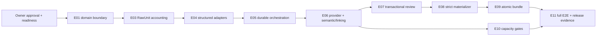

# Piano di sviluppo MVP — Maintenance Knowledge Graph Builder

## 0. Controllo del piano

| Campo | Valore |
|---|---|
| Specifica normativa | MVP `2.1` |
| Digest approvato | `sha256:fd41a66b9d2b0eeaef53e0cd8840a31c2daa09ed0fdbd27a53451a5ccc8e57d2` |
| Owner approval | `Product Owner`, `2026-08-03T09:20:43Z` |
| Readiness verificata | `READY_FOR_PLANNING` |
| Checker | `python3 scripts/check_spec_consistency.py --format json --require-status READY_FOR_PLANNING` |
| Esito checker al momento del piano | `valid=true`, `issues=[]`, digest invariato |
| Stato del presente documento | G1 accettato; G2 completato; prima campagna CSV G3 implementata e verificata; G3 non accettato, gate umano aperto e campagna PDF bloccata |

Questo piano usa come fonti normative `SPECIFICHE_MVP.md`,
`docs/specs/SPEC_INDEX.json`, `docs/specs/TRACEABILITY_MATRIX.md`,
`docs/specs/DECISION_REGISTER.md`, `docs/specs/UX_SPECIFICATION.md`,
`docs/specs/DATA_CONTRACTS.md`, `docs/specs/ACCEPTANCE_CRITERIA.md`,
`docs/specs/BASELINE_AND_CODEBASE_IMPACT.md` e
`docs/specs/AUDIT_REMEDIATION_REPORT.md`.

Le decisioni attive `DEC-001`–`DEC-044` (con `DEC-024` sostituita) sono input congelati, non opzioni da
rinegoziare. Tutte le capacità associate ad `AUD-021`–`AUD-031` hanno stato
iniziale **PLANNED / NOT IMPLEMENTED**. La loro presenza in questo piano non
costituisce evidenza di implementazione. `AUD-032` resta un guardrail: niente
feature extra e niente hard-code che impedisca evoluzioni future.

### 0.1 Regole di esecuzione

1. Si implementa un solo incremento alla volta sulla sua dipendenza minima.
2. Ogni incremento termina con test automatici verdi, artifact riproducibile,
   aggiornamento della matrice di evidenza e una demo interna utilizzabile.
3. Le slice UI vengono costruite insieme alle API che consumano: l'epica
   `AUD-027` chiude il flusso E2E, ma la UX non viene rimandata alla fine.
4. Sicurezza, accounting, resume, publisher e dataset multisource entrano
   appena esiste il relativo boundary; non esiste una fase finale di
   “hardening generico”.
5. `DS-003` viene creato come fixture versionata nella prima fase e cresce
   insieme alle capacità. `DS-004`, con almeno **10.000 righe**, è il limite
   strutturato verificato dell'MVP; nessuna attività promette scala maggiore.
6. I target `tests/planned/*`, `TST-*` e `ART-*` restano `specified` finché il
   test reale non esiste, non passa e il relativo artifact non è materializzato.
7. Una modifica normativa richiede nuovo digest, semantic review e owner
   approval. L'implementazione non deve “aggiustare” la specifica per far
   passare il codice.
8. A ciascuno dei cinque checkpoint Product Owner lo sviluppo si ferma. Il
   Product Owner prova le funzioni maturate e decide esplicitamente:
   **correggere** oppure **proseguire**.

### 0.2 Convenzione di tracciabilità

Una tupla come
`AC-WS-001 / TST-WS-001 / ART-WS-001` indica rispettivamente criterio di
accettazione, verification dell'indice e artifact
`artifacts/acceptance/ac-ws-001/result.json`. Ogni requisito o contratto
citato porta anche la relativa obligation `OBL-<ID>`, per esempio
`FR-001` → `OBL-FR-001` e `DC-EV-001` → `OBL-DC-EV-001`.

Quando una tupla è citata prima della sua epica di **primary validation
owner** (sezione 9.2), l'incremento implementa e testa una slice necessaria e
deposita evidenza di supporto, ma non marca `TST-*` o `ART-*` come completato.
Solo il primary validation owner può chiudere l'intero criterio, dopo aver
rieseguito anche le evidenze precedenti. Questo evita falsi verdi su criteri
E2E come multisource, resume con decisioni o coverage pubblicata.

Ogni `ART-*` deve contenere almeno:

- stato e timestamp UTC;
- commit e comando eseguito;
- dataset e hash, se applicabile;
- assertion e soglie con risultato;
- riferimenti agli artifact grezzi;
- environment riproducibile, senza segreti.

## 1. Sintesi dell'architettura target

### 1.1 Flusso target


### 1.2 Confini e storage

| Confine | Responsabilità target | Scelta implementativa |
|---|---|---|
| Dominio | ID, state machine e invarianti senza dipendenze da PDF o provider | modelli Pydantic separati per workspace, source, evidence, run, candidate, review e bundle |
| Operational store | stato mutabile, ledger append-only, decisioni e checkpoint | SQLite locale, transazioni, migration versionate e WAL; lo schema fisico non modifica i contratti logici |
| Raw/cache | file originali, risposta provider persistita, embedding e output di stage | filesystem locale content-addressed per hash, con riferimenti nel DB |
| Ingestion | inventario completo, locator e EvidenceUnit; nessuna semantica specifica del formato oltre il mapping | adapter PDF riusato e adattato; adapter CSV/XLSX/JSON nuovi |
| Semantic core | candidate mining, generation, grounding, linking e merge condivisi | evoluzione dei servizi esistenti; input `EvidenceUnit[]`, mai `pdf_id` obbligatorio |
| Review | decisione, validazione, nuova revisione e audit atomici | un solo write path transazionale; API legacy non estesa |
| Publish | materializzazione strict, hash, lock, CAS, versioni immutabili | staging sullo stesso filesystem, fsync, atomic rename, registry SQLite |
| Read side | apre solo bundle committed e hash-validi | reader condiviso da explorer, download e chat |
| Frontend | unico percorso macchina → pubblicazione | shell HTML/CSS/JS esistente adattata e suddivisa per capability; nessun nuovo framework richiesto |

### 1.3 Layout di moduli previsto

I nomi sono una scelta implementativa concreta e possono essere raffinati
senza cambiare i boundary:

```text
backend/
  domain/
    ids.py
    workspace.py
    sources.py
    evidence.py
    runs.py
    candidates.py
    review.py
    publishing.py
    providers.py
  storage/
    database.py
    migrations/
    repositories/
    raw_store.py
    cache_store.py
    bundle_registry.py
  adapters/
    pdf.py
    structured/
      csv.py
      xlsx.py
      json.py
    providers/
      base.py
      fake.py
      openai.py
      local_endpoint.py
  services/
    ingestion/
    semantic/
    entity_resolution/
    review/
    publishing/
    diagnostics/
  routers/
    workspaces.py
    sources.py
    preparation.py
    runs.py
    review.py
    publish.py
    graphs.py
    chat.py
frontend/
  console.html
  console.css
  app/
    api.js
    state.js
    shell.js
    machine.js
    sources.js
    preparation.js
    processing.js
    review.js
    publish.js
    explore.js
tests/
  planned/
  fixtures/
  golden/workspaces/
artifacts/
  acceptance/
  user-gates/
```

### 1.4 Invarianti architetturali

- `ontology_schema.JSON` rimane byte-invariato e viene caricato a runtime.
- `workspace_id` è il confine del grafo; `source_id` identifica l'input;
  `run_id` identifica una configurazione immutabile.
- Nessun adapter pubblica o implementa un proprio core semantico.
- Ogni RawUnit nasce prima di filtri/cap e termina con una disposition attiva.
- Il core usa locator discriminati e `provenance_refs[]`, non una sola pagina.
- Il candidate graph è una sequenza di revisioni immutabili basate su una
  versione pubblicata.
- La generation produce una revisione di sottografo per fonte; la barriera di
  linking/merge si apre soltanto dopo l'approvazione di tutti i sottografi
  inclusi nel run.
- Una fonte aggiunta a una versione pubblicata genera soltanto il proprio
  sottografo e il delta verso la base, salvo invalidazioni esplicite.
- Graph, evidence index e manifest sono una sola unità di lettura atomica.
- Explorer e chat verificano hash/versione e non accedono a candidate graph.
- Nessuna route o tool consente graph mutation generiche.

## 2. Analisi della baseline e strategia di riuso

### 2.1 Baseline osservata

La baseline importata è FastAPI più console web, con pipeline PDF,
estrazione/OCR/tabelle, scoping, core neurosimbolico, run snapshot, audit,
fake LLM, golden harness ed export JSON. I mismatch principali sono visibili
nel codice:

- `backend/models.py`, `backend/graph/state.py`,
  `backend/runstore/run_store.py` e diversi router usano `pdf_id`,
  `source_page` e `pages_to_keep` come boundary;
- `backend/runstore/run_store.py` salva snapshot ispezionabili ma non
  checkpoint `prepared/committed`;
- `backend/services/ontology_export_store.py` usa `V0`, `latest` e validazione
  best-effort;
- `backend/services/llm_gateway.py` è accoppiato al client OpenAI e non espone
  l'interfaccia generation/embedding/preflight completa;
- `backend/main.py` configura `allow_origins=["*"]`;
- `backend/routers/upload.py` e i path legacy devono ricevere containment,
  inventory e limiti;
- il frontend corrente è centrato sulla pipeline PDF e non sul workspace
  multisource.

Il report di readiness registra 325 test raccolti e verdi nello snapshot
pre-piano. I numeri storici restano distinti: 313 al commit importato e floor
riconciliato 301 dopo la rimozione dell'editor. Ogni futura baseline registra
commit, comando, timestamp e conteggio effettivo.

Il working tree contiene già cambiamenti di documentazione e rimozione
dell'editor. Non vengono considerati completati per il solo fatto di essere
presenti: devono essere preservati, caratterizzati e accettati con
`AC-UX-007`.

### 2.2 Matrice riuso / adattamento / sostituzione

| Classificazione | Componenti | Strategia e condizione di uscita |
|---|---|---|
| **RIUSARE integralmente** | `ontology_schema.JSON` | checksum fisso; nessuna modifica o migrazione |
| **RIUSARE** | `backend/main.py` come bootstrap FastAPI; `backend/services/pdf_service.py`, `page_offset_service.py`, `cutplan_service.py`; graph reasoning; trace append-only; fake LLM; golden harness | mantenere characterization test; aggiungere nuovi boundary senza riscrittura in blocco |
| **ADATTARE** | `backend/models.py`; `backend/graph/*`; extraction/ontology/grounding services; `backend/runstore/run_store.py`; `backend/services/llm_gateway.py`; `backend/routers/upload.py`, `runs.py`, `chat.py`; `frontend/console.*` | dipendenze da PDF isolate negli adapter; core su EvidenceUnit; run/store e UI su workspace/source/run |
| **RIUSARE E RICALIBRARE** | `backend/services/confidence.py`, review queue, matching lessicale, graph reasoning | feature versionate, guard contestuali, held-out e CalibrationProfile valido |
| **RICOLLOCARE E RIUSARE** | `backend/services/graph_view_service.py` e componenti visuali senza write action | reader hash-verified e explorer read-only soltanto dopo bundle committed |
| **SOSTITUIRE** | write path di review distribuito fra router/conversation/patch/merge; `backend/services/ontology_export_store.py` come publisher; upload/load basato su path/filename | nuovo endpoint transazionale di ReviewDecision; strict publisher atomico; source inventory server-side |
| **CREARE** | domain package, repository SQLite, RawUnit ledger, structured adapters, provider interface, evidence index, bundle registry, acceptance runner, DS-003/004/005/CHAT | ogni nuovo modulo nasce dietro contract test e artifact |
| **RIMUOVERE** | editor libero, package `modify`, route `/modify`, asset `frontend/editor`, tool chat di mutation, test esclusivamente editor | solo dopo nuovi E2E/contract equivalenti e `AC-UX-007`; preservare explorer read-only |
| **NON MIGRARE** | `data/runs` storici, output `V0/latest`, sessioni/cache runtime del backup | nuovo store parte vuoto; golden fixture versionate restano |
| **NON USARE COME CORE** | batch manual runner | può restare utility di regressione; non è merge multisource |

### 2.3 Strategia di compatibilità

1. Introdurre nuovi modelli e repository accanto ai modelli PDF legacy.
2. Incapsulare la pipeline PDF in un adapter che produce RawUnit/EvidenceUnit;
   mantenere i characterization test fino all'equivalenza.
3. Aggiungere route target per workspace/source/preparation/run; spostare la
   console una slice alla volta.
4. Rimuovere una route legacy soltanto quando la UI non la usa più, esiste il
   contract test sostitutivo ed esiste copertura E2E equivalente.
5. Accettare `MODEL_NAME` solo come fallback generation documentato; non
   propagare alias legacy agli embedding.
6. Non importare run e output storici. Il primo bundle target è sempre `V001`.
7. Mantenere un adapter interno temporaneo `pdf_id → source_id` al massimo
   fino al checkpoint Product Owner 3; non esporlo nel contratto target.

## 3. Roadmap: epiche ordinate per dipendenza

| Ordine | Epica obbligatoria | Esito di chiusura | Dipende da | Checkpoint PO |
|---:|---|---|---|---|
| E01 | `AUD-021` — boundary workspace/source/evidence | una source PDF attraversa i nuovi boundary nello stesso workspace | readiness | G1 |
| E02 | `AUD-028` — confine locale browser-safe | upload e file access sono inventory-based, contained e same-origin | E01 source identity | G1 |
| E03 | `AUD-022` — nessuna perdita silenziosa | ledger RawUnit bilanciato prima di filtri/cap, incluso PDF gerarchico | E01 | G1 |
| E04 | `AUD-030` — matrice parser | CSV/XLSX/JSON convergono in EvidenceUnit con mapping/join | E01–E03 | G2 |
| E05 | `AUD-025` — run store riavviabile | stato, call lifecycle, checkpoint, resume e delega durabili | E03–E04 | G3 |
| E06 | `AUD-026` — provider e preflight | provider intercambiabili, egress controllato, core condiviso e calibrazione | E04–E05 | G3 |
| E07 | `AUD-024` — review transazionale | candidate revision e ReviewDecision sono atomici e reversibili | E05–E06 | G4 |
| E08 | `AUD-023` — publisher strict | materializzazione e validazione ontologica/evidence non sono best-effort | E07 | G4 |
| E09 | `AUD-031` — bundle atomico | lock, CAS, staging, hash e reader committed; V001/V002 immutabili | E08 | G4 |
| E10 | `AUD-029` — capacity gate | DS-004 10.000 righe e DS-005 documentale superano i limiti misurabili | E04–E06, E09 per artifact | G5 |
| E11 | `AUD-027` — flusso E2E completo | console unica, explorer/chat read-only e release gate multisource | tutte; le slice UI iniziano in E01 | G5 |

L'ordine è quello di **chiusura** delle dipendenze. Le slice frontend e i
dataset vengono sviluppati carry-along: E11 non autorizza a lasciare senza UI
gli incrementi precedenti.

### 3.1 Percorso critico



E02 è un ramo obbligatorio che deve chiudere prima dell'upload E2E di G1.
Nessuna demo con upload reale può bypassarlo.

## 4. Checkpoint Product Owner e Definition of Done per fase

### G1 — Fondazioni sicure e inventory documentale semplice

**Quando:** dopo I01–I08.  
**Prova Product Owner:** creare/confermare una macchina; caricare liberamente
più PDF e CSV; vedere ogni file comparire; verificare che tutti i PDF risultino
preparati con tutte le pagine incluse senza schermata pagina-per-pagina;
rimuovere un file con la × rossa confermando l'azione; ricaricare lo stesso
PDF senza 500; verificare che un duplicato attivo e un formato non supportato
siano bloccati prima dell'invio; provare traversal e origine non ammessa.
**Decisione richiesta:** `correggere G1` oppure `proseguire a G2`.

**Esito Product Owner:** `proseguire a G2`; G1 accettato il
`2026-08-02` dopo verifica di caricamento, rimozione/ripristino, rifiuto di
duplicati/formati non supportati, persistenza e home workspace.

Definition of Done:

- ontology checksum e un solo Asset sono verificati;
- workspace/source/evidence usano ID stabili e locator generici;
- PDF baseline resta verde;
- PDF all-pages è automatico e idempotente; nessun endpoint di scope manuale;
- upload multiplo 2 PDF + 2 CSV è coperto da API ed E2E;
- nessun path arbitrario, wildcard CORS o upload oltre limite;
- inventario e disposition PDF sono bilanciati anche sui child;
- fixture scheletro DS-003 è versionata e gold-blind;
- artifact automatici di G1 e verbale `artifacts/user-gates/g1/result.json`
  sono presenti.

### G2 — Preparazione multisource

**Stato implementazione:** completato e superato per proseguire a G3.
La verifica automatica copre il percorso browser `AC-UX-014`, i contratti
`AC-TAB-001..005`, `AC-JOIN-001`, `AC-LANG-001..002`, la capacità da 10.000
righe e le regressioni G1. Il Product Owner ha autorizzato il passaggio a G3;
l'hardening semantico emerso successivamente appartiene al checkpoint G3.

**Quando:** dopo I09–I11.  
**Prova Product Owner:** dalla home riaprire il workspace accettato in G1,
senza ricaricare i documenti. Il sistema prepara automaticamente PDF, CSV,
XLSX multi-foglio e JSONL e mostra sulle card quali fonti sono pronte. Il
passo visibile è `Struttura dati`, senza etichette G1/G2: per ogni fonte
tabellare il Product Owner vede le prime cinque righe interpretate e la mappa
dalle colonne ai concetti che alimenteranno il grafo. Interviene soltanto sulle
eccezioni intenzionali, presentate una alla volta: corregge un mapping, approva
un join dopo il confronto prima/dopo e verifica che una linea JSONL malformata
sia isolata senza fermare gli altri dati. Conclude confermando ogni fonte
nella rispettiva card. Il grafo vero viene proposto nel successivo passo
`Elaborazione`, non simulato in questa schermata.

**Rafforzamento Product Owner:** la conferma finale globale è sostituita dalla
conferma sulla card di ciascuna fonte. Prima dell'accettazione vengono eseguiti
anche CSV con `;`, Latin-1/Windows-1252, multilinea, righe corte/lunghe, payload
binario e fixture EN/IT/DE/mixed. Traccia: `DEC-041`, `AC-TAB-001`,
`AC-LANG-002`, `AC-UX-014`.
**Decisione richiesta:** `correggere G2` oppure `proseguire a G3`.

**Guardrail UX non negoziabili:** il percorso predefinito è automatico con
eccezioni; una sola decisione e una sola azione primaria per schermata;
nessuna approvazione riga-per-riga, pagina-per-pagina o colonna-per-colonna;
tabella ordinaria limitata alle prime 5 righe e preview estese di massimo 20
righe per pagina; dettagli tecnici chiusi; nessun box di
successo che duplichi le card; join assenti per default e mostrati soltanto
quando proposti esplicitamente. Il gate non viene presentato al Product Owner
finché `AC-UX-014` non è verde in E2E.

Definition of Done:

- tutti i formati MVP producono EvidenceUnit nello stesso workspace;
- il workspace G1 viene ripreso senza duplicare inventory o caricamenti;
- il percorso senza eccezioni richiede soltanto la conferma sulla card di ogni
  fonte;
- le eccezioni sono azionabili e non nascondono né fermano fonti indipendenti;
- matrice edge parser parametrizzata e verde;
- mapping/fingerprint/join/normalizzazione sono versionati;
- dati IT/DE non qualificati sono preservati ma non auto-staged;
- DS-002 e porzione strutturata di DS-003 sono eseguiti;
- DS-004 da almeno 10.000 righe è già versionato, benché il capacity gate
  finale appartenga a E10;
- `AC-UX-014 / TST-UX-014 / ART-UX-014` dimostra semplicità e progressive
  disclosure con Playwright;
- artifact automatici e `artifacts/user-gates/g2/result.json` sono presenti.

### G3 — Elaborazione riprendibile e provider controllato

**Quando:** dopo I12–I17.  
**Stato Product Owner:** `correggere G3`; checkpoint non accettato. La UI
permette già di navigare grafo, nodi, relazioni ed evidenze, ma i due CSV
sintetici iniziali dimostrano soltanto wiring e UX. Il mapper diretto corrente
non è ancora agnostico e il sottografo visualizzato non supera il contratto
ontologico strict.

**Prima slice obbligatoria — hardening CSV:** costruire una matrice eterogenea
di intestazioni, lingue, separatori, encoding, campi mancanti e casi negativi;
rendere il mapping configurabile e fail-closed; usare il core neurosimbolico
condiviso; serializzare proprietà canoniche; impedire l'approvazione finché
ogni controllo di `AC-ONT-002`, `AC-TAB-004`, `AC-HITL-002` e `AC-UX-005` non
è verde. Il report diagnostico e l'ordine di lavoro sono congelati in
`docs/G3_ENGINE_HARDENING_HANDOFF.md`.

**Seconda slice obbligatoria — PDF:** applicare lo stesso contratto source-scoped
alla pipeline PDF già riusata dalla codebase di origine; vedere preflight ed
egress preview; interrompere, riavviare l'app e riprendere senza chiamate
duplicate; cambiare mapping/modello e vedere `Avvia nuovo run`; provare
modalità manuale, automatica ed exceptions-only. Il differimento del collaudo
PDF non autorizza una seconda pipeline né riduce i requisiti di provenance.
**Decisione richiesta:** `correggere G3` oppure `proseguire a G4`.

Definition of Done:

- state machine, checkpoint e call lifecycle sono transazionali e durabili;
- pause/resume/retry/cancel hanno semantica distinta;
- fake, OpenAI e local endpoint superano lo stesso contract test;
- preview e payload remoto coincidono, secret leak è zero;
- core semantico usa EvidenceUnit e structured output;
- generation e deduplica intra-source producono una SourceSubgraphRevision
  immutabile per fonte;
- mapping semanticamente incompleto o output parziale non classificato non
  possono produrre un sottografo approvabile;
- ogni revisione passa il validatore strict dell'ontologia sul payload reale:
  proprietà obbligatorie `100%`, proprietà extra `0`, domain/range errati `0`,
  endpoint mancanti `0`, ID duplicati `0`, provenance risolvibile `100%`;
- la matrice CSV eterogenea e i casi negativi fail-closed sono verdi prima di
  iniziare il collaudo PDF;
- grafo, tabella nodi e tabella relazioni rappresentano la stessa revisione e
  aprono locator/evidenze senza permettere mutation libere;
- ogni sottografo richiede approvazione umana source-scoped prima della
  barriera di merge;
- entity linking/merge non auto-stage senza profilo valido;
- report preliminare DS-003 reale è non vuoto; eventuali gap di soglia sono
  visibili e bloccano l'automazione, non lo sviluppo delle slice manuali;
- artifact automatici e `artifacts/user-gates/g3/result.json` sono presenti.

### G4 — Review, pubblicazione e uso read-only

**Quando:** dopo I18–I24.  
**Prova Product Owner:** risolvere un conflitto, correggere un candidato,
riaprire prima del publish, confermare auto-staged in aggregato; pubblicare
V001, aggiungere una nuova fonte senza rielaborare le tre precedenti,
approvarne il sottografo, revisionare il delta verso V001 e pubblicare V002;
confrontare versioni, aprire evidence
e interrogare la chat; verificare che editor/mutation non esistano.
**Decisione richiesta:** `correggere G4` oppure `proseguire a G5`.

Definition of Done:

- ReviewDecision, validazione, revisione e audit sono una transazione;
- ogni candidate graph-affecting è terminale prima del publish;
- strict validator non corregge o pota silenziosamente;
- V002 è ricostruibile come `apply(V001, approved_delta)`;
- V001 e i sottografi delle fonti già incluse restano byte-invariati; il run
  incrementale genera soltanto il sottografo nuovo e il delta cross-source;
- failure injection e concorrenza non espongono bundle parziali;
- explorer e chat aprono soltanto bundle committed hash-validi;
- publish richiede conferma umana e l'editor libero è assente;
- artifact automatici e `artifacts/user-gates/g4/result.json` sono presenti.

### G5 — Release candidate MVP

**Quando:** dopo I25–I29.  
**Prova Product Owner:** attraversare il flusso completo su DS-003 con
provider reale congelato; ispezionare i report di qualità, il run DS-004 da
10.000 righe, il corpus DS-005 e la chat DS-CHAT-001; eseguire il controllo
manuale tastiera/viewport e approvare o respingere la release candidate.
**Decisione richiesta:** `correggere G5` oppure `accettare MVP`.

Definition of Done:

- tutti i 75 `AC-*`, `TST-*` e `ART-*` sono implementati, verdi e risolvibili;
- DS-003 supera precisione/recall/evidence/negative claim con provider reale;
- DS-004 rispetta accounting, call ceiling e picco RSS `<= 2 GiB`;
- DS-005 preserva almeno 500 pagine su almeno 5 PDF;
- DS-CHAT-001 supera recall@3, abstention e bundle coherence;
- E2E, accessibilità, Ruff, pytest, golden mock e link docs sono verdi;
- nessun `AUD-021`–`AUD-031` resta `PLANNING_INPUT` senza test e artifact;
- il lifecycle normativo viene aggiornato solo in un commit di sealing
  dedicato, seguito da nuovo digest/review/approval prima della dichiarazione
  di release;
- `artifacts/user-gates/g5/result.json` contiene l'esito Product Owner.

## 5. Epiche e incrementi di sviluppo

### E01 — `AUD-021`: nuovo boundary workspace/source/evidence

**Stato:** implementato e accettato nel checkpoint G1.
**Obiettivo:** sostituire il PDF come boundary del dominio senza duplicare la
pipeline semantica.

#### I01 — Spine del dominio e persistence bootstrap

**Output verticale:** API e UI possono creare/riprendere il workspace
selezionato, elencare i workspace persistiti nella home, confermare il suo
Asset e leggere lo stato derivato.

Attività e tracciabilità:

- Creare ID opachi/stabili, timestamp UTC, modelli Workspace/Asset e regole di
  unicità cross-tipo. Traccia:
  `INV-001`, `INV-002`, `FR-001`, `FR-ONTO-001`, `FR-ONTO-002`,
  `DC-ID-001`, `DC-ID-002`, `DC-ID-003`, `DC-TIME-001` e relative
  `OBL-*`.
- Creare bootstrap SQLite, migration `001_operational_core`, repository
  transazionale e derivazione iniziale dello stato workspace. Traccia:
  `NFR-001`, `DC-STATE-001`, `OBL-NFR-001`, `OBL-DC-STATE-001`.
- Aggiungere onboarding API/UI con `OperatorAssertion` per i valori attestati,
  senza default inventati. Traccia: `ACT-001`, `FR-UX-005`,
  `DC-ASSERT-001`, `OBL-ACT-001`, `OBL-FR-UX-005`,
  `OBL-DC-ASSERT-001`.
- Esporre la home G1 con stato, conteggio documenti, ultimo aggiornamento e
  apertura del workspace per ID; `+ Nuovo workspace` avvia un onboarding vuoto
  e crea un ID distinto. Questa slice è implementata e coperta da test API/E2E.
  Traccia: `FR-UX-004`, `AC-UX-001`, `DEC-038`.

Codebase probabile:
`backend/domain/ids.py`, `backend/domain/workspace.py`,
`backend/storage/database.py`, `backend/storage/migrations/001_operational_core.sql`,
`backend/storage/repositories/workspaces.py`, `backend/routers/workspaces.py`,
`backend/main.py`, `frontend/home.html`, `frontend/app/home.js`,
`frontend/app/machine.js`; adattare
`backend/models.py` senza rimuovere ancora i modelli PDF legacy.

Verifica e artifact:
`AC-ONT-001 / TST-ONT-001 / ART-ONT-001`,
`AC-WS-001 / TST-WS-001 / ART-WS-001`,
`AC-ONT-003 / TST-ONT-003 / ART-ONT-003`. Test unitari di migration,
unique ID, timestamp e stato derivato completano il target
`tests/planned/test_ws_acceptance.py`.

Gate utente: contribuisce a **G1**; il Product Owner conferma l'identità,
chiude/riapre il browser e ritrova la scheda senza un secondo Asset.

Exit: un Asset completo e confermato è persistito; checksum ontologia
registrato; un placeholder o secondo Asset fallisce prima della persistenza.

#### I02 — Source registry e attribuzione operatore

**Output verticale:** upload di una source immutabile con hash, blocco dei
duplicati attivi prima dell'invio, comparsa immediata nell'inventory e
rimozione intuitiva.

Attività e tracciabilità:

- Implementare Source, raw content-addressed e deduplica fisica/logica.
  Traccia: `FR-002`, `DC-SRC-001`, `DC-SRC-002`, `DC-SRC-003`,
  `OBL-FR-002`, `OBL-DC-SRC-001`, `OBL-DC-SRC-002`,
  `OBL-DC-SRC-003`.
- Registrare la selezione del file come attribuzione operatore, senza analisi
  contenutistica, conferma o quarantena. Traccia:
  `FR-WS-IDENTITY-001`, `DC-SRC-ASSESS-001`,
  `OBL-FR-WS-IDENTITY-001`, `OBL-DC-SRC-ASSESS-001`.
- Esporre source inventory nella stessa shell, senza creare grafi o sessioni
  per file. Traccia: `INV-003`, `FR-UX-006`, `OBL-INV-003`,
  `OBL-FR-UX-006`.

Codebase probabile:
`backend/domain/sources.py`, `backend/storage/raw_store.py`,
`backend/storage/repositories/sources.py`, `backend/routers/sources.py`,
`backend/routers/upload.py`, `frontend/app/sources.js`; characterization su
`backend/services/pdf_service.py`.

Verifica e artifact:
`AC-WS-004 / TST-WS-004 / ART-WS-004`,
`AC-WS-005 / TST-WS-005 / ART-WS-005`,
`AC-UX-002 / TST-UX-002 / ART-UX-002`.

Gate utente: contribuisce a **G1**; il Product Owner carica quanti file
supportati desidera, ne rimuove uno con la × rossa dopo aver confermato e
verifica che un duplicato attivo sia segnalato e non inviato, mentre un file
rimosso possa essere ripristinato.

Exit: ogni source ha hash e decisione di upload tracciata; non esiste un gate
di associazione; reopen ripristina l'inventory.

#### I03 — EvidenceUnit e adapter PDF di compatibilità

**Output verticale:** una source PDF approvata produce EvidenceUnit con
locator generico e attraversa la pipeline esistente nello stesso workspace.

Attività e tracciabilità:

- Creare discriminated locator, EvidenceUnit, record role, quality flag,
  raw reference e provenance composita. Traccia:
  `INV-004`, `INV-008`, `FR-EV-001`, `FR-EV-002`,
  `DC-EV-005`, `DC-EV-001`, `DC-EV-002`, `DC-EV-003`,
  `DC-PROV-001`, `DC-EV-004` e relative `OBL-*`.
- Incapsulare estrazione, OCR, tabelle e scoping esistenti in un PDF adapter;
  `source_page` resta una proiezione interna temporanea, non requisito del
  core. Traccia: `FR-PDF-001`, `FR-PDF-002`, `FR-PDF-003`,
  `INV-007`, `OBL-FR-PDF-001`–`003`, `OBL-INV-007`.
- Creare subito lo scheletro gold-blind di `DS-003`: manifest conforme allo
  schema, due PDF e placeholder verificabili per le altre source; nessuna
  label nella ingestion view.

Codebase probabile:
`backend/domain/evidence.py`, `backend/adapters/pdf.py`,
`backend/services/pdf_service.py`, `backend/services/page_offset_service.py`,
`backend/services/cutplan_service.py`, `backend/services/evidence_grounding_service.py`,
`backend/services/ontology_workflow.py`,
`tests/golden/workspaces/ds003_expected.schema.json`,
`tests/golden/workspaces/ds003/`.

Verifica e artifact:
`AC-PDF-001 / TST-PDF-001 / ART-PDF-001`,
`AC-PDF-002 / TST-PDF-002 / ART-PDF-002`,
`AC-PDF-003 / TST-PDF-003 / ART-PDF-003`,
`AC-EV-002 / TST-EV-002 / ART-EV-002`,
`AC-WS-002 / TST-WS-002 / ART-WS-002`.

Gate utente: contribuisce a **G1**; il Product Owner carica il PDF e vede lo
stato `Caricato` nella relativa card, senza riepilogo finale né controlli per
pagina, nello stesso workspace/graph ID.

Exit: characterization PDF verde; core invocabile con EvidenceUnit; nessuna
nuova pipeline semantica per il formato.

### E02 — `AUD-028`: containment, same-origin e request limits

**Stato:** implementato e accettato nel checkpoint G1.
**Obiettivo:** rendere browser-safe il confine trusted-local prima dell'E2E
di upload.

#### I04 — Inventory file boundary e limiti

**Output verticale:** upload e load possono riferire soltanto source
inventariate dentro root autorizzate.

Attività e tracciabilità:

- Canonicalizzare con `Path.resolve()`, verificare containment reale,
  rifiutare traversal, collisioni di prefisso, symlink escape e nomi non
  inventariati. Traccia: `NFR-005`, `OBL-NFR-005`.
- Introdurre limiti configurati per upload, body e request; stream su file
  temporaneo contained prima del content hash; errore azionabile senza perdere
  le altre source. Traccia: `NFR-004`, `FR-UX-016`,
  `OBL-NFR-004`, `OBL-FR-UX-016`.

Codebase probabile:
`backend/routers/upload.py`, `backend/domain/sources.py`,
`backend/storage/raw_store.py`, `backend/config.py`, `backend/app_config.py`,
`backend/main.py`, `tests/planned/test_sec_acceptance.py`.

Verifica e artifact:
`AC-SEC-003 / TST-SEC-003 / ART-SEC-003`,
`AC-UX-009 / TST-UX-009 / ART-UX-009`.

Gate utente: contribuisce a **G1**; il Product Owner prova un file valido,
uno oltre limite e un nome ostile, vedendo messaggi che dichiarano cosa è
stato preservato.

Exit: tutti i path esterni falliscono `4xx`; nessuna route accetta path locale
arbitrario.

#### I05 — Same-origin, loopback e regressione del boundary

**Output verticale:** app bindata a loopback per default, CORS esplicito e
testata con server avviato.

Attività e tracciabilità:

- Sostituire wildcard CORS con origin locale configurata, validare Host/Origin
  e mantenere loopback come default del launcher. Traccia:
  `NFR-005`, `OBL-NFR-005`.
- Testare download e static serving con gli stessi vincoli di inventory;
  verificare che l'OpenAPI non introduca bypass. Traccia:
  `FR-OUT-004`, `OBL-FR-OUT-004`.

Codebase probabile:
`backend/main.py`, `scripts/dev_server.mjs`, `run.sh`,
`backend/routers/sources.py`, futuri `backend/routers/graphs.py`,
`tests/planned/test_sec_acceptance.py`, `tests/console.spec.js`.

Verifica e artifact:
`AC-SEC-003 / TST-SEC-003 / ART-SEC-003`,
`AC-REG-001 / TST-REG-001 / ART-REG-001`.

Gate utente: chiude la parte sicurezza di **G1**; un Origin non autorizzato
fallisce senza rendere inutilizzabile la console locale.

Exit: nessun `allow_origins=["*"]`; launcher e test documentano host, origin e
limiti effettivi.

### E03 — `AUD-022`: rimuovere drop e troncamenti silenziosi

**Stato:** implementato e accettato nel checkpoint G1.
**Obiettivo:** registrare RawUnit e disposition prima di qualunque filtro,
pruning, cap o merge.

#### I06 — Ledger RawUnit e quattro state machine

**Output verticale:** inventory e ledger append-only bilanciano ogni source e
distinguono Source, Preparation, Run e Workspace.

Attività e tracciabilità:

- Implementare RawUnit gerarchica, tentativi append-only, disposition attiva e
  reason/retryability strutturati. Traccia:
  `INV-005`, `DC-DISPOSITION-001`, `OBL-INV-005`,
  `OBL-DC-DISPOSITION-001`.
- Implementare transizioni e derivazione delle quattro state machine, con
  vincoli DB e service-level. Traccia: `FR-004`, `DC-STATE-001`,
  `OBL-FR-004`, `OBL-DC-STATE-001`.
- Registrare audit e contatori per source/parent senza contatore totale
  indipendente. Traccia: `NFR-003`, `OBL-NFR-003`.

Codebase probabile:
`backend/domain/runs.py`, `backend/domain/evidence.py`,
`backend/storage/migrations/002_raw_ledger.sql`,
`backend/storage/repositories/raw_units.py`,
`backend/storage/repositories/runs.py`, adattare
`backend/graph/state.py`, `backend/runstore/run_store.py`,
`backend/observability/trace.py`.

Verifica e artifact:
`AC-EV-001 / TST-EV-001 / ART-EV-001`,
`AC-HITL-004 / TST-HITL-004 / ART-HITL-004`.

Gate utente: contribuisce a **G1**; il Product Owner vede contatori distinti
per source e stati non confusi.

Exit: equazione contabile verificata da constraint/service test; nessun esito
terminale sovrascrive il tentativo precedente.

#### I07 — Inventario PDF gerarchico prima dei cap

**Output verticale:** pagina, block, table, table row e OCR region sono
inventariati e classificati anche oltre i limiti storici.

Attività e tracciabilità:

- Modificare il PDF adapter affinché l'inventario top-level e child preceda
  scope/cap; preservare parent locator. Traccia:
  `FR-PDF-001`, `FR-PDF-003`, `DC-DISPOSITION-001`,
  `OBL-FR-PDF-001`, `OBL-FR-PDF-003`,
  `OBL-DC-DISPOSITION-001`.
- Aggiungere fixture con quinta tabella/riga 61 e OCR low confidence; ogni
  unità esclusa o limitata riceve disposition esplicita.

Codebase probabile:
`backend/adapters/pdf.py`, `backend/services/pdf_service.py`,
`backend/services/extraction_workflow.py`,
`backend/services/extraction_grounding_filters.py`,
`tests/fixtures/manuals/`, `tests/planned/test_pdf_acceptance.py`.

Verifica e artifact:
`AC-PDF-004 / TST-PDF-004 / ART-PDF-004`,
`AC-EV-001 / TST-EV-001 / ART-EV-001`.

Gate automatico: contribuisce a **G1**; il test recupera la quinta tabella e la
riga 61 dal report accounting senza esporre il drill-down al Product Owner.

Exit: marker recuperabile; ogni parent group è bilanciato; nessun cap limita
l'inventario.

#### I08 — Accounting E2E, errori e report di regressione

**Output verticale:** report di run dimostra accounting esatto e rende
azionabili fallimenti/esclusioni/quarantene.

Attività e tracciabilità:

- Produrre report per source, top-level, child aggregate e parent group, con
  ledger hash nel manifest di run. Traccia:
  `DC-DISPOSITION-001`, `NFR-003`,
  `OBL-DC-DISPOSITION-001`, `OBL-NFR-003`.
- Conservare il drill-down tecnico via report/API e separare gli errori
  riprendibili/terminali senza caricare centinaia di RawUnit nella UI G1. Traccia:
  `FR-UX-010`, `FR-UX-016`, `NFR-004` e relative `OBL-*`.
- Registrare il vero conteggio suite, commit e comando senza etichettarlo
  automaticamente come 301. Traccia:
  `AC-REG-002 / TST-REG-002 / ART-REG-002`.

Codebase probabile:
`backend/services/run_metrics.py`, `backend/routers/runs.py`,
`backend/graph/projections.py`,
`scripts/eval_golden.py`, `tests/planned/test_ev_acceptance.py`,
`tests/planned/test_reg_acceptance.py`.

Verifica e artifact:
`AC-EV-001 / TST-EV-001 / ART-EV-001`,
`AC-UX-009 / TST-UX-009 / ART-UX-009`,
`AC-REG-002 / TST-REG-002 / ART-REG-002`.

Gate utente: completa **G1**; il Product Owner decide correggere/proseguire
dopo il riepilogo semplice, mentre accounting e drill-down sono verificati
automaticamente.

Exit: perdita non classificata zero su tutte le fixture G1; regressione PDF e
suite corrente documentate.

### E04 — `AUD-030`: contract-test matrix dei parser

**Stato:** implementato e completato per il checkpoint G2.
**Obiettivo:** aggiungere i formati strutturati attraverso lo stesso Evidence
Model, con edge policy normativa e senza superare il limite MVP di 10.000
righe verificato.

#### I09 — CSV, profiling e mapping verticale

**Stato implementazione:** completato. Adapter CSV, fingerprint, profiling,
mapping verticale, semantic text e UI a eccezioni sono attivi.

**Output verticale:** `machine_logs.csv` viene inventariato, profilato, mappato
e trasformato in EvidenceUnit role-specific nello stesso workspace.

Attività e tracciabilità:

- Implementare CSV streaming con encoding/delimiter/header override, record
  logici multiline e locator line/record. Traccia:
  `FR-TAB-001`, `FR-TAB-004`, `DC-PARSER-001`,
  `OBL-FR-TAB-001`, `OBL-FR-TAB-004`,
  `OBL-DC-PARSER-001`.
- Implementare in G2 MappingProfile/fingerprint, preview e tipi.
  Traccia: `FR-TAB-005`, `FR-UX-009`, `OBL-FR-TAB-005`,
  `OBL-FR-UX-009`.
- Costruire la prima slice della corsia semplice: profiling automatico, card
  per fonte, dettagli chiusi, tabella semantica delle prime 5 righe, mappa
  colonne→famiglie del grafo e una sola eccezione di mapping aperta. La UI usa
  `Struttura dati`, mai il nome del checkpoint; nodi e relazioni restano nel
  successivo passo `Elaborazione`. Traccia: `FR-UX-003`, `FR-UX-009`, `DEC-039`, `DEC-040`,
  `AC-UX-014` e relative `OBL-*`.
- Costruire semantic text separati e normalizzazione raw-preserving.
  Traccia: `FR-NORM-001`, `FR-NORM-002`, `DC-EV-005`,
  `OBL-FR-NORM-001`, `OBL-FR-NORM-002`, `OBL-DC-EV-005`.

Codebase probabile:
`backend/adapters/structured/csv.py`,
`backend/services/ingestion/profiling.py`,
`backend/services/ingestion/mapping.py`,
`backend/services/ingestion/normalization.py`,
`backend/domain/evidence.py`, `backend/routers/preparation.py`,
un nuovo modulo UI G2, `machine_logs.csv`, `tests/planned/test_tab_acceptance.py`.

Verifica e artifact:
`AC-TAB-001 / TST-TAB-001 / ART-TAB-001`,
`AC-TAB-004 / TST-TAB-004 / ART-TAB-004`,
`AC-NORM-001 / TST-NORM-001 / ART-NORM-001`,
`AC-NORM-002 / TST-NORM-002 / ART-NORM-002`,
evidenza di supporto per `AC-UX-014 / TST-UX-014 / ART-UX-014`.

Gate utente: contribuisce a **G2**; il Product Owner corregge mapping e vede
la preview esatta dei testi per ruolo.

Exit: DS-002 ha loss zero; label-like columns non entrano nell'ingestion
view; cambio template invalida solo il downstream dichiarato.

#### I10 — XLSX, JSON/JSONL e matrice edge

**Stato implementazione:** completato. XLSX multi-foglio, fogli nascosti,
formule senza cache, JSON lossless, JSONPath e isolamento JSONL sono coperti
da test di contratto.

**Output verticale:** XLSX multi-foglio e JSON/JSONL usano gli stessi stati,
ledger, mapping ed EvidenceUnit.

Attività e tracciabilità:

- Implementare XLSX con inventario hidden/very-hidden, header, merged cell,
  formule/cached value, protezione e locator cella. Traccia:
  `FR-TAB-002`, `DC-PARSER-001`,
  `OBL-FR-TAB-002`, `OBL-DC-PARSER-001`.
- Implementare JSON lossless e JSONL per collection/path espliciti, duplicate
  key blocking, precisione decimale ed error isolation. Traccia:
  `FR-TAB-003`, `DC-PARSER-001`,
  `OBL-FR-TAB-003`, `OBL-DC-PARSER-001`.
- Rendere parametrizzata l'intera matrice parser; ogni caso dimostra
  accounting esatto.
- Presentare errori isolabili sulla card interessata con causa, stato
  preservato e prossima azione; nessuna pagina tecnica separata e nessun
  arresto delle fonti indipendenti. Traccia: `FR-UX-009`, `FR-UX-016`,
  `DEC-039`, `AC-UX-009`, `AC-UX-014` e relative `OBL-*`.

Codebase probabile:
`backend/adapters/structured/xlsx.py`,
`backend/adapters/structured/json.py`,
`backend/services/ingestion/inventory.py`,
`tests/fixtures/structured/`, `tests/planned/test_tab_acceptance.py`.
Dipendenze da aggiungere in `requirements.txt` solo dopo spike di licenza e
supporto Python 3.12 (`openpyxl` o equivalente); nessun parser viene scelto
per aggirare il contratto.

Verifica e artifact:
`AC-TAB-002 / TST-TAB-002 / ART-TAB-002`,
`AC-TAB-003 / TST-TAB-003 / ART-TAB-003`,
`AC-TAB-005 / TST-TAB-005 / ART-TAB-005`,
`AC-EV-001 / TST-EV-001 / ART-EV-001`.

Gate utente: contribuisce a **G2**; il Product Owner ispeziona un foglio
nascosto, una formula senza cache, una linea JSONL malformata e il locator raw.

Exit: tutti gli edge case normativi sono verdi; le altre strutture continuano
dopo un errore isolabile.

#### I11 — Join esplicito, lingua e preparazione adattiva

**Stato implementazione:** completato. JoinSpec n:1 esplicito, lineage lookup,
qualifica EN/IT/DE/mixed, ledger bilanciato e conferma per fonte sono attivi.

**Output verticale:** strutture indipendenti restano separate per default; un
JoinSpec approvato produce lineage composita e la coda di preparazione si
chiude per tutti i formati.

Attività e tracciabilità:

- Implementare JoinSpec, fan-out pre-materialization, policy unmatched/multiple
  e property evidence. Traccia: `FR-TAB-005`, `DC-JOIN-001`,
  `DC-PROV-001`, `OBL-FR-TAB-005`, `OBL-DC-JOIN-001`,
  `OBL-DC-PROV-001`.
- Implementare qualifica `qualified_en|unqualified_it|unqualified_de|unknown|mixed`;
  IT/DE è preservato, non auto-staged; traduzione eventuale resta puntualmente
  revisionata. Traccia: `FR-LANG-002`, `DC-LANG-001`,
  `OBL-FR-LANG-002`, `OBL-DC-LANG-001`.
- Completare in G2 la UI adattiva per selection, mapping, join e
  normalization con una decisione alla volta, modalità automatica con
  eccezioni e conferma sulla card di ogni fonte; il PDF all-pages di G1 resta senza scope
  manuale. Traccia: `FR-UX-003`, `FR-UX-007`, `FR-UX-008`, `FR-UX-009`,
  `FR-UX-018`, `DEC-039` e relative `OBL-*`.
- Versionare `DS-004` con 10.000 righe, 3 tabelle logiche e 30 colonne; in
  questa fase verifica parsing/accounting, non ancora RSS/call ceiling.

Codebase probabile:
`backend/services/ingestion/join.py`,
`backend/services/language_utils.py`,
`backend/services/translation_service.py`,
`backend/routers/preparation.py`, una nuova UI G2 dedicata,
`tests/fixtures/scale/ds004/`, `tests/golden/workspaces/ds003/`,
`tests/planned/test_join_acceptance.py`,
`tests/planned/spec_acceptance.spec.js`.

Verifica e artifact:
`AC-JOIN-001 / TST-JOIN-001 / ART-JOIN-001`,
`AC-LANG-002 / TST-LANG-002 / ART-LANG-002`,
`AC-UX-003 / TST-UX-003 / ART-UX-003`,
`AC-UX-012 / TST-UX-012 / ART-UX-012`,
`AC-UX-014 / TST-UX-014 / ART-UX-014`.

Gate utente: completa **G2**; il Product Owner decide correggere/proseguire
dopo mixed-source preparation e verifica del lineage.

Exit: nessun join implicito; lineage di ogni lookup risolvibile; tutte le
source incluse sono `ready` o hanno un esito esplicito; il Product Owner può
completare la prova G2 senza aprire dettagli tecnici né approvare elementi
non ambigui.

### E05 — `AUD-025`: run store riavviabile

**Stato iniziale:** `PLANNING_INPUT`, non implementato.  
**Obiettivo:** rendere durevoli configurazione, output di stage, chiamate,
decisioni e safe point prima di estendere il provider reale.

#### I12 — Run immutabile, checkpoint e call lifecycle

**Output verticale:** un run con fake provider persiste config hash, work unit,
call response e checkpoint `prepared|committed|aborted`.

Attività e tracciabilità:

- Congelare RunInput con workspace/source/mapping/policy PDF/attribuzione/join/lingua,
  ontology, provider, prompt, soglie e base version. Traccia:
  `FR-003`, `FR-004`, `OBL-FR-003`, `OBL-FR-004`.
- Implementare checkpoint scope discriminato e commit atomico di output,
  disposition, call refs, audit e hash. Traccia:
  `DC-CHECKPOINT-001`, `OBL-DC-CHECKPOINT-001`.
- Implementare lifecycle call con response persisted prima del consumo e
  idempotency key. Traccia: `DC-CALL-001`, `OBL-DC-CALL-001`.

Codebase probabile:
`backend/domain/runs.py`,
`backend/storage/migrations/003_run_checkpoint_calls.sql`,
`backend/storage/repositories/runs.py`,
`backend/storage/repositories/checkpoints.py`,
`backend/storage/repositories/model_calls.py`,
`backend/runstore/run_store.py`, `backend/observability/trace.py`.

Verifica e artifact:
`AC-HITL-004 / TST-HITL-004 / ART-HITL-004`,
`AC-RES-001 / TST-RES-001 / ART-RES-001`,
`AC-RES-002 / TST-RES-002 / ART-RES-002`.

Gate utente: contribuisce a **G3**; lo stato è visibile nella UI, mentre i
crash point sono inizialmente provati automaticamente.

Exit: `prepared` non è mai safe; una risposta persistita sopravvive al crash;
nessun wrapper `try/except: pass` può rendere opzionale la persistenza target.

#### I13 — Pause, resume, retry, cancel e invalidazione

**Output verticale:** dopo restart la UI riprende lo stesso run dal checkpoint
committed oppure richiede un nuovo run quando cambia un input logico.

Attività e tracciabilità:

- Implementare transizioni `pausing→paused`, resume_state, retry della sola
  work unit e cancel terminale. Traccia:
  `FR-004`, `DC-STATE-001`, `DC-CHECKPOINT-001` e relative `OBL-*`.
- Applicare la matrice di invalidazione a raw, identity, adapter, mapping,
  authority, attribuzione source, language, provider, model, prompt, embedding,
  threshold e decision. Traccia: `DC-CACHE-001`,
  `OBL-DC-CACHE-001`.
- Aggiungere failure injection prima/dopo response persist, prepare e commit;
  registrare le chiamate ripetute. Traccia:
  `NFR-004`, `OBL-NFR-004`.

Codebase probabile:
`backend/services/run_orchestrator.py`,
`backend/storage/repositories/checkpoints.py`,
`backend/routers/runs.py`, adattare `backend/graph/supervisor.py`,
`backend/graph/store.py`, un nuovo modulo UI run,
`tests/planned/test_res_acceptance.py`.

Verifica e artifact:
`AC-RES-002 / TST-RES-002 / ART-RES-002`,
`AC-UX-005 / TST-UX-005 / ART-UX-005`,
`AC-HITL-004 / TST-HITL-004 / ART-HITL-004`.

Gate utente: contribuisce a **G3**; il Product Owner interrompe, riavvia,
riprende e poi modifica un mapping per osservare `Avvia nuovo run`.

Exit: chiamate già `response_persisted` ripetute zero; candidate/disposition
duplicate zero; config mismatch non è mai presentato come resume.

#### I14 — Delega append-only e backpressure

**Output verticale:** uno step delegabile può funzionare manualmente,
automaticamente o exceptions-only senza omettere artifact e validation.

Attività e tracciabilità:

- Implementare step catalog, modalità ammesse, scope, checkpoint efficace,
  supersede/revoke e default queue limit 100. Traccia:
  `FR-HITL-005`, `DC-DELEGATION-001`,
  `OBL-FR-HITL-005`, `OBL-DC-DELEGATION-001`.
- Implementare backpressure locale per source/partition e global stop solo per
  identity, global conflict, ontology guard e publish. Traccia:
  `DEC-032` congelata, `FR-UX-018`, `OBL-FR-UX-018`.
- Integrare modalità e audit nella UI senza offrire combinazioni vietate.
  Traccia: `FR-UI-001`, `OBL-FR-UI-001`.

Codebase probabile:
`backend/domain/runs.py`,
`backend/storage/repositories/delegations.py`,
`backend/services/run_orchestrator.py`, `backend/routers/runs.py`,
nuovi moduli UI G2/G3,
`tests/planned/spec_acceptance.spec.js`.

Verifica e artifact:
`AC-UX-013 / TST-UX-013 / ART-UX-013`,
`AC-HITL-003 / TST-HITL-003 / ART-HITL-003`,
`AC-UX-005 / TST-UX-005 / ART-UX-005`.

Gate utente: contribuisce a **G3**; il Product Owner prova le tre modalità e
torna alla verifica manuale.

Exit: ogni step automatico lascia artifact/contatori/audit; una guard non è
mai superata dalla delega.

### E06 — `AUD-026`: provider adapter e capability preflight

**Stato iniziale:** `PLANNING_INPUT`, non implementato.  
**Obiettivo:** separare provider/modello generation ed embedding, bloccare
egress non approvato e adattare il core semantico condiviso ai nuovi contratti.

#### I15 — ProviderConfig, adapter e preflight reale

**Output verticale:** fake, OpenAI e local endpoint implementano la stessa
interfaccia; un provider senza capability fallisce prima del run.

Attività e tracciabilità:

- Implementare ProviderConfig versionato senza secret e la precedenza
  run override → environment → config → default, incluso il solo fallback
  generation `MODEL_NAME`. Traccia:
  `FR-LLM-001`, `DC-PROVIDER-001`,
  `OBL-FR-LLM-001`, `OBL-DC-PROVIDER-001`.
- Definire interface generation/embedding/timeout/retry/identity/usage/
  capability e adapter fake/OpenAI/local. Traccia:
  `FR-LLM-002`, `OBL-FR-LLM-002`.
- Eseguire preflight con probe structured output, embedding/context/dimension
  richiesti senza contenuto sorgente. Traccia:
  `FR-LLM-003`, `OBL-FR-LLM-003`.

Codebase probabile:
`backend/domain/providers.py`, `backend/adapters/providers/base.py`,
`fake.py`, `openai.py`, `local_endpoint.py`,
`backend/services/provider_preflight.py`,
`backend/services/llm_gateway.py`, `backend/services/llm_service.py`,
`backend/config.py`, `backend/app_config.py`, `.env.example`, `config.yaml`,
`tests/planned/test_llm_acceptance.py`.

Verifica e artifact:
`AC-LLM-001 / TST-LLM-001 / ART-LLM-001`,
`AC-LLM-002 / TST-LLM-002 / ART-LLM-002`,
`AC-RES-001 / TST-RES-001 / ART-RES-001`.

Gate utente: contribuisce a **G3**; il Product Owner seleziona la config
risolta, vede un preflight verde e uno bloccato senza candidate parziali.

Exit: dominio privo di client OpenAI; generation ed embedding possono avere
provider/modello/base URL distinti.

#### I16 — Egress allowlist, secret safety e semantic core condiviso

**Output verticale:** un batch EvidenceUnit passa dal provider adapter alla
candidate generation con preview byte-equivalente e structured output
validato, producendo una SourceSubgraphRevision distinta per fonte.

Attività e tracciabilità:

- Implementare allowlist per stage e serializer canonico condiviso fra preview
  e call; fake spy cattura il payload. Traccia:
  `NFR-002`, `DC-EGRESS-001`,
  `OBL-NFR-002`, `OBL-DC-EGRESS-001`.
- Scansionare response/frontend/log/graph/evidence/manifest per secret;
  persistere solo secret reference. Traccia:
  `FR-LLM-001`, `NFR-002` e relative `OBL-*`.
- Adattare candidate mining, extraction, grounding e ontology pipeline a
  evidence bundle e schema output, mantenendo retry limitato/quarantena. La
  generation usa scope `source` o `partition` e consolida duplicati soltanto
  dentro il sottografo corrente.
  Traccia: `FR-NS-001`, `FR-NS-002`, `FR-NS-003`, `FR-NS-004` e relative
  `OBL-*`.
- Applicare outcome/causalità minimi senza usare rationale o co-occorrenza
  come evidence. Traccia: `DC-OUTCOME-001`,
  `OBL-DC-OUTCOME-001`.
- Eliminare il mapper CSV parallelo come autorità semantica: gli adapter
  strutturati producono EvidenceUnit, mentre lo stesso core condiviso genera e
  valida il grafo. Intestazioni sconosciute diventano mapping exception o
  esclusioni esplicite, mai perdita silenziosa.
- Validare ogni `SourceSubgraphRevision` sul payload ontologico completo prima
  dello stato `reviewing`; un esito non conforme resta `invalid` e non espone
  l'approvazione.
- Eseguire la matrice definita in `docs/G3_ENGINE_HARDENING_HANDOFF.md`, prima
  CSV e poi PDF, conservando report per fixture e failure class.

Codebase probabile:
`backend/services/data_egress.py`,
`backend/services/extraction_pipeline.py`,
`backend/services/candidate_mining_service.py`,
`backend/services/evidence_grounding_service.py`,
`backend/services/ontology_pipeline.py`,
`backend/services/ontology_pipeline_validation.py`,
`backend/services/llm_guardrails.py`, un nuovo modulo UI elaborazione,
`tests/planned/test_sec_acceptance.py`,
`tests/planned/test_sem_acceptance.py`.

Verifica e artifact:
`AC-SEC-001 / TST-SEC-001 / ART-SEC-001`,
`AC-SEC-002 / TST-SEC-002 / ART-SEC-002`,
`AC-SEM-002 / TST-SEM-002 / ART-SEM-002`,
`AC-ONT-002 / TST-ONT-002 / ART-ONT-002`.

Gate utente: contribuisce a **G3**; il Product Owner confronta preview e
payload spy, poi osserva il blocco di una policy non approvata.

Exit: full file, colonne escluse, path e secret non escono; parsing libero non
alimenta il candidate graph; ogni fonte produce un sottografo identificabile,
senza merge cross-source implicito.

#### I17 — Embedding, entity linking, merge e calibrazione

**Output verticale:** ogni sottografo viene approvato source-by-source; soltanto
dopo la barriera, deduplica e matching cross-source producono candidate
revisionabili. Auto-stage è possibile soltanto con CalibrationProfile valido.

Attività e tracciabilità:

- Costruire embedding role-specific, exact matcher per codici e cache key
  completa. Traccia: `FR-EMB-001`, `FR-EMB-002`,
  `OBL-FR-EMB-001`, `OBL-FR-EMB-002`.
- Adattare deduplica/entity linking/merge alle feature contestuali, guard
  type/asset/component/error/firmware e soglie congelate. Traccia:
  `FR-MERGE-001`, `FR-MERGE-002`, `FR-MERGE-003`,
  `FR-MERGE-004`, `DC-CONTEXT-001` e relative `OBL-*`.
- Persistire decisione `approve_source_subgraph|reject_source_subgraph` legata
  a revisione, fingerprint, config hash ed evidenze; bloccare la barriera
  cross-source finché ogni sottografo incluso non è approvato. Traccia:
  `FR-HITL-002`, `FR-MERGE-005`, `DC-CGRAPH-001`, `AC-HITL-002`,
  `AC-UX-005` e relative `OBL-*`.
- Nel run incrementale, confrontare il solo nuovo sottografo approvato con
  `base_graph_version`; non rigenerare fonti già pubblicate salvo invalidazione
  esplicita. Traccia: `FR-MERGE-005`, `AC-WS-003`, `AC-NONREG-001`.
- Implementare CalibrationProfile non vacuo con precisione, coverage,
  minimum sample, dataset hash e invalidazione provider/model/language/
  feature/schema. Traccia:
  `DC-CALIBRATION-001`, `OBL-DC-CALIBRATION-001`.
- Eseguire DS-003 in fake mode ad ogni commit e iniziare run reale blindato;
  il fake certifica solo wiring, il reale governa la qualità.

Codebase probabile:
`backend/services/entity_resolution/embeddings.py`,
`backend/services/entity_resolution/linking.py`,
`backend/services/entity_resolution/merge.py`,
`backend/services/confidence.py`,
`backend/services/ontology_merge_service.py`,
`backend/services/graph_reasoning.py`,
`backend/storage/cache_store.py`,
`scripts/eval_golden.py`, `tests/planned/test_emb_acceptance.py`,
`tests/planned/test_merge_acceptance.py`,
`tests/planned/test_cal_acceptance.py`.

Verifica e artifact:
`AC-EMB-001 / TST-EMB-001 / ART-EMB-001`,
`AC-EMB-002 / TST-EMB-002 / ART-EMB-002`,
`AC-MERGE-001 / TST-MERGE-001 / ART-MERGE-001`,
`AC-MERGE-002 / TST-MERGE-002 / ART-MERGE-002`,
`AC-MERGE-003 / TST-MERGE-003 / ART-MERGE-003`,
`AC-MERGE-004 / TST-MERGE-004 / ART-MERGE-004`,
`AC-MERGE-005 / TST-MERGE-005 / ART-MERGE-005`,
`AC-CAL-001 / TST-CAL-001 / ART-CAL-001`,
`AC-SEM-001 / TST-SEM-001 / ART-SEM-001`,
`AC-LANG-001 / TST-LANG-001 / ART-LANG-001`.

Gate utente: completa **G3** soltanto dopo l'hardening; il Product Owner approva un sottografo alla volta,
osserva la barriera cross-source e poi ispeziona candidate
auto-staged/review-only, vedendo perché un cambio modello invalida
l'automazione.

Exit: false auto-stage su guard simboliche zero; nessun merge precede le
approvazioni source-scoped; profilo invalido forza review; DS-003 produce claim
`>0`. Se le soglie reali non sono ancora
raggiunte, G3 resta non accettato. La UI può essere dimostrata separatamente,
ma non sostituisce conformità ontologica e qualità del motore; G4 e G5 restano
bloccati.

### E07 — `AUD-024`: sostituire gli endpoint review legacy

**Stato iniziale:** `PLANNING_INPUT`, non implementato.  
**Obiettivo:** rendere candidate, conflitti, gap e decisioni una sequenza
immutabile, atomica e reversibile.

#### I18 — CandidateGraphRevision, authority, conflict e gap

**Output verticale:** una pipeline run produce una revisione candidata rispetto
alla base, con candidate e sidecar revisionabili nella stessa inbox.

Attività e tracciabilità:

- Implementare Candidate kind/operation/status e revisioni immutabili con
  `base_graph_version`. Traccia:
  `FR-MERGE-005`, `DC-CAND-001`, `DC-CAND-002`, `DC-CAND-003`,
  `DC-CGRAPH-001` e relative `OBL-*`.
- Implementare authority ordering, Conflict, KnowledgeGap e
  OutcomeAssessment, conservando tutte le evidence. Traccia:
  `FR-EV-003`, `FR-MERGE-004`, `DC-CONFLICT-001`,
  `DC-GAP-001`, `DC-OUTCOME-001` e relative `OBL-*`.
- Proiettare una inbox unificata blocking/ambiguous/conflict/informative/
  auto-staged senza mutazioni. Traccia:
  `FR-HITL-002`, `FR-UX-011`,
  `OBL-FR-HITL-002`, `OBL-FR-UX-011`.

Codebase probabile:
`backend/domain/candidates.py`, `backend/domain/review.py`,
`backend/storage/migrations/004_candidate_review.sql`,
`backend/storage/repositories/candidates.py`,
`backend/storage/repositories/review.py`,
`backend/services/review/projection.py`,
`backend/services/review_queue_service.py`,
`backend/routers/review.py`, `frontend/app/review.js`.

Verifica e artifact:
`AC-EV-003 / TST-EV-003 / ART-EV-003`,
`AC-SEM-002 / TST-SEM-002 / ART-SEM-002`,
`AC-HITL-002 / TST-HITL-002 / ART-HITL-002`,
`AC-UX-006 / TST-UX-006 / ART-UX-006`.

Gate utente: contribuisce a **G4**; il Product Owner vede insieme conflitto,
merge ambiguo, proprietà mancante e auto-stage.

Exit: ogni oggetto ha stato/pubblicabilità derivata; `blocking=false` non
nasconde candidate aperti.

#### I19 — Unico write path ReviewDecision

**Output verticale:** approve/reject/edit/select/merge/split/exclude/conflict
resolution producono atomicamente decisione, validazione, revisione e audit.

Attività e tracciabilità:

- Implementare command service e transazione unica con subject union, before/
  after, evidence seen, context hash e operator. Traccia:
  `FR-HITL-003`, `DC-REVIEW-001`,
  `OBL-FR-HITL-003`, `OBL-DC-REVIEW-001`.
- Validare patch entro la proposta e l'ontologia; integrare OperatorAssertion
  soltanto per field path contestuali. Traccia:
  `FR-ONTO-001`–`FR-ONTO-005`, `DC-ASSERT-001` e relative `OBL-*`.
- Deprecare e poi rimuovere endpoint di verdict/patch/relation separati quando
  UI e test usano il nuovo path. Traccia:
  `FR-OUT-004`, `FR-UX-012`,
  `OBL-FR-OUT-004`, `OBL-FR-UX-012`.

Codebase probabile:
`backend/services/review/commands.py`, `backend/routers/review.py`,
adattare/sostituire parti di `backend/routers/multi_agent.py`,
`backend/services/conversation/actions.py`,
`backend/services/ontology_patch_service.py`,
`backend/services/ontology_merge_service.py`,
`frontend/app/review.js`, `tests/planned/test_hitl_acceptance.py`.

Verifica e artifact:
`AC-HITL-002 / TST-HITL-002 / ART-HITL-002`,
`AC-HITL-004 / TST-HITL-004 / ART-HITL-004`,
`AC-UX-006 / TST-UX-006 / ART-UX-006`,
`AC-ONT-004 / TST-ONT-004 / ART-ONT-004`.

Gate utente: contribuisce a **G4**; il Product Owner corregge un valore,
controlla evidence/before/after e prova un payload non valido.

Exit: failure in qualunque passo lascia zero effetto visibile; OpenAPI non
espone create/delete/save graph generici.

#### I20 — Reopen/revert e conferma aggregata

**Output verticale:** una decisione pre-publish può essere riaperta o
revertita; auto-staged validi vengono approvati in aggregato solo al gate.

Attività e tracciabilità:

- Implementare supersession/reopen/revert append-only e inversione staged
  atomica; dopo publish imporre nuovo run con withdraw/supersede/update.
  Traccia: `FR-HITL-003`, `DC-REVIEW-001`, `FR-MERGE-005` e relative
  `OBL-*`.
- Implementare sample inspection e bulk solo per auto-staged senza guard.
  Traccia: `FR-HITL-002`, `FR-UX-013`,
  `OBL-FR-HITL-002`, `OBL-FR-UX-013`.
- Applicare la truth table come dry-run di pubblicabilità, senza scrivere
  artifact. Traccia: `DC-PUBLISH-001`,
  `OBL-DC-PUBLISH-001`.

Codebase probabile:
`backend/services/review/commands.py`,
`backend/services/review/publishability.py`,
`backend/storage/repositories/review.py`, `backend/routers/review.py`,
`frontend/app/review.js`, `frontend/app/publish.js`.

Verifica e artifact:
`AC-HITL-003 / TST-HITL-003 / ART-HITL-003`,
`AC-HITL-005 / TST-HITL-005 / ART-HITL-005`,
`AC-UX-006 / TST-UX-006 / ART-UX-006`,
`AC-NONREG-001 / TST-NONREG-001 / ART-NONREG-001`.

Gate utente: completa la parte review di **G4**; il Product Owner riapre prima
del publish e verifica che dopo publish l'azione non sia disponibile.

Exit: tutti i candidate graph-affecting sono terminali o bloccano; decisioni
aggregate risolvibili ai singoli candidate.

### E08 — `AUD-023`: publisher strict derivato dall'ontologia

**Stato iniziale:** `PLANNING_INPUT`, non implementato.  
**Obiettivo:** sostituire export best-effort con materializzazione deterministica
e validazione esatta di graph, evidence index e diff.

#### I21 — Strict graph materializer ed evidence index

**Output verticale:** da una CandidateGraphRevision publishable si costruiscono
in memoria graph ed evidence index conformi o un errore bloccante, senza
scrivere `published`.

Attività e tracciabilità:

- Materializzare le sei collection nodo e le sole tre chiavi relazione;
  validare proprietà obbligatorie/extra, ID globali, endpoint, domain/range,
  un Asset e Component/HAS_COMPONENT. Traccia:
  `INV-001`, `FR-NS-002`, `FR-ONTO-001`–`FR-ONTO-006`,
  `DC-GRAPH-001`, `DC-GRAPH-002`, `DC-GRAPH-003`,
  `DC-GRAPH-004`, `DC-GRAPH-005` e relative `OBL-*`.
- Costruire node/property/relationship evidence, identity lineage, tombstone,
  conflict e gap; richiedere copertura risolvibile al 100%. Traccia:
  `INV-004`, `INV-008`, `DC-EIDX-001`, `DC-EIDX-002`,
  `DC-PROV-001` e relative `OBL-*`.
- Rimuovere correzione/pruning silenziosi dal path strict; mantenere l'export
  legacy solo per characterization fino alla sostituzione.

Codebase probabile:
`backend/domain/publishing.py`,
`backend/services/publishing/materializer.py`,
`backend/services/publishing/ontology_validator.py`,
`backend/services/publishing/evidence_index.py`,
adattare `backend/services/ontology_contract.py`,
`backend/services/ontology_pipeline_validation.py`; sostituire il ruolo di
`backend/services/ontology_export_store.py`.

Verifica e artifact:
`AC-ONT-002 / TST-ONT-002 / ART-ONT-002`,
`AC-ONT-003 / TST-ONT-003 / ART-ONT-003`,
`AC-ONT-004 / TST-ONT-004 / ART-ONT-004`,
`AC-EV-002 / TST-EV-002 / ART-EV-002`,
`AC-PUB-002 / TST-PUB-002 / ART-PUB-002`.

Gate utente: contribuisce a **G4**; il Product Owner vede errori bloccanti
linkati all'elemento di review e knowledge gap veritieri non inventati.

Exit: le sei mutazioni negative di `AC-PUB-002` falliscono; nessun artifact è
marcato published; knowledge gap non blocking resta sidecar.

#### I22 — Version diff, immutabilità e non-regressione

**Output verticale:** il sistema calcola `Vnext = apply(Vbase, approved_delta)`
e blocca ogni perdita non spiegata.

Attività e tracciabilità:

- Implementare diff di nodi, proprietà, relazioni, evidence, merge/split e
  gap; ordinamento deterministico. Traccia:
  `FR-MERGE-005`, `DC-VERSION-002`,
  `OBL-FR-MERGE-005`, `OBL-DC-VERSION-002`.
- Verificare stabilità ID, base claim conservation, withdraw/supersede e
  tombstone. Traccia: `FR-OUT-002`, `FR-OUT-003`, `FR-OUT-004`,
  `DC-ID-003`, `DC-VERSION-001`, `DC-VERSION-003` e relative `OBL-*`.
- Rendere versioni pubblicate read-only a livello repository/service/API.

Codebase probabile:
`backend/services/publishing/diff.py`,
`backend/services/publishing/non_regression.py`,
`backend/storage/repositories/candidates.py`,
`backend/routers/publish.py`, `frontend/app/publish.js`,
`tests/planned/test_nonreg_acceptance.py`,
`tests/planned/test_pub_acceptance.py`.

Verifica e artifact:
`AC-WS-003 / TST-WS-003 / ART-WS-003`,
`AC-PUB-003 / TST-PUB-003 / ART-PUB-003`,
`AC-PUB-004 / TST-PUB-004 / ART-PUB-004`,
`AC-NONREG-001 / TST-NONREG-001 / ART-NONREG-001`.

Gate utente: contribuisce a **G4**; il Product Owner vede diff V001→V002 e il
blocco di una sparizione senza withdrawal.

Exit: Vbase byte-invariata; stesso input produce ordine/contenuto semantico
identici; diff completamente ricostruibile.

### E09 — `AUD-031`: staging, lock, CAS e atomic commit

**Stato iniziale:** `PLANNING_INPUT`, non implementato.  
**Obiettivo:** pubblicare e leggere esclusivamente bundle atomici verificati,
mai singoli file o `latest` non validato.

#### I23 — Atomic bundle publisher e publication registry

**Output verticale:** conferma umana pubblica esattamente i tre file V001 sotto
lock; failure injection non rende visibile una versione parziale.

Attività e tracciabilità:

- Implementare truth table finale, decisioni aggregate per auto-staged e
  conferma esplicita. Traccia:
  `INV-006`, `FR-HITL-004`, `DC-PUBLISH-001`,
  `OBL-INV-006`, `OBL-FR-HITL-004`, `OBL-DC-PUBLISH-001`.
- Implementare version allocation monotona, lock workspace, compare-and-swap
  su base version, staging same-filesystem, hash/size, fsync, atomic rename,
  latest post-commit e manifest registry hash. Traccia:
  `FR-OUT-001`, `DC-PUBLISH-001`,
  `OBL-FR-OUT-001`, `OBL-DC-PUBLISH-001`.
- Iniettare failure dopo ogni write e attorno al rename; provare due publish
  concorrenti e retry idempotente.

Codebase probabile:
`backend/services/publishing/publisher.py`,
`backend/storage/bundle_registry.py`,
`backend/storage/repositories/publications.py`,
`backend/storage/migrations/005_publication_registry.sql`,
`backend/routers/publish.py`, `frontend/app/publish.js`,
`tests/planned/test_pub_acceptance.py`.

Verifica e artifact:
`AC-PUB-001 / TST-PUB-001 / ART-PUB-001`,
`AC-PUB-005 / TST-PUB-005 / ART-PUB-005`,
`AC-HITL-005 / TST-HITL-005 / ART-HITL-005`.

Gate utente: contribuisce a **G4**; il Product Owner conferma macchina/versione,
vede “pubblicazione in corso” e la versione solo dopo commit.

Exit: directory bundle contiene esattamente tre file; primo publish V001;
stale base perde senza overwrite; precedente current resta leggibile dopo
failure.

#### I24 — Verified reader, explorer e chat read-only

**Output verticale:** explorer, download e chat condividono un reader che
verifica bundle ID, graph ID, versione e hash prima di esporre dati.

Attività e tracciabilità:

- Creare bundle reader fail-closed e selezione versione; vietare mix di file o
  fallback a latest non verificato. Traccia:
  `FR-OUT-002`, `FR-OUT-003`,
  `OBL-FR-OUT-002`, `OBL-FR-OUT-003`.
- Ricollocare graph view in explorer read-only con ricerca, filtri, evidence,
  diff e download. Traccia:
  `FR-UX-015`, `OBL-FR-UX-015`.
- Adattare chat a una versione selezionata, massimo tre ipotesi/domande,
  path ontologici, evidence e astensione; rimuovere tool mutation.
  Traccia: `UC-003`, `FR-CHAT-001`,
  `OBL-UC-003`, `OBL-FR-CHAT-001`.
- Creare `DS-CHAT-001` riferito a bundle V001/V002 immutabili e separato
  dall'ingestion view.

Codebase probabile:
`backend/services/publishing/reader.py`,
`backend/services/graph_view_service.py`,
`backend/services/diagnostics/query.py`,
`backend/routers/graphs.py`, `backend/routers/chat.py`,
`backend/services/conversation/tools/inspect.py`,
`frontend/app/explore.js`, `tests/fixtures/chat/ds_chat_001.json`,
`tests/planned/test_chat_acceptance.py`.

Verifica e artifact:
`AC-UX-008 / TST-UX-008 / ART-UX-008`,
`AC-CHAT-001 / TST-CHAT-001 / ART-CHAT-001`,
`AC-CHAT-002 / TST-CHAT-002 / ART-CHAT-002`,
`AC-CHAT-003 / TST-CHAT-003 / ART-CHAT-003`,
`AC-CHAT-004 / TST-CHAT-004 / ART-CHAT-004`,
`AC-PUB-004 / TST-PUB-004 / ART-PUB-004`.

Gate utente: completa **G4**; il Product Owner esplora V001/V002, apre
provenance, prova query supportata/non supportata e verifica assenza di
modifica.

Exit: hash mismatch fallisce prima della query; candidate graph non è
leggibile dalla chat; accuracy/abstention non possono passare con risposta
sempre vuota.

### E10 — `AUD-029`: capacity gate, RSS/call ceiling e tempo informativo

**Stato iniziale:** `PLANNING_INPUT`, non implementato.  
**Obiettivo:** dimostrare il limite MVP dichiarato, non estenderlo: 10.000
righe strutturate e il corpus documentale congelato.

#### I25 — DS-004: 10.000 righe strutturate

**Output verticale:** un run interrompibile e riprendibile completa DS-004 con
accounting, batching e limiti misurati.

Attività e tracciabilità:

- Eseguire deduplica pre-call, chunk stabili e batch generation effettivi di
  almeno 20 unità compatibili. Traccia:
  `NFR-PERF-001`, `OBL-NFR-PERF-001`.
- Misurare unique semantic units, chiamate ordinarie
  `<= ceil(unique/20)`, retry separati, cache hit, peak RSS `<=2 GiB`,
  durata e hardware. Traccia:
  `NFR-PERF-003`, `OBL-NFR-PERF-003`.
- Eseguire pause/resume a metà dataset verificando call/disposition/candidate
  duplicate zero. Traccia:
  `DC-CHECKPOINT-001`, `OBL-DC-CHECKPOINT-001`.

Codebase probabile:
`backend/services/run_orchestrator.py`,
`backend/services/semantic/batching.py`,
`backend/services/run_metrics.py`,
`scripts/run_structured_benchmark.py` (nuovo),
`tests/fixtures/scale/ds004/`,
`tests/planned/test_perf_acceptance.py`.

Verifica e artifact:
`AC-PERF-001 / TST-PERF-001 / ART-PERF-001`,
`AC-RES-002 / TST-RES-002 / ART-RES-002`,
`AC-EV-001 / TST-EV-001 / ART-EV-001`.

Gate utente: contribuisce a **G5**; il Product Owner non deve attendere
l'intero benchmark interattivamente, ma verifica dataset hash, report,
drill-down e una breve riproduzione pause/resume.

Exit: tutti i gate funzionali verdi; wall-clock etichettato informativo;
nessuna affermazione oltre 10.000 righe.

#### I26 — DS-005: corpus PDF e metriche aggregate

**Output verticale:** almeno cinque PDF e 500 pagine completano inventory,
scoping/OCR selettivo e batching senza richiesta monolitica.

Attività e tracciabilità:

- Versionare DS-005 con PDF scansionato, troubleshooting table e pagine
  irrilevanti; preservare tutti i page/raw locator. Traccia:
  `NFR-PERF-002`, `OBL-NFR-PERF-002`.
- Produrre metriche per documento e aggregate, hardware/provider/model/cache/
  calls/RSS/duration. Traccia:
  `NFR-PERF-003`, `OBL-NFR-PERF-003`.
- Confrontare la regressione DS-001 e impedire richieste modello con corpus
  intero. Traccia: `FR-PDF-001`, `OBL-FR-PDF-001`.

Codebase probabile:
`tests/fixtures/scale/ds005/`,
`scripts/run_pdf_benchmark.py` (nuovo),
`backend/adapters/pdf.py`, `backend/services/run_metrics.py`,
`tests/planned/test_perf_acceptance.py`,
`tests/planned/test_pdf_acceptance.py`.

Verifica e artifact:
`AC-PERF-002 / TST-PERF-002 / ART-PERF-002`,
`AC-PDF-001 / TST-PDF-001 / ART-PDF-001`,
`AC-PDF-004 / TST-PDF-004 / ART-PDF-004`.

Gate utente: contribuisce a **G5**; il Product Owner ispeziona report per
documento, OCR selettivo e una pagina irrilevante esclusa ma contabilizzata.

Exit: almeno 500 pagine preservate; no single-request corpus; metriche complete
e riproducibili.

### E11 — `AUD-027`: nuovo E2E del flusso completo

**Stato iniziale:** `PLANNING_INPUT`, non implementato.  
**Obiettivo:** chiudere e verificare le slice UI sviluppate dalle epiche
precedenti in un solo percorso operatore, senza editor libero.

#### I27 — Application shell e percorso Macchina→Preparazione

**Output verticale:** partendo dalla home workspace già consegnata in G1,
shell persistente, stepper e source queue portano dal workspace vuoto a tutte
le source `ready` senza pagine tecniche esterne.

Attività e tracciabilità:

- Consolidare header, stato provider/versione, stepper, pannello blocchi,
  autosave e redirect al primo blocco. Traccia:
  `FR-UI-001`, `FR-UX-001`, `FR-UX-002`, `FR-UX-003`,
  `FR-UX-004` e relative `OBL-*`.
- Estendere, senza ricrearla, la home G1 già implementata; I27 aggiunge i
  pannelli e i redirect del flusso completo, non una seconda dashboard.
- Integrare onboarding, mixed upload e preparazione adattiva già costruiti,
  con un'azione primaria e progressive disclosure. Traccia:
  `FR-UX-005`–`FR-UX-009` e relative `OBL-*`.
- Automatizzare E2E Macchina→Fonti→Preparazione su DS-003.

Codebase probabile:
`frontend/console.html`, `frontend/console.css`, `frontend/console.js`,
`frontend/app/shell.js`, `state.js`, `api.js`, `machine.js`, `sources.js`,
`preparation.js`, `tests/planned/spec_acceptance.spec.js`.

Verifica e artifact:
`AC-UX-001 / TST-UX-001 / ART-UX-001`,
`AC-UX-002 / TST-UX-002 / ART-UX-002`,
`AC-UX-003 / TST-UX-003 / ART-UX-003`,
`AC-UX-004 / TST-UX-004 / ART-UX-004`,
`AC-UX-010 / TST-UX-010 / ART-UX-010`.

Gate utente: contribuisce a **G5**; il Product Owner ripete la prima metà del
flusso senza conoscere route o stage interni.

Exit: URL non consentita torna al blocco; autosave sopravvive al refresh; un
solo CTA primario per passo.

#### I28 — Elaborazione→Review→Publish→Explore, no mutation e accessibilità

**Output verticale:** seconda metà del percorso unificata, robusta da tastiera
e priva di editor/tool/route di mutation.

Attività e tracciabilità:

- Integrare progresso/recovery, inbox, publish e explorer delle epiche E05–E09
  nella shell. Traccia:
  `FR-UX-010`–`FR-UX-015` e relative `OBL-*`.
- Rimuovere definitivamente editor/page/package/route/tool/config/test
  esclusivamente mutation; mantenere graph view neutra. Traccia:
  `FR-OUT-004`, `FR-UX-012`,
  `OBL-FR-OUT-004`, `OBL-FR-UX-012`.
- Completare errori azionabili, focus/keyboard/labels/live status, viewport
  1024×768 e UI IT/EN separata dalla source language. Traccia:
  `FR-UX-016`, `FR-UX-017`, `FR-LANG-002` e relative `OBL-*`.

Codebase probabile:
nuovi moduli UI `processing`, `review`, `publish`, `explore`,
`frontend/console.css`, `backend/main.py`,
`backend/services/conversation/tools/dispatch.py`,
`backend/services/conversation/tools/schemas.py`,
eliminazioni già previste `frontend/editor/`, `modify/`,
`backend/routers/modify.py`, servizi editor e test esclusivi;
`tests/test_no_graph_editor.py`,
`tests/planned/spec_acceptance.spec.js`.

Verifica e artifact:
`AC-UX-005 / TST-UX-005 / ART-UX-005`,
`AC-UX-006 / TST-UX-006 / ART-UX-006`,
`AC-UX-007 / TST-UX-007 / ART-UX-007`,
`AC-UX-008 / TST-UX-008 / ART-UX-008`,
`AC-UX-009 / TST-UX-009 / ART-UX-009`,
`AC-UX-011 / TST-UX-011 / ART-UX-011`,
`AC-UX-012 / TST-UX-012 / ART-UX-012`,
`AC-UX-013 / TST-UX-013 / ART-UX-013`.

Gate utente: contribuisce a **G5**; il Product Owner usa solo tastiera,
verifica i sei passi, delega/eccezione, publish/explore e assenza di modifica.

Exit: E2E e accessibilità senza violation critica; OpenAPI/tool catalog senza
mutation; route legacy 404.

#### I29 — Golden reale, evidence pack e release sealing

**Output verticale:** release candidate riproducibile con un solo graph
multisource, quality gate reali e copertura normativa completa.

Attività e tracciabilità:

- Completare `DS-003`: 2 PDF, CSV, XLSX due fogli, JSON/JSONL, almeno 30 claim,
  duplicate/complement/conflict/alias/code/outcome/gap, split calibration/
  held-out e locator. Traccia:
  `UC-001`, `UC-002`, `INV-003`, `OBL-UC-001`,
  `OBL-UC-002`, `OBL-INV-003`.
- Eseguire provider/modello reale congelato con evaluation view blindata,
  report per source/tipo/aggregato, negative claims e non-vacuità. Traccia:
  `FR-LANG-001`, `FR-NS-001`, `FR-MERGE-003` e relative `OBL-*`.
- Eseguire pytest, Ruff, contract, golden mock, Playwright, docs links,
  secret scan, DS-004/005/CHAT e generare manifest di riproducibilità.
- Verificare automaticamente che ogni obligation, finding, AC, TST e ART del
  digest approvato abbia un owner, un test e un artifact; solo dopo aggiornare
  i lifecycle in un commit di sealing e ottenere un nuovo digest approvato.

Codebase probabile:
`tests/golden/workspaces/ds003/`,
`scripts/eval_golden.py`, nuovi
`scripts/build_acceptance_manifest.py` e
`scripts/check_implementation_coverage.py`,
`tests/planned/test_sem_acceptance.py`,
`tests/planned/test_reg_acceptance.py`,
`artifacts/acceptance/`.

Verifica e artifact:
`AC-SEM-001 / TST-SEM-001 / ART-SEM-001`,
`AC-SEM-002 / TST-SEM-002 / ART-SEM-002`,
`AC-WS-002 / TST-WS-002 / ART-WS-002`,
`AC-REG-001 / TST-REG-001 / ART-REG-001`,
`AC-REG-002 / TST-REG-002 / ART-REG-002`, oltre a tutti i tuple owner
elencati nella matrice di copertura.

Gate utente: completa **G5**; il Product Owner esegue il runbook, ispeziona
evidence pack e decide correggere oppure accettare l'MVP.

Exit: tutti i gate verdi con artifact; zero finding senza disposizione; nessuna
capacità viene dichiarata implementata prima del sealing.

## 6. Dipendenze tecniche e criteri di avanzamento

### 6.1 Dependency map degli incrementi

| Incremento | Dipendenze hard | Può procedere in parallelo | Non può chiudere prima di |
|---|---|---|---|
| I01 | readiness | fixture design | checksum e DB migration test |
| I02 | I01 workspace/ID | UI source card | I04 secure upload per demo reale |
| I03 | I01–I02 | DS-003 schema | PDF characterization |
| I04–I05 | I02 | I06 ledger | security API e server E2E |
| I06 | I01–I02 | I07 fixture | ledger transaction test |
| I07–I08 | I03, I06 | report UI | accounting gerarchico |
| I09 | I02, I06 | UI mapping | DS-002 blind adapter spy |
| I10 | I06 | parser fixture creation | matrice edge completa |
| I11 | I09–I10 | DS-004 creation | join lineage/property evidence |
| I12 | I06, fake provider esistente | I15 interface spike | checkpoint transaction |
| I13 | I12 | processing UI | failure injection |
| I14 | I12–I13 | delegation UI | backpressure/audit |
| I15 | I12 call seam | local fake server | tre adapter contract |
| I16 | I11–I15 | secret scan | egress spy e structured output |
| I17 | I16 | held-out annotation | profilo/calibration guard |
| I18 | I17 | review UI projection | candidate revision persistence |
| I19 | I18 | legacy route characterization | rollback atomico |
| I20 | I19 | publish dry-run UI | reopen/revert/aggregate tests |
| I21 | I18–I20 | negative strict fixtures | ontology/evidence coverage |
| I22 | I21 | diff UI | claim conservation |
| I23 | I20–I22 | failure fixture generation | lock/CAS/atomicity |
| I24 | I23 | DS-CHAT annotation | bundle reader fail-closed |
| I25 | I11, I13, I16 | I26 | 10k/RSS/call/resume report |
| I26 | I07, I13, I16 | I25 | 500-page report |
| I27 | slice UI I01–I11 | I25–I26 | first-half E2E |
| I28 | I13–I24 | I25–I26 | second-half E2E/no mutation/a11y |
| I29 | I24–I28 | evidence packaging | tutti i gate e G5 |

### 6.2 Gate automatico di ogni incremento

Ogni incremento, prima di essere candidato a un checkpoint PO, deve:

1. eseguire i selector `TST-*` assegnati;
2. produrre i rispettivi `ART-*`;
3. eseguire `ruff check backend tests scripts`;
4. eseguire la suite di characterization interessata e non ridurre copertura;
5. eseguire `python3 scripts/check_spec_consistency.py
   --require-status READY_FOR_PLANNING`;
6. aggiornare un report di copertura derivato senza cambiare le fonti
   normative;
7. lasciare zero migration non applicabile e zero fixture gold accessibile
   alla pipeline.

La suite completa viene eseguita almeno a ogni checkpoint PO; i test mirati
non sostituiscono la regressione.

### 6.3 Arresti obbligatori

Lo sviluppo si arresta immediatamente se:

- cambia il digest normativo;
- il checker non deriva più `READY_FOR_PLANNING`;
- si scopre una decisione di prodotto necessaria non coperta da
  `DEC-001`–`DEC-044`;
- un incremento richiederebbe modificare l'ontologia;
- la baseline PDF degrada senza copertura equivalente;
- accounting, containment, strict publish o bundle hash possono essere
  bypassati;
- un checkpoint PO ha esito `correggere`.

## 7. Rischi, migrazioni, compatibilità e debito tecnico

### 7.1 Registro rischi

| ID | Rischio / trigger | Impatto | Mitigazione e test di uscita | Owner |
|---|---|---|---|---|
| R-01 | DS-003 reale non raggiunge precisione/recall o calibration coverage | blocco G5; auto-stage non qualificabile | gold blindato, error analysis per source/tipo, soglie mai abbassate; fallback `review_only` mantiene correttezza ma non chiude `AC-CAL-001` | Semantic |
| R-02 | label leakage da DS-002/003 nelle feature o prompt | quality report invalido | ingestion view separata, adapter spy e schema denylist; evaluator legge gold solo post-prediction | QA/Data |
| R-03 | cap storici continuano a troncare PDF/tabelle | perdita silenziosa | inventario pre-cap, marker quinta tabella/riga 61, accounting parent/child e DS-004 | Ingestion |
| R-04 | SQLite e filesystem divergono durante checkpoint/publish | duplicate, resume errato o bundle parziale | prepared/committed protocol, write-ahead records, same-filesystem staging, failure injection a ogni boundary | Platform |
| R-05 | provider non garantisce idempotenza di rete | possibile doppio addebito dopo call indeterminate | idempotency key stabile, stato `indeterminate`, output semantic dedup e audit separato; nessuna promessa di billing exactly-once | Provider |
| R-06 | symlink/traversal o origin bypass | lettura/scrittura fuori scope | inventory ID, resolve+containment, no prefix string check, same-origin, limiti e negative API tests prima di G1 | Security |
| R-07 | review legacy resta un secondo write path | mutazione senza decisione | characterization, nuovo command service unico, rimozione route solo dopo E2E e OpenAPI negative scan | Review |
| R-08 | validator legacy maschera extra/dangling | pubblicazione non conforme | strict materializer separato, mutation negative fixtures, nessun prune/coercion nel publish path | Publisher |
| R-09 | due processi pubblicano stessa versione | overwrite o `latest` incoerente | lock workspace, CAS base/current, registry hash, concurrency test | Publisher |
| R-10 | DS-004 supera 2 GiB o call ceiling | blocco capacity gate | streaming/chunk, dedup pre-call, batch>=20, profiling RSS anticipato da G2 | Performance |
| R-11 | frontend monolitico rende rischiosa la migrazione | regressione UX / doppio percorso | estrarre moduli per capability, E2E per slice, route legacy rimossa solo dopo consumer migration | Frontend |
| R-12 | IT/DE viene interpretato come “supportato” | claim prodotto errato | qualification esplicita, review-only, badge distinto, nessun auto-stage; `AC-LANG-002` | Product/QA |
| R-13 | output/runtime storici contaminano V001 | versioni o graph ID ambigui | nessuna migrazione runtime, root test isolate, bundle registry nuovo | Platform |
| R-14 | working tree preesistente viene sovrascritto | perdita di lavoro/remediation | prima dell'implementazione creare snapshot/commit intenzionale del perimetro approvato; mai reset distruttivo | Tech lead |
| R-15 | aggiornare lifecycle in SPEC_INDEX cambia digest | approval obsoleta | non aggiornare piecemeal; sealing commit finale, nuovo checker, semantic review e owner approval | Product/QA |
| R-16 | fake verde viene scambiato per quality gate | falsa accettazione | artifact separati fake/real; `AC-SEM-001` e `AC-CAL-001` richiedono provider reale congelato | QA |

R-01, R-04, R-09 e R-10 richiedono attenzione speciale perché possono
bloccare rispettivamente qualità di release, correttezza del resume,
immutabilità del bundle e limite verificato di 10.000 righe.

### 7.2 Migrazioni e compatibilità

| ID | Migrazione | Strategia | Compatibilità / rollback |
|---|---|---|---|
| MIG-01 | filesystem run store → SQLite operational store | migration versionate su DB nuovo; nessun import dei run storici | rollback dell'app usa DB di test isolato; dati legacy restano intatti e non supportati |
| MIG-02 | file PDF/sessione → Workspace/Source/raw hash | dual-read interno temporaneo per PDF; tutte le nuove write usano source ID | shim `pdf_id→source_id` rimosso entro G3 |
| MIG-03 | evidence `source_page` → locator/provenance union | PDF adapter deriva locator e, temporaneamente, page projection per servizi legacy | characterization PDF finché tutti i consumer usano provenance |
| MIG-04 | snapshot per fase → checkpoint committed | snapshot legacy solo read-only diagnostico; nuovi run usano checkpoint table | nessun resume dei run storici promesso |
| MIG-05 | `V0`/`latest/ontology.json` → bundle `V001` | publication root e registry nuovi; nessun overwrite/import | reader target ignora output legacy; test root isolata |
| MIG-06 | endpoint review multipli → ReviewDecision | route target prima, UI migration, deprecation, rimozione | non mantenere alias mutation dopo G4 |
| MIG-07 | config `MODEL_NAME` → generation/embedding canonici | warning e fallback solo generation; config resolved visibile | rimozione alias dopo una release successiva, non nell'MVP |
| MIG-08 | console tecnica → shell guidata | strangler per passo nella stessa console, non seconda app | ogni slice ha E2E prima della rimozione della vista precedente |
| MIG-09 | editor libero → explorer read-only | preservare utility visuali neutre, rimuovere tutto il write path | nessun rollback funzionale dell'editor; decisione prodotto congelata |

### 7.3 Debito tecnico esplicito e scadenza

| ID | Debito ammesso temporaneamente | Scadenza / exit |
|---|---|---|
| TD-01 | proiezione interna `source_page` per servizi PDF legacy | eliminata dai contratti core entro I16; può restare solo nell'adapter PDF |
| TD-02 | coesistenza `backend/models.py` e nuovi modelli domain | consumer target migrati entro I20; nessun nuovo modello target aggiunto al monolite |
| TD-03 | export legacy per characterization | non raggiungibile dalla UI target dopo I23; rimosso o marcato test-only entro I29 |
| TD-04 | vanilla JS senza framework | accettato per MVP; moduli ES per capability e contract API impediscono nuova monoliticità |
| TD-05 | local endpoint contract-compatible ma non quality-qualified | capability disponibile; nessuna dichiarazione di qualità semantica fino a profilo reale dedicato |
| TD-06 | wall-clock senza reference hardware | resta informativo; non diventa SLA MVP |
| TD-07 | un solo workspace selezionato e operativo alla volta | la home elenca, crea e riapre workspace per ID; eliminazione e amministrazione avanzata multi-workspace restano fuori scope |

## 8. Milestone finali dell'MVP

| Milestone | Contenuto | Gate di accettazione |
|---|---|---|
| M0 — Planning ready | owner approval registrata, checker verde, piano approvato | digest corrente e `READY_FOR_PLANNING` |
| M1 — Secure evidence foundation | E01–E03, DS-003 skeleton, PDF adapter, accounting e boundary sicuro | G1 |
| M2 — Multisource preparation | E04, DS-002, CSV/XLSX/JSON, mapping/join/language, DS-004 versionato | G2 |
| M3 — Durable semantic candidate | E05–E06, checkpoint/resume/delega, provider/egress, semantic core, linking/calibration preliminare | G3 |
| M4 — Controlled publication | E07–E09, review atomica, strict validation, V001/V002, explorer/chat | G4 |
| M5 — MVP release candidate | E10–E11, scale/document/chat/golden real, E2E/a11y/regression evidence | G5 |
| M6 — Sealed MVP | lifecycle verification/artifact aggiornato, nuovo digest/review/owner approval | Product Owner accetta MVP |

Non sono milestone MVP: multi-tenancy, Neo4j, Word/e-mail native, mailbox,
streaming, agent diagnostico di produzione, graph editing, supporto qualificato
IT/DE o scala strutturata oltre il dataset verificato di 10.000 righe.

## 9. Matrice di copertura

### 9.1 Requirement e contract: primary implementation owner

Ogni ID compare almeno una volta come owner primario. Le citazioni nelle
schede degli incrementi definiscono le dipendenze secondarie e le tuple
AC/TST/ART.

| Epica | Requirement con owner primario | Contract con owner primario |
|---|---|---|
| E01 / `AUD-021` | `INV-001`, `INV-002`, `INV-003`, `INV-004`, `INV-007`, `INV-008`, `FR-001`, `FR-WS-IDENTITY-001`, `FR-002`, `FR-003`, `FR-PDF-001`, `FR-PDF-002`, `FR-PDF-003`, `FR-EV-001`, `FR-EV-002`, `FR-HITL-001`, `NFR-001` | `DC-ID-001`, `DC-ID-002`, `DC-ID-003`, `DC-TIME-001`, `DC-SRC-001`, `DC-SRC-002`, `DC-SRC-003`, `DC-SRC-ASSESS-001`, `DC-EV-005`, `DC-EV-001`, `DC-EV-002`, `DC-EV-003`, `DC-PROV-001`, `DC-EV-004` |
| E02 / `AUD-028` | `NFR-005` | — |
| E03 / `AUD-022` | `INV-005`, `FR-004`, `NFR-003`, `NFR-004` | `DC-DISPOSITION-001`, `DC-STATE-001` |
| E04 / `AUD-030` | `FR-TAB-001`, `FR-TAB-002`, `FR-TAB-003`, `FR-TAB-004`, `FR-TAB-005`, `FR-NORM-001`, `FR-NORM-002`, `FR-LANG-002` | `DC-PARSER-001`, `DC-JOIN-001`, `DC-LANG-001` |
| E05 / `AUD-025` | `FR-HITL-005` | `DC-DELEGATION-001`, `DC-CHECKPOINT-001`, `DC-CALL-001`, `DC-CACHE-001` |
| E06 / `AUD-026` | `FR-NS-001`, `FR-NS-002`, `FR-NS-003`, `FR-NS-004`, `FR-MERGE-001`, `FR-MERGE-002`, `FR-MERGE-003`, `FR-MERGE-004`, `FR-EMB-001`, `FR-EMB-002`, `FR-LLM-001`, `FR-LLM-002`, `FR-LLM-003`, `FR-LANG-001`, `NFR-002` | `DC-CONTEXT-001`, `DC-OUTCOME-001`, `DC-CALIBRATION-001`, `DC-PROVIDER-001`, `DC-EGRESS-001` |
| E07 / `AUD-024` | `ACT-001`, `FR-EV-003`, `FR-MERGE-005`, `FR-HITL-002`, `FR-HITL-003` | `DC-ASSERT-001`, `DC-CONFLICT-001`, `DC-GAP-001`, `DC-CAND-001`, `DC-CAND-002`, `DC-CAND-003`, `DC-CGRAPH-001`, `DC-REVIEW-001` |
| E08 / `AUD-023` | `INV-006`, `FR-ONTO-001`, `FR-ONTO-002`, `FR-ONTO-003`, `FR-ONTO-004`, `FR-ONTO-005`, `FR-ONTO-006`, `FR-OUT-002`, `FR-OUT-003`, `FR-OUT-004` | `DC-GRAPH-001`, `DC-GRAPH-002`, `DC-GRAPH-003`, `DC-GRAPH-004`, `DC-GRAPH-005`, `DC-EIDX-001`, `DC-EIDX-002`, `DC-VERSION-001`, `DC-VERSION-002`, `DC-VERSION-003` |
| E09 / `AUD-031` | `UC-001`, `UC-002`, `UC-003`, `FR-HITL-004`, `FR-OUT-001`, `FR-CHAT-001` | `DC-PUBLISH-001` |
| E10 / `AUD-029` | `NFR-PERF-001`, `NFR-PERF-002`, `NFR-PERF-003` | — |
| E11 / `AUD-027` | `FR-UI-001`, `FR-UX-001`, `FR-UX-002`, `FR-UX-003`, `FR-UX-018`, `FR-UX-004`, `FR-UX-005`, `FR-UX-006`, `FR-UX-007`, `FR-UX-008`, `FR-UX-009`, `FR-UX-010`, `FR-UX-011`, `FR-UX-012`, `FR-UX-013`, `FR-UX-014`, `FR-UX-015`, `FR-UX-016`, `FR-UX-017` | — |

Copertura dichiarata: **89 requirement** e **47 contract**. La verifica
automatica finale deve confrontare questi insiemi con i 136 `source_id`
delle obligation in `SPEC_INDEX.json`, non fidarsi del conteggio scritto.

#### 9.1.1 Obligation esatte

La dicitura “relative `OBL-*`” nelle attività si risolve senza ambiguità nella
seguente ownership primaria. L'implementation coverage checker deve richiedere
tutti questi ID:

| Epica | Obligation |
|---|---|
| E01 | `OBL-INV-001`, `OBL-INV-002`, `OBL-INV-003`, `OBL-INV-004`, `OBL-INV-007`, `OBL-INV-008`, `OBL-FR-001`, `OBL-FR-WS-IDENTITY-001`, `OBL-FR-002`, `OBL-FR-003`, `OBL-FR-PDF-001`, `OBL-FR-PDF-002`, `OBL-FR-PDF-003`, `OBL-FR-EV-001`, `OBL-FR-EV-002`, `OBL-FR-HITL-001`, `OBL-NFR-001`, `OBL-DC-ID-001`, `OBL-DC-ID-002`, `OBL-DC-ID-003`, `OBL-DC-TIME-001`, `OBL-DC-SRC-001`, `OBL-DC-SRC-002`, `OBL-DC-SRC-003`, `OBL-DC-SRC-ASSESS-001`, `OBL-DC-EV-005`, `OBL-DC-EV-001`, `OBL-DC-EV-002`, `OBL-DC-EV-003`, `OBL-DC-PROV-001`, `OBL-DC-EV-004` |
| E02 | `OBL-NFR-005` |
| E03 | `OBL-INV-005`, `OBL-FR-004`, `OBL-NFR-003`, `OBL-NFR-004`, `OBL-DC-DISPOSITION-001`, `OBL-DC-STATE-001` |
| E04 | `OBL-FR-TAB-001`, `OBL-FR-TAB-002`, `OBL-FR-TAB-003`, `OBL-FR-TAB-004`, `OBL-FR-TAB-005`, `OBL-FR-NORM-001`, `OBL-FR-NORM-002`, `OBL-FR-LANG-002`, `OBL-DC-PARSER-001`, `OBL-DC-JOIN-001`, `OBL-DC-LANG-001` |
| E05 | `OBL-FR-HITL-005`, `OBL-DC-DELEGATION-001`, `OBL-DC-CHECKPOINT-001`, `OBL-DC-CALL-001`, `OBL-DC-CACHE-001` |
| E06 | `OBL-FR-NS-001`, `OBL-FR-NS-002`, `OBL-FR-NS-003`, `OBL-FR-NS-004`, `OBL-FR-MERGE-001`, `OBL-FR-MERGE-002`, `OBL-FR-MERGE-003`, `OBL-FR-MERGE-004`, `OBL-FR-EMB-001`, `OBL-FR-EMB-002`, `OBL-FR-LLM-001`, `OBL-FR-LLM-002`, `OBL-FR-LLM-003`, `OBL-FR-LANG-001`, `OBL-NFR-002`, `OBL-DC-CONTEXT-001`, `OBL-DC-OUTCOME-001`, `OBL-DC-CALIBRATION-001`, `OBL-DC-PROVIDER-001`, `OBL-DC-EGRESS-001` |
| E07 | `OBL-ACT-001`, `OBL-FR-EV-003`, `OBL-FR-MERGE-005`, `OBL-FR-HITL-002`, `OBL-FR-HITL-003`, `OBL-DC-ASSERT-001`, `OBL-DC-CONFLICT-001`, `OBL-DC-GAP-001`, `OBL-DC-CAND-001`, `OBL-DC-CAND-002`, `OBL-DC-CAND-003`, `OBL-DC-CGRAPH-001`, `OBL-DC-REVIEW-001` |
| E08 | `OBL-INV-006`, `OBL-FR-ONTO-001`, `OBL-FR-ONTO-002`, `OBL-FR-ONTO-003`, `OBL-FR-ONTO-004`, `OBL-FR-ONTO-005`, `OBL-FR-ONTO-006`, `OBL-FR-OUT-002`, `OBL-FR-OUT-003`, `OBL-FR-OUT-004`, `OBL-DC-GRAPH-001`, `OBL-DC-GRAPH-002`, `OBL-DC-GRAPH-003`, `OBL-DC-GRAPH-004`, `OBL-DC-GRAPH-005`, `OBL-DC-EIDX-001`, `OBL-DC-EIDX-002`, `OBL-DC-VERSION-001`, `OBL-DC-VERSION-002`, `OBL-DC-VERSION-003` |
| E09 | `OBL-UC-001`, `OBL-UC-002`, `OBL-UC-003`, `OBL-FR-HITL-004`, `OBL-FR-OUT-001`, `OBL-FR-CHAT-001`, `OBL-DC-PUBLISH-001` |
| E10 | `OBL-NFR-PERF-001`, `OBL-NFR-PERF-002`, `OBL-NFR-PERF-003` |
| E11 | `OBL-FR-UI-001`, `OBL-FR-UX-001`, `OBL-FR-UX-002`, `OBL-FR-UX-003`, `OBL-FR-UX-018`, `OBL-FR-UX-004`, `OBL-FR-UX-005`, `OBL-FR-UX-006`, `OBL-FR-UX-007`, `OBL-FR-UX-008`, `OBL-FR-UX-009`, `OBL-FR-UX-010`, `OBL-FR-UX-011`, `OBL-FR-UX-012`, `OBL-FR-UX-013`, `OBL-FR-UX-014`, `OBL-FR-UX-015`, `OBL-FR-UX-016`, `OBL-FR-UX-017` |

### 9.2 Acceptance, verification e artifact: primary validation owner

| Epica | Acceptance | Verification | Artifact |
|---|---|---|---|
| E01 | `AC-ONT-001`, `AC-WS-001`, `AC-WS-004`, `AC-WS-005`, `AC-PDF-001`, `AC-PDF-002`, `AC-PDF-003`, `AC-HITL-001` | `TST-ONT-001`, `TST-WS-001`, `TST-WS-004`, `TST-WS-005`, `TST-PDF-001`, `TST-PDF-002`, `TST-PDF-003`, `TST-HITL-001` | `ART-ONT-001`, `ART-WS-001`, `ART-WS-004`, `ART-WS-005`, `ART-PDF-001`, `ART-PDF-002`, `ART-PDF-003`, `ART-HITL-001` |
| E02 | `AC-SEC-003` | `TST-SEC-003` | `ART-SEC-003` |
| E03 | `AC-PDF-004` | `TST-PDF-004` | `ART-PDF-004` |
| E04 | `AC-TAB-001`, `AC-TAB-002`, `AC-TAB-003`, `AC-TAB-004`, `AC-TAB-005`, `AC-JOIN-001`, `AC-NORM-001`, `AC-NORM-002`, `AC-EV-001`, `AC-LANG-002`, `AC-UX-014` | `TST-TAB-001`, `TST-TAB-002`, `TST-TAB-003`, `TST-TAB-004`, `TST-TAB-005`, `TST-JOIN-001`, `TST-NORM-001`, `TST-NORM-002`, `TST-EV-001`, `TST-LANG-002`, `TST-UX-014` | `ART-TAB-001`, `ART-TAB-002`, `ART-TAB-003`, `ART-TAB-004`, `ART-TAB-005`, `ART-JOIN-001`, `ART-NORM-001`, `ART-NORM-002`, `ART-EV-001`, `ART-LANG-002`, `ART-UX-014` |
| E05 | `AC-RES-001`, `AC-RES-002`, `AC-UX-005`, `AC-UX-013` | `TST-RES-001`, `TST-RES-002`, `TST-UX-005`, `TST-UX-013` | `ART-RES-001`, `ART-RES-002`, `ART-UX-005`, `ART-UX-013` |
| E06 | `AC-LLM-001`, `AC-LLM-002`, `AC-SEC-001`, `AC-SEC-002`, `AC-LANG-001`, `AC-MERGE-001`, `AC-MERGE-002`, `AC-MERGE-003`, `AC-MERGE-004`, `AC-MERGE-005`, `AC-CAL-001`, `AC-EMB-001`, `AC-EMB-002` | `TST-LLM-001`, `TST-LLM-002`, `TST-SEC-001`, `TST-SEC-002`, `TST-LANG-001`, `TST-MERGE-001`, `TST-MERGE-002`, `TST-MERGE-003`, `TST-MERGE-004`, `TST-MERGE-005`, `TST-CAL-001`, `TST-EMB-001`, `TST-EMB-002` | `ART-LLM-001`, `ART-LLM-002`, `ART-SEC-001`, `ART-SEC-002`, `ART-LANG-001`, `ART-MERGE-001`, `ART-MERGE-002`, `ART-MERGE-003`, `ART-MERGE-004`, `ART-MERGE-005`, `ART-CAL-001`, `ART-EMB-001`, `ART-EMB-002` |
| E07 | `AC-EV-003`, `AC-SEM-002`, `AC-HITL-002`, `AC-HITL-003`, `AC-HITL-004`, `AC-UX-006` | `TST-EV-003`, `TST-SEM-002`, `TST-HITL-002`, `TST-HITL-003`, `TST-HITL-004`, `TST-UX-006` | `ART-EV-003`, `ART-SEM-002`, `ART-HITL-002`, `ART-HITL-003`, `ART-HITL-004`, `ART-UX-006` |
| E08 | `AC-ONT-002`, `AC-ONT-003`, `AC-ONT-004`, `AC-WS-003`, `AC-EV-002`, `AC-PUB-002`, `AC-PUB-003`, `AC-PUB-004`, `AC-NONREG-001` | `TST-ONT-002`, `TST-ONT-003`, `TST-ONT-004`, `TST-WS-003`, `TST-EV-002`, `TST-PUB-002`, `TST-PUB-003`, `TST-PUB-004`, `TST-NONREG-001` | `ART-ONT-002`, `ART-ONT-003`, `ART-ONT-004`, `ART-WS-003`, `ART-EV-002`, `ART-PUB-002`, `ART-PUB-003`, `ART-PUB-004`, `ART-NONREG-001` |
| E09 | `AC-HITL-005`, `AC-PUB-001`, `AC-PUB-005`, `AC-UX-008`, `AC-CHAT-001`, `AC-CHAT-002`, `AC-CHAT-003`, `AC-CHAT-004` | `TST-HITL-005`, `TST-PUB-001`, `TST-PUB-005`, `TST-UX-008`, `TST-CHAT-001`, `TST-CHAT-002`, `TST-CHAT-003`, `TST-CHAT-004` | `ART-HITL-005`, `ART-PUB-001`, `ART-PUB-005`, `ART-UX-008`, `ART-CHAT-001`, `ART-CHAT-002`, `ART-CHAT-003`, `ART-CHAT-004` |
| E10 | `AC-PERF-001`, `AC-PERF-002` | `TST-PERF-001`, `TST-PERF-002` | `ART-PERF-001`, `ART-PERF-002` |
| E11 | `AC-WS-002`, `AC-SEM-001`, `AC-UX-001`, `AC-UX-002`, `AC-UX-003`, `AC-UX-004`, `AC-UX-007`, `AC-UX-009`, `AC-UX-010`, `AC-UX-011`, `AC-UX-012`, `AC-REG-001`, `AC-REG-002` | `TST-WS-002`, `TST-SEM-001`, `TST-UX-001`, `TST-UX-002`, `TST-UX-003`, `TST-UX-004`, `TST-UX-007`, `TST-UX-009`, `TST-UX-010`, `TST-UX-011`, `TST-UX-012`, `TST-REG-001`, `TST-REG-002` | `ART-WS-002`, `ART-SEM-001`, `ART-UX-001`, `ART-UX-002`, `ART-UX-003`, `ART-UX-004`, `ART-UX-007`, `ART-UX-009`, `ART-UX-010`, `ART-UX-011`, `ART-UX-012`, `ART-REG-001`, `ART-REG-002` |

Copertura dichiarata: **76 acceptance**, **76 verification** e **76
artifact**. `DS-001`, `DS-002`, `DS-003`, `DS-004`, `DS-005` e
`DS-CHAT-001` sono tutti assegnati rispettivamente a E01/E03, E04, E01→E11,
E04→E10, E10 ed E09.

### 9.3 Tutti i finding audit

| Finding | Stato di partenza | Owner nel piano | Evidenza di chiusura richiesta |
|---|---|---|---|
| `AUD-001` | closed normative | I02 | `FR-WS-IDENTITY-001`, `DC-SRC-ASSESS-001`, `AC-WS-005` |
| `AUD-002` | closed normative | I11 | `FR-TAB-005`, `DC-JOIN-001`, `DC-PROV-001`, `AC-JOIN-001` |
| `AUD-003` | closed normative | I06–I08 | `INV-005`, `DC-DISPOSITION-001`, `DC-STATE-001`, `AC-EV-001` |
| `AUD-004` | closed normative | I18–I23 | `FR-MERGE-005`, `DC-CGRAPH-001`, `DC-REVIEW-001`, `DC-PUBLISH-001` |
| `AUD-005` | closed normative | I12–I13 | `FR-004`, `DC-CHECKPOINT-001`, `DC-CACHE-001`, `AC-RES-002` |
| `AUD-006` | closed normative | I01, I19, I21 | `FR-ONTO-001`–`005`, `DC-ASSERT-001`, `AC-ONT-004` |
| `AUD-007` | closed normative | I17 | `FR-MERGE-002`, `DC-CONTEXT-001`, `AC-MERGE-001`, `AC-MERGE-003` |
| `AUD-008` | closed normative | I16–I18 | `FR-EV-003`, `FR-NS-004`, `DC-CONFLICT-001`, `DC-GAP-001`, `DC-OUTCOME-001`, `AC-SEM-002` |
| `AUD-009` | closed normative | I14 | `FR-HITL-005`, `DC-DELEGATION-001`, `FR-UX-018`, `AC-UX-013` |
| `AUD-010` | closed normative | I11 | `FR-LANG-002`, `DC-LANG-001`, `AC-LANG-002` |
| `AUD-011` | closed normative | I15–I16 | `FR-LLM-001`–`003`, `DC-PROVIDER-001`, `DC-EGRESS-001`, `AC-LLM-001`, `AC-LLM-002`, `AC-SEC-002` |
| `AUD-012` | closed acceptance | I29 governance | checker, schema, readiness e mutation test restano verdi |
| `AUD-013` | closed normative | I09, I17 | `FR-NORM-002`, role-specific text/cache, `AC-NORM-002` |
| `AUD-014` | closed normative | I08, I29 | report vero con commit/comando; `AC-REG-002` |
| `AUD-015` | closed acceptance | I16–I17, I29 | golden lint, expected gap e negative relation check |
| `AUD-016` | closed acceptance | I03→I29 | DS-003 versionato e `AC-SEM-001` |
| `AUD-017` | closed acceptance | I17 | `DC-CALIBRATION-001`, `AC-CAL-001` |
| `AUD-018` | closed acceptance | I29 | coverage source→AC→TST→ART legata al digest |
| `AUD-019` | closed acceptance | I22 | `FR-MERGE-005`, `DC-CGRAPH-001`, `AC-NONREG-001` |
| `AUD-020` | closed acceptance | I24 | `DS-CHAT-001`, `AC-CHAT-004`, bundle hash |
| `AUD-021` | `PLANNING_INPUT` | **E01 / I01–I03** | chiude solo con test/artifact G1 |
| `AUD-022` | `PLANNING_INPUT` | **E03 / I06–I08** | chiude solo con accounting zero-loss |
| `AUD-023` | `PLANNING_INPUT` | **E08 / I21–I22** | chiude solo con strict negative tests |
| `AUD-024` | `PLANNING_INPUT` | **E07 / I18–I20** | chiude solo con transazione/reversal E2E |
| `AUD-025` | `PLANNING_INPUT` | **E05 / I12–I14** | chiude solo con failure injection/resume |
| `AUD-026` | `PLANNING_INPUT` | **E06 / I15–I17** | chiude solo con adapter/preflight/quality evidence |
| `AUD-027` | `PLANNING_INPUT` | **E11 / I27–I29** | chiude solo con full E2E e G5 |
| `AUD-028` | `PLANNING_INPUT` | **E02 / I04–I05** | chiude prima di G1 upload |
| `AUD-029` | `PLANNING_INPUT` | **E10 / I25–I26** | chiude con DS-004/005 report |
| `AUD-030` | `PLANNING_INPUT` | **E04 / I09–I11** | chiude con matrice parser parametrizzata |
| `AUD-031` | `PLANNING_INPUT` | **E09 / I23–I24** | chiude con failure/concurrency/hash tests |
| `AUD-032` | deferred guardrail | tutte | nessuna feature extra; nessun hard-code di lingua/provider/cache/checkpoint/chat/publish |

### 9.4 Decisioni congelate: controllo anti-rinegoziazione

| Gruppo | Decisioni | Applicazione nel piano |
|---|---|---|
| Repository e architettura | `DEC-001`, `DEC-002`, `DEC-003`, `DEC-015`, `DEC-019` | evolve `log-kg-builder`, una pipeline, ontology invariata |
| Scope prodotto | `DEC-004`, `DEC-005`, `DEC-006`, `DEC-007`, `DEC-008`, `DEC-009`, `DEC-010`, `DEC-020` | una macchina, componenti, un graph JSON, formati fissati, locale |
| Provider e lingua | `DEC-011`, `DEC-012`, `DEC-013`, `DEC-014`, `DEC-033`, `DEC-034` | OpenAI default configurato, adapter, EN qualificato, IT/DE non qualificato |
| HITL e UX | `DEC-016`, `DEC-017`, `DEC-018`, `DEC-021`, `DEC-022`, `DEC-023`, `DEC-032`, `DEC-037`, `DEC-038`, `DEC-039`, `DEC-040`, `DEC-041`, `DEC-042`, `DEC-043`, `DEC-044` | gate umani mirati, checkpoint PO, flusso prodotto senza etichette di sviluppo; UI G3 separata dalla readiness del motore, hardening CSV strict prima del PDF e dell'approvazione |
| Identità, join, accounting | `DEC-025`, `DEC-026`, `DEC-029`, `DEC-030`, `DEC-036` | attribuzione operatore, JoinSpec, RawUnit, assertion e context sidecar |
| Lifecycle e publish | `DEC-027`, `DEC-028`, `DEC-031`, `DEC-035` | revisioni/withdrawal, checkpoint committed, authority/outcome, calibrazione non vacua |

## 10. Stato dell'handoff all'implementazione

L'handoff è stato autorizzato e gli incrementi **I01–I11** sono stati eseguiti
in ordine. Restano validi i vincoli originali:

- scope dei file elencati in I01;
- tuple normative di I01;
- test e artifact prima del codice di I02;
- nessuna modifica alle fonti normative;
- arresto al checkpoint G2 dopo I11, in attesa della decisione Product Owner.

Commit, push e PR restano azioni separate e non sono implicati dalla sola
preparazione del checkpoint.
