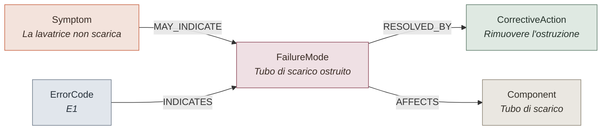
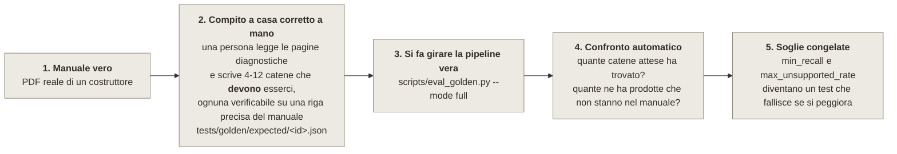

> Documento storico preservato dalla versione locale antecedente a C9–C12.
> I numeri, le linee di codice e le conclusioni seguenti non descrivono v22.
> Le affermazioni di assenza di invenzioni non costituiscono una verifica
> semantica globale. Vedere la [guida aggiornata](PIPELINE_SPIEGAZIONE_IT.md).

# Come funziona la pipeline — guida per non addetti ai lavori

**Scopo di questo documento.** Spiegare, a chi non conosce il progetto, che cosa
fa il sistema, come lo fa, dove interviene la persona e quanto bene funziona sui
manuali veri. Ogni blocco del diagramma riporta il file di codice
corrispondente, così si può passare dal disegno al sorgente uno a uno.

**Ultima verifica dei dati riportati:** 28 luglio 2026 (suite di test e gate di
qualità rieseguiti in quella data).

---

## 1. In una frase

Il sistema prende **un manuale di manutenzione in PDF** e lo trasforma in un
**grafo di conoscenza diagnostica** — una rete di "sintomo → causa → rimedio"
navigabile da un software — facendo **approvare i passaggi critici a un
operatore umano** e **citando sempre la pagina del manuale** da cui ogni
informazione proviene.

---

## 2. Il problema, e perché serve un umano nel ciclo

Un manuale di manutenzione contiene la conoscenza necessaria a diagnosticare un
guasto, ma in una forma che un software non sa usare: tabelle di allarmi,
diagrammi di flusso, prosa, disegni tecnici, riferimenti incrociati tra pagine
lontane.

Il sistema estrae quella conoscenza in forma strutturata. Ma un modello
linguistico può **sbagliare** o **inventare**: in manutenzione industriale un
rimedio inventato è pericoloso. Da qui le due scelte di fondo del progetto:

1. **Niente passa senza prova.** Ogni nodo e ogni relazione porta con sé una
   *citazione testuale* e il *numero di pagina*. Ciò che non è verificabile nel
   testo viene segnalato, non nascosto.
2. **Niente si esporta senza un umano.** La pipeline si **ferma** in tre punti
   e chiede all'operatore di decidere. È il modello "human-in-the-loop" (HITL).

---

## 3. Che cosa produce: il grafo di conoscenza

Il risultato finale è un file JSON con **6 tipi di "scatola" (nodi)** e
**6 tipi di "freccia" (relazioni)**. Il contratto è definito una volta per tutte
in [`ontology_schema.JSON`](../ontology_schema.JSON).

| Nodo | Che cos'è | Esempio |
|---|---|---|
| `Asset` | la macchina di cui parla il manuale | Robot ABB IRC5 |
| `Component` | un pezzo o sottosistema | contattore freno K44 |
| `Symptom` | quello che l'operatore **osserva** | "tutti i LED spenti" |
| `FailureMode` | la **causa tecnica** sottostante | "fusibile principale Q1 bruciato" |
| `CorrectiveAction` | il **rimedio** da eseguire | "sostituire il fusibile Q1" |
| `ErrorCode` | il codice di allarme mostrato dalla macchina | "E4" |

| Freccia | Da → A | Significato |
|---|---|---|
| `HAS_COMPONENT` | Asset → Component | la macchina contiene il pezzo |
| `MAY_INDICATE` | Symptom → FailureMode | il sintomo **può** indicare quella causa |
| `AFFECTS` | FailureMode → Component | la causa riguarda quel pezzo |
| `RESOLVED_BY` | FailureMode → CorrectiveAction | la causa si risolve con quel rimedio |
| `GENERATES_ERROR` | Asset → ErrorCode | la macchina può generare quel codice |
| `INDICATES` | ErrorCode → FailureMode | il codice indica quella causa |

### La "catena diagnostica" — l'unità di misura di tutto

Tutto il sistema, e tutta la valutazione della qualità, ruota intorno a un
oggetto solo: la **catena diagnostica atomica**.

"Atomica" significa: **un** sintomo, **una** causa, **un** rimedio. Non un blob
del tipo "la macchina non scarica → 5 cause possibili → 5 rimedi possibili".
Questo è importante per la sezione test: la qualità si misura contando quante
catene atomiche corrette il sistema ha ricostruito.

---

## 4. Diagramma principale — i 9 blocchi, con i riferimenti al codice

Legenda dei simboli usati dentro i blocchi:

- 👤 = **cosa fa la persona**
- 🖥️ = **frontend** (il browser: file e funzione)
- 🔌 = **chiamata HTTP** (l'API del backend)
- ⚙️ = **backend** (servizio o agente che esegue il lavoro)
- 💾 = **dove finisce lo stato** (cosa resta su disco)

I blocchi **arancioni** sono i tre punti in cui la pipeline **si ferma e aspetta
l'operatore**. I blocchi **verdi** sono automatici.

```mermaid
flowchart TD
    A["<b>1 · SCELTA DEL MANUALE</b><br/>👤 sceglie il PDF da <code>manuals/</code>, i modelli, la lingua, le iniziali<br/>🖥️ frontend/console.js → viewSetup #40;#41;<br/>🔌 GET /api/manuals · POST /api/load-manual<br/>⚙️ backend/routers/upload.py:53 → services/pdf_service.py extract_text_by_page<br/>💾 data/runs/&lt;run_id&gt;/ #40;manifest, pages.json, copia del PDF#41;"]

    B["<b>2 · SCOPING — quali pagine servono?</b><br/>🖥️ chatAction #40;'propose_cut_plan'#41; · console.js:748<br/>🔌 POST /chat/start/#123;pdf_id#125; poi POST /chat/action<br/>⚙️ agents/scoping_agent.py → services/scoping_workflow.py create_cut_plan_workflow<br/>⚙️ indice + offset pagine + OCR selettivo sulle pagine povere di testo<br/>💾 cut_plan #40;sezioni + pages_to_keep#41; · run_status = awaiting_operator"]

    C["<b>3 · APPROVAZIONE PAGINE #40;fermata 1#41;</b><br/>👤 controlla le sezioni tenute/scartate e approva<br/>🖥️ console.js → viewScoping #40;#41; · riga 995<br/>🔌 POST /chat/action #123;action: approve_cut_plan#125;<br/>⚙️ services/scoping_workflow.py approve_cut_plan_workflow<br/>💾 graph/supervisor.py record_cut_plan_approval_route"]

    D["<b>4 · BOZZA DELL'ONTOLOGIA — il cuore</b><br/>⚙️ agents/ontology_draft_agent.py → services/ontology_workflow.py draft_ontology_workflow<br/>⚙️ spezza in blocchi da max 5 pagine, poi per ogni blocco: services/ontology_pipeline.py build_initial_ontology<br/>⚙️ 5 passate di qualità sul grafo unito #40;vedi diagramma 2#41;<br/>💾 ontology_pipeline #40;nodi, relazioni, problemi, coda di revisione#41;"]

    E["<b>5 · REVISIONE DEL GRAFO #40;fermata 2#41;</b><br/>👤 compila i campi obbligatori mancanti, accetta/rifiuta le relazioni suggerite<br/>🖥️ console.js → viewGraph #40;#41; · viewReview #40;#41; · viewFields #40;#41; · viewQuality #40;#41;<br/>🔌 POST /chat/action #123;fill_required_field | apply_suggested_relation#125;<br/>⚙️ services/conversation/tools/ontology.py<br/>💾 decisioni in data/runs/&lt;run_id&gt;/events.jsonl"]

    F["<b>6 · ESTRAZIONE DELLE TRIPLE</b><br/>👤 preme 'Avvia estrazione'<br/>🖥️ console.js → viewDashboard #40;#41; · riga 948<br/>🔌 POST /chat/action #123;action: run_extraction#125;<br/>⚙️ services/extraction_pipeline.py run_extraction_pipeline → catena di agenti<br/>⚙️ normalmente NON è una seconda chiamata al modello: proietta il grafo già disegnato #40;graph_projection_service.py#41;<br/>💾 cleaned_triplets + verdetti di validazione"]

    G["<b>7 · REVIEW CENTER #40;fermata 3#41;</b><br/>👤 approva / scarta / corregge ogni catena, con la citazione sotto gli occhi<br/>🖥️ console.js → viewReview #40;#41; · riga 1262<br/>🔌 POST /api/runs/#123;id#125;/review-decisions<br/>⚙️ backend/routers/runs.py:252<br/>💾 events.jsonl → la sessione si può chiudere e riaprire"]

    H["<b>8 · EXPORT</b><br/>👤 preme 'Esporta'<br/>🖥️ console.js → viewExport #40;#41; · riga 1507<br/>🔌 POST /chat/action #123;action: export_ontology#125;<br/>⚙️ services/conversation/tools/export.py → style_cleanup_service.py → ontology_export_store.py<br/>💾 output/latest/ e output/&lt;manuale&gt;/ : ontology.json + metrics.json + conversation.json"]

    I["<b>9 · EDITOR DEL GRAFO #40;opzionale#41;</b><br/>👤 ritocca a mano nodi e relazioni del grafo esportato<br/>🖥️ frontend/editor/editor.js · http://127.0.0.1:8000/modify/latest<br/>🔌 /modify/#123;pdf_id#125;/api/... #40;update, create, delete, save#41;<br/>⚙️ backend/routers/modify.py + services/graph_editor_session.py + modify/"]

    A --> B --> C --> D --> E --> F --> G --> H --> I

    classDef human fill:#F6E7DF,stroke:#C96442,stroke-width:2px,color:#3A2C25,text-align:left;
    classDef auto  fill:#E4EDE6,stroke:#5E7B6A,stroke-width:1px,color:#26332C,text-align:left;
    classDef start fill:#EDEAE3,stroke:#8C8474,stroke-width:1px,color:#332F28,text-align:left;
    class A start;
    class B,D,F auto;
    class C,E,G,H,I human;
```

### Chi comanda il traffico: il supervisore

Fra un blocco e l'altro c'è un **supervisore deterministico**
([`backend/graph/supervisor.py`](../backend/graph/supervisor.py)): non è
un'intelligenza artificiale che "decide", è una tabella di regole fisse che
scrive nel registro *chi ha finito*, *chi tocca dopo* e *perché*. Quando il
prossimo passo tocca all'umano imposta `run_status = awaiting_operator` e la
console mostra il banner **"Tocca a te"**.

C'è anche un **cancello** ([`services/conversation/gate.py`](../backend/services/conversation/gate.py)):
se il frontend chiede un'azione fuori sequenza (es. esportare prima di aver
estratto), il backend la rifiuta.

---

## 5. Zoom sul blocco 4 — come nasce la bozza dell'ontologia

Questo è il punto in cui il sistema fa la maggior parte del lavoro intelligente.
Non è "una chiamata a ChatGPT": è una catena di passaggi con controlli, in cui
il modello viene usato più volte con compiti stretti e verificabili.

```mermaid
flowchart TD
    subgraph PRE["Prima del modello"]
        M1["<b>Pre-scrematura deterministica</b><br/>services/candidate_mining_service.py<br/>trova con espressioni regolari i candidati componenti e codici errore<br/>e li passa al modello come suggerimento"]
    end

    subgraph LG["Per ogni blocco di max 5 pagine — grafo LangGraph<br/>services/ontology_pipeline.py :673 _build_graph"]
        N1["extract<br/>il modello propone nodi e proprietà"]
        N2["normalize<br/>id canonici, pulizia"]
        N3["relation_extract<br/>il modello propone le frecce, con citazione"]
        N4["semantic_validate<br/>controlli di senso: il rimedio è davvero un'azione? la citazione esiste?"]
        N5{"problemi<br/>gravi?"}
        N6["re_extract<br/><b>ciclo riflessivo</b>: rifà il pezzo sbagliato<br/>max 1 tentativo, config.yaml reflective_loop"]
        N7["human_review<br/>marca ciò che deve vedere l'umano"]
        N8["schema_validate<br/>rispetta ontology_schema.JSON?"]
        N9["graph_validate<br/>services/graph_reasoning.py: nodi isolati, catene rotte"]
        N10["confidence_score<br/>services/confidence.py: voto 0-1 per ogni nodo"]
        N1 --> N2 --> N3 --> N4 --> N5
        N5 -->|sì, recuperabile| N6 --> N2
        N5 -->|serve l'umano| N7 --> N8
        N5 -->|no| N8 --> N9 --> N10
    end

    subgraph RUN["Sul grafo unito di tutto il manuale<br/>services/ontology_workflow.py :458 _finalize_run_level_quality"]
        R1["<b>1. Seconda raccolta</b><br/>coverage_completion_service.py<br/>ripesca le catene presenti nel testo ma sfuggite alla bozza.<br/>Scarta ciò che non ha una citazione verbatim verificata"]
        R2["<b>2. Completamento rimedi</b><br/>resolution_completion_service.py<br/>per ogni causa senza rimedio cerca la soluzione <b>in tutto il manuale</b>,<br/>anche nelle pagine che lo scoping aveva scartato"]
        R3["<b>3. Chiusura del grafo</b><br/>graph_closure_service.py<br/>applica da sola solo le relazioni che riesce a verificare nel testo;<br/>le altre restano 'suggerite' e le decide l'operatore"]
        R4["<b>4. Verifica delle prove</b><br/>evidence_grounding_service.py<br/>ricontrolla ogni citazione contro la pagina citata.<br/>Se la citazione non c'è, il nodo scende di punteggio e va in revisione"]
        R5["<b>5. Coda di revisione</b><br/>review_queue_service.py<br/>costruisce la 'zona rossa' dell'operatore, ordinata per gravità"]
        R1 --> R2 --> R3 --> R4 --> R5
    end

    M1 --> N1
    N10 --> MERGE["unione dei blocchi<br/>_merge_pipeline_results"] --> R1

    classDef pre fill:#EDEAE3,stroke:#8C8474,color:#332F28;
    classDef lgc fill:#E4EDE6,stroke:#5E7B6A,color:#26332C;
    classDef runl fill:#F6E7DF,stroke:#C96442,color:#3A2C25;
    class M1 pre;
    class N1,N2,N3,N4,N6,N7,N8,N9,N10 lgc;
    class R1,R2,R3,R4,R5 runl;
```

### Le sette reti di sicurezza, in parole povere

| # | Rete di sicurezza | File | A cosa serve |
|---|---|---|---|
| 1 | Pre-scrematura | `candidate_mining_service.py` | trovare codici errore e componenti con regole fisse, senza dipendere dal modello |
| 2 | Ciclo riflessivo | `ontology_pipeline.py` `_re_extract_node` | se la validazione trova un errore grave, il modello rifà quel pezzo |
| 3 | Seconda raccolta | `coverage_completion_service.py` | il modello, riletto lo stesso testo, non trova sempre le stesse cose: una seconda passata recupera i rami persi |
| 4 | Completamento rimedi | `resolution_completion_service.py` | il rimedio spesso sta in un capitolo diverso da quello del sintomo |
| 5 | Chiusura del grafo | `graph_closure_service.py` | collega da sé solo ciò che sa dimostrare; il resto lo chiede all'umano |
| 6 | Verifica delle prove | `evidence_grounding_service.py` | ogni citazione viene ricontrollata contro la pagina reale |
| 7 | Punteggio + coda | `confidence.py` + `review_queue_service.py` | decide cosa passa da solo e cosa deve guardare la persona |

**Nota sull'estrazione (blocco 6).** Nella modalità normale il sistema **non**
fa una seconda estrazione con il modello: proietta come triple il grafo già
costruito e verificato
([`graph_projection_service.py`](../backend/services/graph_projection_service.py)).
L'operatore valida quindi *esattamente* ciò che verrà esportato, e non serve
riconciliare due estrazioni diverse. La vecchia estrazione via modello resta
come riserva se la bozza non contiene catene validabili.

---

## 6. Il punteggio di affidabilità e la coda di revisione

Ogni nodo riceve un voto da 0 a 1 ([`services/confidence.py`](../backend/services/confidence.py)),
composto da 5 ingredienti — i pesi sono in [`config.yaml`](../config.yaml):

| Ingrediente | Peso | Domanda a cui risponde |
|---|---|---|
| `evidence_present` | 0,25 | c'è una citazione? |
| `required_props_complete` | 0,25 | i campi obbligatori dello schema sono pieni? |
| `chain_participation` | 0,20 | il nodo è dentro una catena completa sintomo→causa→rimedio? |
| `corroboration` | 0,15 | l'informazione compare più volte / è confermata? |
| `clean_extraction` | 0,15 | è uscita al primo colpo, senza ritentativi? |

Poi due soglie:

- **≥ 0,80** (`theta_high`) → il nodo passa da solo (verde);
- **< 0,80** → finisce nella coda di revisione dell'operatore (rosso).

Con questa taratura, sul campione LG circa il **13% dei nodi** va in revisione
umana — tipicamente rimedi senza prova (0,25–0,40) e sintomi/cause dubbie con
catena incompleta (~0,75), mentre i nodi auto-approvati stanno fra 0,80 e 0,98.

**Importante:** i *buchi strutturali* (una causa senza rimedio, un codice errore
scollegato, una relazione che punta a un nodo inesistente) arrivano
all'operatore **sempre**, qualunque sia il punteggio. Un voto generoso non può
far passare in silenzio una catena incompleta.

L'export è **best-effort**: il file viene comunque prodotto anche con problemi
aperti, ma i problemi sono **dichiarati dentro il file** (`export_status`,
`export_warnings`), non nascosti.

---

## 7. Test e risultati su documenti veri

Questa è la sezione che risponde alla domanda: **"funziona davvero, e come lo
sapete?"**

### 7.1 Come si misura la qualità — il metodo

Un test normale del software risponde a "il codice è rotto?". Qui serve
rispondere a un'altra domanda: **"il risultato è buono?"**. Le due cose sono
diverse: il codice può essere perfetto e l'estrazione mediocre.

Il metodo, formalizzato in [`docs/EVALUATION_PROTOCOL.md`](EVALUATION_PROTOCOL.md), è
questo:

Il "compito a casa corretto a mano" si chiama **golden fixture**. Oggi ce ne
sono **9**: **6 da manuali industriali/domestici veri** e 3 sintetici piccoli,
usati come prova di fumo.

### 7.2 Glossario dei numeri — che cosa vuol dire ogni KPI

> Questa è la parte da leggere prima di guardare le tabelle.

**Recall (campionario) — "quante ne ha trovate"**
Immagina una checklist di 12 voci scritta a mano da un tecnico: "queste 12
catene sintomo→causa→rimedio devono uscire". Il recall è la frazione di
checklist trovata dal sistema.
- `recall = 1.0` → **12 su 12**, ha trovato tutto (100%).
- `recall = 0.8` → **8 su 10**, ne ha mancate 2.
- `recall = 0.0` → non ne ha trovata nessuna.
Si chiama "campionario" perché la checklist **non è l'elenco completo** di tutto
ciò che c'è nel manuale: è un campione rappresentativo. Serve a confrontare due
versioni del sistema sullo stesso manuale, non a dire "copre l'82% del manuale".

**unsupported_rate — "quante se ne è inventate"** ⭐ *il numero più importante*
Di tutte le catene prodotte, la frazione che **non si trova nel manuale**.
- `0.0` → **zero invenzioni**: tutto ciò che il sistema ha scritto è
  rintracciabile nel testo. È il valore richiesto da tutte le soglie.
- `0.15` → il 15% di quello che ha prodotto è inventato (inaccettabile qui).
In gergo è il tasso di "allucinazioni". Per un uso in manutenzione è il KPI che
determina se ci si può fidare.

**grounded_precision — "quanta della roba prodotta è verificabile"**
Frazione di catene prodotte che sono *sostenute dal testo*, che stessero o no
nella checklist. `1.0` = tutte. È l'immagine speculare di `unsupported_rate`
(`grounded_precision = 1 − unsupported_rate`).

**precision_strict — "quanta della roba prodotta stava esattamente in checklist"**
Attenzione: **un valore basso qui non è un difetto.** La checklist ha 9 voci; se
il sistema estrae 45 catene tutte corrette, `precision_strict` risulta 0,20 solo
perché il campione non le elencava. Per questo il numero viene *riportato ma non
usato come soglia*.

**extra_grounded — "roba in più, ma vera"**
Catene non presenti in checklist ma verificate nel testo. Sono **valore
aggiunto, non errori**: nella corsa ABB sono state 28 oltre alle 12 attese.

**forbidden_chains — "le trappole"**
Collegamenti sbagliati osservati in passato (es. una causa presa dalla riga
accanto della tabella) che **non devono mai ricomparire**. Se ricompaiono, il
test fallisce. Sul manuale Haier ce ne sono 4, sull'Eagle 5.

**scoping must-keep — "non ha buttato le pagine giuste?"**
Elenco di pagine che il taglio deve obbligatoriamente conservare. Esito `pass` o
`fail`, senza sfumature.

**blocking review items — "quanti stop obbligatori per l'operatore"**
Problemi che l'operatore deve risolvere. Il valore atteso è **0**: non significa
"coda vuota" (le voci *informative* sono normali e legittime), significa
"nessun problema bloccante".

**dangling relations — "frecce nel vuoto"**
Relazioni che puntano a un nodo che non esiste. Atteso: **0**.

**causal grounding ratio — "quante frecce causali hanno la prova"**
Frazione di relazioni causali con una citazione testuale verificata. `1.0` =
tutte.

**graph health score — "quanto è sano il grafo"**
Indice sintetico 0–1 di completezza strutturale (nodi collegati, catene chiuse).
`0,892` sull'ultima corsa Whirlpool.

**Token, costo, durata**
I "token" sono le unità con cui si paga il modello (grossomodo: pezzi di
parola). Servono a stimare il costo di elaborare un manuale.

### 7.3 Risultati sui manuali veri (modello reale `gpt-5.4`)

Sei manuali reali di sei costruttori diversi, scelti per stressare difficoltà
diverse. Ogni riga riporta i valori osservati in corse a pagamento vere; i
report completi sono archiviati in `eval_runs/<timestamp>/`.

| Manuale | Settore / difficoltà | Catene in checklist | Recall osservato | Invenzioni (`unsupported_rate`) | Soglia congelata |
|---|---|---:|---|---:|---|
| **ABB IRC5** controller robot | cause elencate "per probabilità" + tabella azioni separata | 12 | **1.0 / 1.0** (12/12 in 2 corse) | 0.0 | min_recall 0,85 |
| **LG LMH2235ST** microonde | codici di autodiagnosi senza rimedio + schemi con punti di misura | 9 | **1.0 / 1.0** | 0.0 | min_recall 0,85 |
| **FANUC 0i-MF (Fryer VB)** CNC | conoscenza sparsa: lista allarmi criptica, prosa, rimandi tra pagine | 6 | **1.0 / 0.833** | 0.0 | min_recall 0,80 |
| **Eastman Eagle S3L** taglio laser | prosa di troubleshooting + pagine di manutenzione preventiva come esche | 11 | **0,82 / 0,82** (0,70–0,82 su 6 corse) | 0.0 | min_recall 0,70 |
| **Haier LMA4120** lavatrice | tabella codici allarme + diagrammi di flusso | 4 | **0,75 – 1.0** | 0.0 | min_recall 0,75 |
| **Whirlpool W11187658** lavastoviglie | tabella codici con alias + tabella sintomi multi-causa in maiuscolo | 10 | **0,80 / 1.0 / 0,80** | 0.0 | min_recall 0,70 |

**Come si legge questa tabella, in una frase:** su sei manuali veri il sistema
ritrova fra il **70% e il 100%** delle catene diagnostiche che un revisore umano
aveva marcato come obbligatorie, e in **nessuna corsa** ha prodotto una singola
catena non rintracciabile nel manuale.

Il dato su cui insistere con un pubblico non tecnico è il secondo: **la colonna
delle invenzioni è a zero ovunque**. Il sistema a volte *manca* qualcosa (e per
questo c'è l'operatore), ma non *inventa*.

#### Perché i recall non sono tutti a 1.0 — le cause vere, già diagnosticate

- **Variabilità del modello.** A parità di codice e di manuale, il modello non
  ripesca sempre gli stessi rami: sul FANUC la catena del "gioco meccanico"
  esce nella corsa 1 e sparisce nella corsa 2. Per questo il protocollo richiede
  **almeno 3 corse** per ogni confronto e le soglie sono messe *sotto* il valore
  osservato stabile (tolleranza ±0,1).
- **Testi che sono immagini.** Nel manuale FANUC lo schema "ATC
  TROUBLESHOOTING" è un disegno senza testo estraibile: è escluso dalle attese,
  perché una pipeline testuale non può vederlo. È un limite dichiarato, non un
  errore mascherato.
- **Semantica, non estrazione.** Sul Whirlpool i 4 codici errore risultavano
  "mancati" perché il manuale, per quei codici, dà solo passi di *verifica*
  ("controllare X") e non un rimedio. Il sistema, per contratto, **rifiuta di
  spacciare un controllo per un rimedio**. La decisione presa il 14/07/2026 è
  stata correggere l'annotazione (`ErrorCode → FailureMode` senza rimedio, con
  il buco dichiarato), non indebolire il sistema: dopo la correzione i recall
  sono passati da 4/10 e 7/10 a **8/10 e 10/10** sugli stessi identici dati,
  senza rifare una sola chiamata a pagamento.

### 7.4 Costi e tempi reali per manuale

| Corsa | Manuale | Token totali | Costo stimato | Durata |
|---|---|---:|---:|---:|
| `20260706T172744Z` | ABB IRC5 | ~160.000 | **$0,88** | ~222 s |
| `20260712T081536Z` | Whirlpool | 215.392 | **$1,14** | 209 s |
| `20260712T081922Z` | Whirlpool | 225.528 | **$1,16** | 221 s |
| `20260705T190435Z` | LG microonde | 136.606 | **$0,55** | — |
| `20260705T192621Z` | FANUC CNC | 99.521 | **$0,46** | — |
| `20260704T122734Z` | Haier lavatrice | 162.594 | **$1,04** | — |

**In sintesi: elaborare un manuale costa fra 0,5 e 1,2 dollari e richiede circa
3–4 minuti di calcolo**, a cui va aggiunto il tempo di revisione umana. I prezzi
usati sono quelli del fornitore alla data della corsa ($2,50 per milione di
token in ingresso, $15 per milione in uscita) e vanno sempre citati insieme al
costo.

### 7.5 Test del codice (l'altra metà)

Oltre alla qualità dell'output, c'è la correttezza del software. Rieseguiti il
**28 luglio 2026**:

| Livello | Che cosa verifica | Comando | Esito |
|---|---|---|---|
| Unità + contratto + integrazione | servizi, schemi, flussi interni, run store, router | `pytest tests/` (modello finto) | **313 test, tutti verdi** |
| E2E interfaccia | i flussi della console nel browser | `npx playwright test` | eseguito prima dei rilasci |
| **Gate di qualità** | le 9 golden fixture con modello deterministico | `python3 scripts/eval_golden.py --mode mock --fail-on-regression` | **9/9 fixture, recall medio 1.0, 0 invenzioni, 2,4 s** |

Il gate di qualità in modalità "finta" è deterministico e gratuito: gira a ogni
modifica e **blocca il codice** se una catena vietata ricompare o se una soglia
congelata viene violata. Le corse a pagamento con il modello vero servono
invece a *misurare*, e si fanno su richiesta.

### 7.6 Che cosa NON è ancora dimostrato — i limiti dichiarati

Onestà intellettuale, utile da dire al collega prima che lo chieda lui:

- **Il recall è campionario, non esaustivo.** Nessun manuale è stato annotato
  al 100%, quindi non si può dire "copre l'X% del manuale".
- **Un solo annotatore.** Non è stata misurata la concordanza fra revisori
  diversi sulle stesse attese.
- **Solo manuali in inglese** fra le fixture.
- **Solo testo.** Schemi e diagrammi che esistono solo come immagine restano
  fuori (l'OCR recupera le pagine povere di testo, non interpreta i disegni).
- **Un manuale alla volta**, con operatore. Non è un sistema batch.
- **Una corsa interrotta non si riprende**: se il server si ferma a metà, la
  sessione resta consultabile ma va rifatta.

---

## 8. Mappa rapida: dal diagramma al codice

Tabella da tenere aperta accanto al disegno.

| Blocco del diagramma | Frontend | Endpoint | Backend |
|---|---|---|---|
| 1 · Scelta manuale | `frontend/console.js` → `viewSetup()` :721 | `GET /api/manuals`, `POST /api/load-manual` | `backend/routers/upload.py:37,53` → `services/pdf_service.py` |
| 1b · Avvio sessione | `console.js:740` | `POST /chat/start/{pdf_id}` | `backend/routers/chat.py:43` → `services/conversation/orchestrator.py` |
| 2 · Scoping | `console.js:748` | `POST /chat/action` (`propose_cut_plan`) | `agents/scoping_agent.py` → `services/scoping_workflow.py:194` |
| 3 · Approvazione pagine | `viewScoping()` :967 · riga 995 | `POST /chat/action` (`approve_cut_plan`) | `services/scoping_workflow.py:591` |
| 4 · Bozza ontologia | (automatico) | — | `agents/ontology_draft_agent.py` → `services/ontology_workflow.py:693` → `services/ontology_pipeline.py:729` |
| 4b · Passate di qualità | (automatico) | — | `services/ontology_workflow.py:458` + `coverage_completion_service.py`, `resolution_completion_service.py`, `graph_closure_service.py`, `evidence_grounding_service.py` |
| 5 · Revisione grafo | `viewGraph()` :1087 · `viewFields()` :1399 · `viewQuality()` :1339 | `POST /chat/action` (`fill_required_field`, `apply_suggested_relation`) | `services/conversation/tools/ontology.py` |
| 6 · Estrazione | `viewDashboard()` :821 · riga 948 | `POST /chat/action` (`run_extraction`) | `services/extraction_pipeline.py:46` → `agents/*` |
| 7 · Review Center | `viewReview()` :1262 | `POST /api/runs/{id}/review-decisions` | `backend/routers/runs.py:252` |
| 8 · Export | `viewExport()` :1455 · riga 1507 | `POST /chat/action` (`export_ontology`) | `services/conversation/tools/export.py:19` |
| 9 · Editor grafo | `frontend/editor/editor.js` | `/modify/{pdf_id}/api/...` | `backend/routers/modify.py` + `modify/` |
| — · Avanzamento live | `console.js:303` (`EventSource`) | `GET /chat/stream/{pdf_id}` | `backend/routers/chat.py:51` |
| — · Registro decisioni | — | — | `backend/graph/supervisor.py`, `backend/runstore/run_store.py` |
| — · Elenco strumenti | — | — | `services/conversation/tools/dispatch.py:72` (tabella dei 30 strumenti) |
| — · Cancello di fase | — | — | `services/conversation/gate.py:144` |
| — · Valutazione qualità | — | — | `scripts/eval_golden.py` + `tests/golden/` |

---

## 9. I cinque messaggi da portare a casa

1. **Un manuale PDF diventa un grafo diagnostico navigabile**, con sei tipi di
   nodo e sei tipi di relazione fissati da un contratto.
2. **Ogni affermazione porta la sua prova**: citazione testuale + numero di
   pagina, ricontrollata dal sistema stesso contro la pagina originale.
3. **La persona decide in tre punti** — quali pagine, quale grafo, quali catene
   — e ogni decisione resta scritta in un registro riapribile.
4. **Sui sei manuali veri testati il sistema ritrova il 70–100% delle catene
   attese e non ha mai inventato nulla** (`unsupported_rate` = 0,0 in ogni
   corsa).
5. **Quello che il sistema non sa, lo dichiara**: buchi, dubbi e problemi
   finiscono nella coda dell'operatore e, se restano, vengono scritti dentro il
   file esportato invece di essere nascosti.

---

### Riferimenti

- Architettura tecnica: [`docs/ARCHITECTURE.md`](ARCHITECTURE.md)
- Protocollo di valutazione (normativo): [`docs/EVALUATION_PROTOCOL.md`](EVALUATION_PROTOCOL.md)
- Report per singolo manuale: [`ABB`](ABB_IRC5_GOLDEN_EVAL.md) · [`FANUC`](FANUC_VB_SERIES_GOLDEN_EVAL.md) · [`Haier`](HAIER_LMA4120_GOLDEN_EVAL.md) · [`LG`](LG_LMH2235ST_GOLDEN_EVAL.md) · [`Whirlpool`](WHIRLPOOL_W11187658_GOLDEN_EVAL.md)
- Mappa della suite di test: [`tests/README.md`](../tests/README.md)
