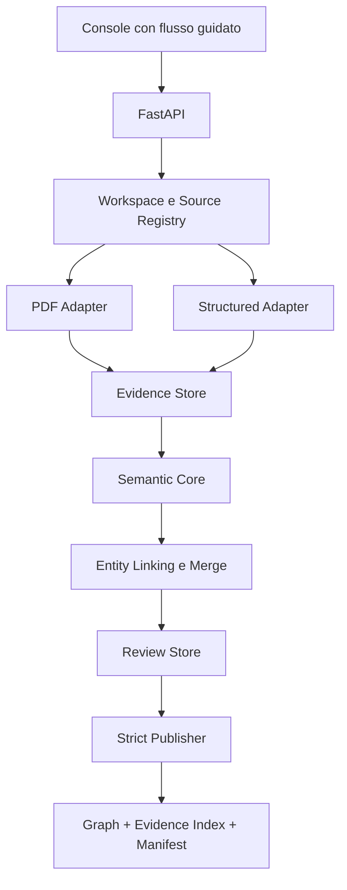

# Baseline e implicazioni della codebase esistente

## 1. Scopo

Questo documento impedisce due errori:

1. riscrivere capacità già mature;
2. trattare l'aggiunta di CSV/XLSX/JSON come un semplice parser, ignorando il
   modello PDF-centrico esistente.

Non è un piano di sviluppo. Definisce i confini di riuso e i contratti che il
futuro piano deve rispettare.

## 2. Provenienza della baseline

| Campo | Valore |
|---|---|
| Repository di backup | `agnostic-KG-builder-for-maintenance` |
| Repository di sviluppo | `log-kg-builder` |
| Commit importato | `54c1234e33f2bab09c69df22d9404afb79702224` |
| Branch | `main` |
| Remote nel nuovo repository | `upstream-backup`, fetch consentito, push disabilitato |
| Ontology SHA-256 | `81f2d894e8b4c3c0ba3bb2e7149941ae91b704ebd8a8b8dedef91b79bd1508db` |

La copia ha incluso codice e cronologia versionata. Non ha incluso:

- `.venv`;
- `node_modules`;
- runtime `data/`;
- PDF locali;
- output ed eval run;
- cache;
- modifiche non versionate presenti nella repository di backup.

La repository di backup non deve essere modificata dal nuovo prodotto.

## 3. Stato verificato della baseline

Al commit importato `54c1234e33f2bab09c69df22d9404afb79702224`:

- 313 test Python risultano raccolti e superati;
- Ruff non riporta errori;
- 9 fixture golden in modalità mock risultano conformi;
- la recall media mock è `1.0`;
- i 27 documenti Markdown della baseline hanno link locali validi.

Questi numeri dimostrano regressione tecnica controllabile, non qualità
universale su nuovi documenti o dati strutturati.

Il floor del pacchetto pre-piano è invece `301` test:

```text
313 baseline importata
+ 1 test del consistency checker
- 17 test esclusivamente legati all'editor rimosso
+ 4 test di caratterizzazione della rimozione
= 301
```

Comando di conteggio: `pytest --collect-only -q`, eseguito dalla root del
repository con la configurazione versionata. `313` descrive il commit
importato; `301` descrive il target dopo la rimozione intenzionale
dell'editor. I due numeri non sono intercambiabili e il report di regressione
deve registrare commit, comando e conteggio raccolto.

## 4. Capacità realmente presenti

### BASE-001 — Applicazione

- backend FastAPI;
- console web HITL;
- editor visuale del grafo nella baseline, da rimuovere nel prodotto target;
- route di upload, run, generazione, review, export e modifica.

### BASE-002 — Pipeline PDF

- un PDF per sessione;
- estrazione testo nativo;
- OCR selettivo;
- estrazione tabelle;
- page offset;
- scoping e cut plan;
- chunking;
- grounding per pagina e citazione.

### BASE-003 — Core semantico

- candidate mining deterministico;
- estrazione tramite modello;
- normalizzazione;
- validazione semantica e ontologica;
- reflective retry;
- graph reasoning e completion;
- confidence e review queue;
- merge di chunk e triplet nella singola lavorazione.

### BASE-004 — Operatività

- eventi e trace append-only;
- snapshot e manifest dei run;
- run archiviati ispezionabili;
- export JSON;
- graph editor legacy, non parte del target;
- fake LLM deterministico;
- golden evaluation.

## 5. Limiti reali della baseline

### GAP-001 — Il confine è il PDF

Lo stato, le API e i modelli usano estesamente:

- `pdf_id`;
- `source_page`;
- `pages_to_keep`;
- `text_with_pages`.

L'evidence model corrente è:

```text
source_page + source_reference + quote
```

Non può rappresentare correttamente righe CSV, celle Excel o JSONPath.

### GAP-002 — Un grafo per manuale

La UI e l'export sono centrati su un manuale. Il batch runner elabora più
manuali producendo output separati; non costruisce un unico grafo
cross-documento.

### GAP-003 — Merge limitato

Il merge corrente consolida:

- chunk della stessa estrazione;
- nodi nel grafo base della singola sessione;
- triplet validate nello stesso export.

Non implementa identity resolution incrementale e robusta fra manuali, log,
report e tabelle della stessa macchina.

### GAP-004 — Persistenza non riprendibile

I run persistiti sono ispezionabili dopo un restart, ma le operazioni in-flight
non possono riprendere dalla UI. Il target richiede checkpoint riprendibili.

### GAP-005 — Export best-effort

L'export corrente può produrre un file con warning e open gap. Nel target:

- un draft può avere warning;
- una versione `published` non può avere violazioni bloccanti;
- i knowledge gap veritieri possono essere dichiarati nel sidecar.

### GAP-006 — Contratto di export

L'export corrente:

- incorpora evidenze nelle relazioni;
- usa metadati manual-centric;
- non produce un evidence index generico;
- non registra il set completo delle fonti.

Il target preserva la struttura `metadata/nodes/relationships`, ma separa
evidence index e manifest.

### GAP-007 — Provider

Il gateway corrente supporta:

- OpenAI;
- mock deterministico.

Non è ancora un adapter generico per provider locali con capability preflight.

### GAP-008 — Lingue

Esistono utility e UI per inglese, italiano e tedesco, ma parte delle regole
deterministiche e della calibrazione è English-centric. La presenza di un
codice lingua non equivale a supporto qualificato.

### GAP-009 — Matching

Il matching esistente usa principalmente normalizzazione lessicale, overlap e
similarità stringa. Non esiste ancora un entity linking cross-source
embedding-based calibrato.

### GAP-010 — Validazione del contratto

Il validatore corrente contiene assunzioni applicative non identiche al file
ontologico, per esempio:

- relation type richiesti globalmente;
- alcune proprietà di `CorrectiveAction` non validate come obbligatorie;
- pruning best-effort di relazioni dangling;
- normalizzazione che può mascherare proprietà extra.

Il publisher target deve validare direttamente il contratto ontologico senza
inventare completezza o correggere silenziosamente.

### GAP-011 — Accounting dopo i filtri

La baseline può perdere sintomi standalone, azioni non riconciliate, nodi
senza catena completa, righe oltre i cap delle tabelle e failure di estrazione
prima che ricevano una disposition. Il piano deve introdurre
`RawUnitDisposition` prima di pruning, cap o merge; non deve riusare i cap
attuali come policy di prodotto.

### GAP-012 — Review non transazionale

Verdict, patch del grafo e relazioni suggerite percorrono endpoint distinti.
La baseline può considerare `ignored` un blocking risolto, creare relazioni
senza evidence e riaprire senza invertire la patch. Questi percorsi sono
characterization input da sostituire con la transazione
decisione-validazione-delta di `DC-REVIEW-001`, non primitive da estendere.

### GAP-013 — Resume soltanto nominale

Gli snapshot per fase vengono sovrascritti e non rappresentano checkpoint
preparati/committed. Un run morto può essere ispezionato ma non ripreso. Il
piano deve implementare il call lifecycle e la matrice di invalidazione di
`DC-CHECKPOINT-001` e non descrivere gli snapshot esistenti come resume.

### GAP-014 — Publisher e versioni divergenti

La baseline usa validazione best-effort, prima versione `V0`, latest
sovrascritto e può potare dangling edge. Il target parte da `V001`, conserva ogni
bundle, valida domain/range e proprietà esatte e rende visibile la versione
soltanto dopo commit atomico.

### GAP-015 — Provider e preflight incompleti

Il gateway è accoppiato al client OpenAI, non espone embedding o capability
complete e l'health endpoint non prova structured output. La selezione UI può
ignorare il modello environment se non elencato nel YAML. Il piano deve usare
`ProviderConfig`, precedenza canonica e preflight reale.

### GAP-016 — UX e dataset target nuovi

La console corrente resta PDF/scoping/ontology/extraction. Non implementa il
percorso workspace/source/review/publish target e non esistono fixture
versionate CSV/XLSX/JSONL multisource. Il futuro piano deve classificare il
flusso come nuovo sistema UX e il golden multisource come artifact di
abilitazione, preservando soltanto componenti visuali e utility dimostrate.

### GAP-017 — Confine locale non browser-safe

Il dev server usa loopback per default, ma upload/load usano filename senza
containment robusto, il controllo download è string-based e CORS consente
`*`. Il piano deve introdurre inventory server-side, `Path.resolve()` più
containment reale, difesa da symlink escape, CORS same-origin e request limits
prima di considerare chiuso `NFR-005`.

## 6. Matrice di riuso

| Area | Decisione | Vincolo |
|---|---|---|
| Ontologia | RIUSARE INTEGRALMENTE | Nessuna modifica |
| FastAPI e bootstrap | RIUSARE | Generalizzare i confini |
| PDF/OCR/tabelle | RIUSARE | Output in EvidenceUnit |
| Scoping/cut plan | RIUSARE | Scoping per Source, non per graph |
| Prompt e pipeline ontologica | ADATTARE | Input evidence bundle, non solo pagine |
| Candidate mining | ADATTARE | Multisource e multilingua controllata |
| Grounding | ADATTARE | Locator generico |
| Confidence/review queue | RIUSARE E RICALIBRARE | Soglie per modello e operazione |
| Graph reasoning | RIUSARE | Nessuna relazione fuori ontologia |
| Graph editor | RIMUOVERE | Nessuna graph mutation libera |
| Visualizzazione grafo | RICOLLOCARE E RIUSARE | Explorer read-only |
| Run store/audit | ADATTARE | Workspace/source/run e resume |
| Review endpoints | SOSTITUIRE IL WRITE PATH | Transazione decisione-validazione-delta |
| Export | SOSTITUIRE IL PUBLISHER | Strict publish più sidecar |
| LLM gateway/mock | ADATTARE | Provider interface e preflight |
| Golden harness | ESTENDERE | PDF più dati strutturati e multisource |
| Local file boundary/CORS | CORREGGERE PRIMA DELL'E2E | Containment, same-origin e limiti |
| Batch manual runner | NON USARE COME CORE | Produce grafi separati |
| Runtime e output storici | NON MIGRARE NELL'MVP | Nessun requisito business |

## 7. Confini architetturali target



### BOUND-001 — Adapter

Un adapter è responsabile soltanto di:

- lettura del formato;
- preservazione del raw;
- inventario deterministico delle unità prima di filtri o cap;
- emissione delle `RawUnit` con identità e parentela stabili;
- locator;
- qualità di ingestion;
- emissione di EvidenceUnit soltanto dopo che la RawUnit è stata registrata.

Non deve implementare una propria ontologia, un proprio graph merge o un
proprio publisher.

### BOUND-002 — Semantic core

Il core riceve evidence unit e non deve dipendere da:

- pagina PDF obbligatoria;
- colonna con nome fisso;
- specifico modello macchina;
- specifico cliente.

### BOUND-003 — Workspace

`workspace_id` sostituisce il PDF come confine del grafo.

`source_id` sostituisce `pdf_id` come identificatore dell'input.

`run_id` identifica un'esecuzione, non un documento e non il grafo.

Il Run Store possiede il ledger append-only delle `RawUnitDisposition`:
registra ogni tentativo e la disposition attiva prima che EvidenceUnit,
candidate, deduplica o pruning possano rendere invisibile una unità.

### BOUND-004 — Provenienza

Ogni punto in cui il codice usa `source_page` come unica provenienza deve poter
accettare un locator discriminato.

Per compatibilità interna temporanea, il PDF adapter può derivare
`source_page`; il core e il contratto pubblico non possono richiederlo.

### BOUND-005 — Publisher

Il publisher deve:

1. costruire l'artifact dal candidate graph approvato;
2. validare proprietà esatte, ID, endpoint, domain e range;
3. verificare coverage dell'evidence index;
4. calcolare checksum e manifest;
5. scrivere una nuova versione immutabile;
6. fallire senza artifact `published` in presenza di errori bloccanti.

Scrittura e allocazione della versione avvengono sotto lock del workspace:
staging, fsync, validazione completa, atomic rename e aggiornamento atomico
dell'indice delle versioni. Un publish concorrente con base non più corrente
fallisce con conflict e deve essere ricalcolato; non può scegliere un numero o
mescolare artifact in modo indipendente.

## 8. Compatibilità e regressione

### COMP-001 — Comportamento PDF

La generalizzazione non deve degradare:

- estrazione testo;
- OCR selettivo;
- page mapping;
- scoping;
- grounding;
- golden quality.

Le characterization test esistenti devono restare attive finché non vengono
sostituite da test equivalenti sul nuovo contratto.

### COMP-002 — API legacy

Le route PDF-centric non sono un contratto esterno di prodotto e possono
essere sostituite.

Una route legacy può essere rimossa soltanto quando:

- la UI non la usa più;
- esiste il nuovo contract test;
- esiste copertura E2E equivalente;
- la rimozione è intenzionale e documentata.

Non è richiesto mantenere per sempre alias come `pdf_id`.

### COMP-003 — Runtime storico

Non è richiesto importare:

- `data/runs` della vecchia applicazione;
- output storici;
- sessioni interrotte;
- cache storiche.

I golden fixture versionati restano invece parte della regressione.

### COMP-004 — Configurazione

La baseline contiene modelli anche in `config.yaml`. Il target deve avere una
precedenza documentata e univoca:

1. override esplicito del run;
2. environment locale;
3. configurazione applicativa;
4. default sicuro.

Valori discordanti non devono produrre selezioni modello implicite.

### COMP-005 — Rimozione intenzionale dell'editor

L'editor legacy non deve essere mantenuto per ragioni di regressione. La sua
rimozione è una decisione di prodotto esplicita e deve includere:

- route e asset statici;
- servizi e configurazioni dedicate;
- tool chat di graph mutation;
- test esclusivamente dedicati a tali funzionalità.

La capacità da preservare è la visualizzazione read-only, ricollocata fuori
dal package `modify`. Le decisioni HITL della review restano parte della
pipeline e non dipendono dall'editor legacy.

## 9. Regole per il futuro piano

Il piano non deve:

- iniziare dai parser strutturati prima di definire `Source`,
  `EvidenceUnit` e locator;
- duplicare l'ontology pipeline;
- sostituire in blocco l'applicazione con un nuovo framework;
- rimuovere test per far passare il refactoring;
- rendere l'export best-effort il graph pubblicato;
- introdurre Neo4j, utenti o multi-tenancy;
- considerare italiano e tedesco qualificati senza golden test;
- trattare il batch runner come merge multisource.
- reintrodurre un editor libero come scorciatoia per correggere la pipeline;
- esporre scoping, qualità ed export come percorsi utente scollegati.
- estendere i write path di review legacy invece di sostituirli con una
  transazione;
- applicare filtri o cap prima dell'accounting;
- usare `latest` senza verificare il bundle manifest e i checksum;
- dichiarare performance wall-clock senza reference hardware.

Il piano deve associare ogni modifica a una regressione o criterio di
accettazione.
