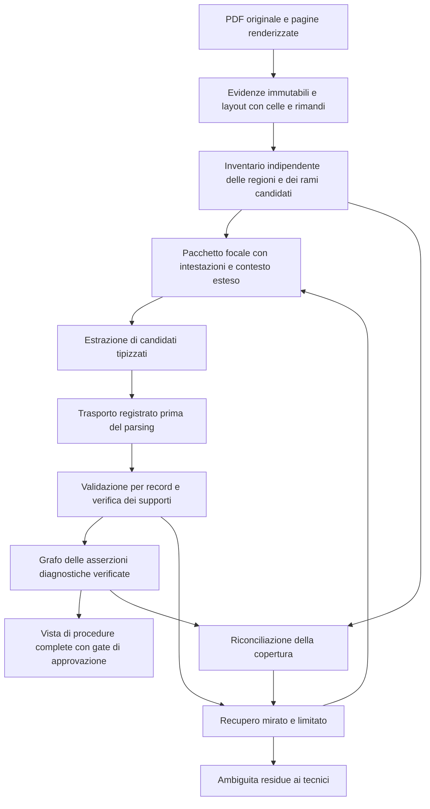

# Analisi e piano per la robustezza dell'estrazione diagnostica

Stato corrente: **implementazione approvata dall'utente con cap cumulativo di 20 USD e ontologia rigida invariata**. La proposta originaria di 40 USD nelle sezioni storiche sottostanti è superata e non autorizza ulteriore spesa. Registro operativo: [autorizzazione](experiments/robustness_20260925/AUTHORIZATION.md) e [rapporto di implementazione](experiments/robustness_20260925/REPORT.md).

L'analisi sottostante fotografa il 25 settembre 2026 prima dell'implementazione, codice `528f0690c8a678dd94fe0e5e385203e4f0d0fbe7`. Le frasi su assenza di modifiche e chiamate si riferiscono a quella prima fase. Documento di coordinamento, non risultato scientifico né certificazione di sicurezza.

## 1. Conclusione e perimetro

Il problema non è soltanto scegliere un modello più capace. La pipeline perde informazione in più punti indipendenti: lettura e selezione delle pagine, inventario dei rami, risposta strutturata indivisibile, collegamento alle evidenze e contratto del grafo. Quest'ultimo privilegia le catene sintomo–guasto–riparazione complete; conserva molte ispezioni soltanto nel ledger e nella revisione. Al tempo stesso, citazioni letterali corrette non dimostrano da sole che una relazione appartenga al ramo giusto.

La proposta è mantenere le evidenze canoniche, la compilazione verificata e i gate, ma introdurre contesto strutturato per ramo con accesso al contesto più ampio, recupero per singolo record e rappresentazione esplicita di ispezioni, condizioni e risultati dei test. Il gold e lo scorer devono essere corretti indipendentemente dalle predizioni prima di usare un aumento di punteggio come prova di miglioramento.

L'obiettivo immediato sono i quattro manuali di sviluppo esistenti. Scrittura del paper, dodici nuovi manuali, generalizzazione blind e consumer industriale non sono prerequisiti di questa fase. I documenti storici restano fonti da valutare. Non si propongono nuove squadre di agenti, un vector database o una riscrittura generale.

### Provenienza e limiti dell'audit

- Stato Git iniziale: modificati `docs/README.md`, `paper/MODEL_DECISION.md`, `paper/README.md`, `paper/STATUS.md`, `paper/manuals/README.md`, `paper/manuals/registry.json`; non tracciati `docs/PIPELINE_SPIEGAZIONE_IT.md` e `paper/experiments/`. Sono preesistenti e da preservare. Questo audit aggiunge documentazione, bibliografia e strumenti di analisi in `paper/`; non modifica il generatore.
- Letti istruzioni, protocollo, decisione sul modello, registro dei manuali, report, osservazioni, manifest, ambiente, budget, runner, analyzer, quattro log e artifact per manuale, oltre ai percorsi attivi del codice e al confronto storico v11.
- [Audit riproducibile](analysis/pipeline_audit_20260925.py) e [risultati offline](analysis/pipeline_audit_20260925.json): 47 hash degli artifact verificati, quattro hash PDF verificati, corrispondenza tra `graph.json` e sottografo in `generation_response.json`. Replay di 141 candidati salvati: nessuna disposizione cambiata. Non è replay delle risposte originali perse, né validazione semantica dei candidati.
- Il runtime locale differisce da quello congelato: PyMuPDF 1.28.0 invece di 1.27.1 e OpenAI SDK 2.44.0 invece di 2.54.0. L'audit legge le evidenze SQLite congelate in sola lettura, senza rigenerarle; Pydantic 2.13.4 coincide. I probe sintetici dimostrano comportamenti del codice locale, non una frequenza di errore sui manuali.
- Verifica visiva mirata dei PDF: Eastman pp. 37–39, Danfoss p. 64, Graco p. 11 e diagramma Hypertherm p. 228; lettura testuale anche delle sezioni diagnostiche Hypertherm. Non è stata eseguita adjudication tecnica dei 34 casi, né un audit esaustivo di tutte le relazioni pubblicate.
- Tutte le pagine citate sono **fisiche, base 1**; i numeri stampati e i rimandi interni vanno registrati separatamente. Il gold non è stato modificato.

## 2. Che cosa mostrano davvero gli artifact

Fonte principale: [pilot congelato](experiments/dev_luna_20260925/REPORT.md), [risultati](experiments/dev_luna_20260925/results.json), [osservazioni](experiments/dev_luna_20260925/OBSERVATIONS.md), [manifest](experiments/dev_luna_20260925/manifest.json), [ambiente](experiments/dev_luna_20260925/environment.json). I tempi sotto sono dell'intero run del singolo manuale, non soltanto della generazione.

| Manuale | Pagine | Tempo, s | Nodi / relazioni | Tipi diagnostici nel grafo | Revisione | Gold storico autonomo |
| --- | ---: | ---: | ---: | --- | ---: | ---: |
| Eastman | 54 | 258,934 | 144 / 145 | 4 sintomi, 6 guasti, 6 azioni | 44 | 3/8 |
| Danfoss | 66 | 114,825 | 35 / 34 | Nessuno: 1 asset e 34 componenti | 23 | 0/8 |
| Graco | 30 | 106,154 | 42 / 41 | Nessuno: 1 asset e 41 componenti | 10 | 0/18 |
| Hypertherm | 231 | 654,585 | 134 / 132 | 6 sintomi, 1 codice, 7 guasti, 7 azioni | 82 | Assente |

Tutti i grafi hanno `approval_eligible=false`. Danfoss ha anche un caso riconosciuto come lacuna esplicita dallo scorer storico. Un grafo di molti componenti non dimostra estrazione diagnostica riuscita; un candidato `publish` non coincide necessariamente con un ramo unico dopo normalizzazione.

| Manuale | Candidati tipizzati persistiti | Record sintetici di accounting | Publish | Review | Gap | Exclude | Passi di ispezione nei candidati |
| --- | ---: | ---: | ---: | ---: | ---: | ---: | ---: |
| Eastman | 61 | 12 | 6 | 15 | 7 | 45 | 7 |
| Danfoss | 12 | 6 | 0 | 13 | 1 | 4 | 3 |
| Graco | 3 | 3 | 0 | 3 | 0 | 3 | 0 |
| Hypertherm | 65 | 18 | 10 | 38 | 18 | 17 | 46 |

Le disposizioni comprendono anche i record sintetici, quindi non sono una misura di recall. I 56 passi di ispezione contano occorrenze, anche ripetute; 16 sono contenuti in candidati `publish` (4 Eastman e 12 Hypertherm), ma neppure questi diventano nodi di ispezione. Il dato non certifica che tutti i 56 passi siano semanticamente corretti. I 159 elementi delle code non sono 159 casi diagnostici distinti: 35 sono segnalazioni di canonicalizzazione ambigua, incluse quelle strutturali.

La campagna ha impiegato 1.152,319 s e 116 chiamate incluso lo smoke test. Il [ledger dei costi](experiments/dev_luna_20260925/real_call_budget.jsonl) contabilizza 0,156349335 USD; 0,139875960 USD derivano dall'usage osservato, il resto da due prenotazioni massime senza usage. Sono valori storici: il precedente cap di 15 USD è concluso e non autorizza nuove spese.

### Dove si interrompono i record

| Manuale / pagine del chunk | Fallimento osservato | Conseguenza documentata |
| --- | --- | --- |
| Eastman 36–39 | `LengthFinishReasonError`: 8.000 completion token, tutti riportati come reasoning | Nessun bundle utilizzabile dal chunk; l'overlap 39–40 recupera quattro candidati pubblicabili, non le pagine precedenti |
| Graco 10–13 | Stesso esaurimento; 8.000 reasoning token | La tabella di p. 11 non arriva alla compilazione; inventario di anchor candidati del chunk vuoto, nonostante 18 finestre advisory |
| Hypertherm 66–70 | Stesso esaurimento | Chunk diagnostico perso |
| Hypertherm 70–74 | HTTP 503, `InternalServerError`, interruzione della connessione a monte | Chunk perso, usage non osservabile |
| Hypertherm 91–95 | `ValidationError` su sei record, indici 5–10, con indicatori vuoti | L'intera risposta è respinta; i record 0–4 non hanno errori riportati, ma senza risposta originale non si può affermare che fossero semanticamente validi |

In questi cinque chunk `provider_response_id` e `raw_sha256` risultano vuoti. I log del primo tipo conservano l'usage tramite l'eccezione del provider; ciò non equivale a conservare la risposta completa. Aumentare soltanto il numero di retry configurato non risolve: il probe offline mostra un solo tentativo effettivo anche con `attempts=3`, perché il livello interno cattura l'errore e restituisce un report anziché propagarne uno ritentabile.

## 3. Diagnosi per stadio: fatti, ipotesi, correzioni e rischi

Nelle voci seguenti **V** indica un comportamento verificato nel codice, negli artifact o nel probe indicato; **H** un effetto sulla qualità ancora da misurare. I riferimenti ai moduli sono alla versione analizzata. Nei percorsi artifact, `P` indica `paper/experiments/dev_luna_20260925` e `R/<id>` indica `P/runs/real/<id>`.

### F01 — Layout e qualità del testo non sono conservati abbastanza

**Sintomo e caso.** Danfoss p. 64 è una tabella con codice, nome, cause e controlli su righe continuate. Graco p. 11 contiene celle di sintomo condivise e 18 rami. Hypertherm p. 228 è un diagramma leggibile nell'immagine, ma il testo nativo contiene sostituzioni e caratteri corrotti: circa 911 caratteri bastano a evitare l'OCR basato sulla soglia di lunghezza.

**Responsabilità.** `backend/adapters/pdf.py`: `inspect`, `_layout_reading_order`, `_semantic_page_units`, `evidence_units_to_legacy_pages`; `backend/services/pdf_service.py`: `apply_selective_ocr`. Le tabelle diventano righe testuali con separatori; non si conserva un modello completo di celle, intestazioni, rowspan/colspan e collegamenti fra continuazioni. La deduplicazione semantica privilegia il testo e può eliminare una rappresentazione di riga già presente nei blocchi. Sul PDF congelato Danfoss p. 64 passa da 48 unità canoniche a 44 anchor resi; Graco p. 11 da 52 a 33. **V:** trasformazioni e conteggi; **H:** quota di errori causata da ciascuna trasformazione.

**Informazione persa.** Posizione e ruolo della cella, eredità del sintomo, associazione causa–controllo, identità di occorrenze testualmente uguali, frecce e uscite Yes/No. Un testo più lungo non è necessariamente un OCR migliore.

**Intervento e prova.** Conservare blocchi originali più struttura geometrica di celle e intestazioni, con provenienza e trasformazioni; qualità testuale basata anche su caratteri anomali, densità e coerenza. Tentare OCR locale delle pagine degradate e confrontare testo/immagine; per diagrammi estrarre nodi e archi separatamente, con verifica visiva. Test su celle condivise, ordine a due colonne, continuazione Eastman 37→38 e diagramma p. 228; misurare associazioni corrette, non solo caratteri recuperati. **Rischio:** OCR che altera codici o unità e unisce celle sbagliate; mai sostituire silenziosamente la fonte nativa né inferire frecce dall'ordine del testo.

### F02 — Scoping e inventario non garantiscono copertura indipendente dall'LLM

**Sintomo e artifact.** In `R/hypertherm_powermax30_air/graph.json`, pp. 85 e 228 non sono selezionate: la prima contiene valori di test, la seconda il diagramma. Il filtro linguistico sul testo congelato le respinge. I rimandi ai test non garantiscono che le pagine destinazione vengano lette: avere tutte le 231 pagine in `retrieval_pages` non significa averle estratte. In Graco il chunk fallito dichiara zero anchor candidati anche se la pagina della tabella è riconosciuta diagnostica.

**Responsabilità e causa.** `cutplan_service.py`: `has_supported_language_content`, `page_has_diagnostic_candidate`, `evidence_has_diagnostic_candidate`; `scoping_workflow.py`: `create_cut_plan_workflow`; `pdf_source_subgraph_generation.py`: `PdfSourceSubgraphBuilder.build_revision`; `ontology_pipeline.py`: `_diagnostic_input_inventory`, `_synthetic_scope_entries`. **V:** filtro a rapporto di parole comuni, ripristino esplicito delle pagine componenti, inventory basata su anchor che soddisfano euristiche lessicali. Il filtro viene saltato solo se rimuove oltre metà delle pagine; non protegge singole pagine diagnostiche numeriche. Le finestre advisory sono 22/8/18/4, ma non determinano il denominatore effettivo. `diagnostic_page_coverage_complete=true` anche con chunk falliti indica pagine inviate, non casi recuperati.

**Perdita / intervento.** Costruire un inventario di regioni e rami da layout, sezioni, intestazioni, segnali lessicali e rimandi; usare l'unione dei segnali e campionare gli esclusi. Un filtro linguistico segnala bassa qualità, non elimina una tabella diagnostica. Seguire rimandi con mappa pagina stampata→fisica e limiti di profondità/volume. Registrare per ogni unità: candidata, letta, estratta, valida, verificata, rappresentata, esclusa con motivo oppure irrisolta.

**Test e rischio.** Rimuovendo artificialmente tutta la risposta LLM, l'inventario deve comunque segnalare le righe Graco mancanti. Pagine 85/228 non devono sparire. Misurare recall dello scoping contro l'inventario umano e costo dei falsi candidati. Il rischio è includere molte pagine irrilevanti o cicli di rimandi: limitare il recupero, non dichiarare copertura completa quando il limite impedisce di finire.

### F03 — v12 corregge un limite di v11, ma perde parte dei vincoli strutturali

**Fatto.** `ontology_workflow.py`: `draft_ontology_workflow`, `_split_pages_by_section`, `_diagnostic_output_token_limit` usa chunk semantici di pagine, mentre le finestre diagnostiche sono advisory. Le precedenti utilità `_bind_candidates_to_record_windows`, `_complete_structural_edge_evidence` e il recupero univoco entro finestra esistono, ma il percorso corrente non fornisce quelle finestre come vincolo. Il probe con `max_pages=4`, overlap 1 produce chunk di 4, 5 e 2 pagine: l'overlap è aggiunto dopo il packing. Analogo rischio per il limite di caratteri.

**Interpretazione.** Il contesto largo è sensato per prose, continuazioni e test; tornare a finestre obbligatorie v11 escluderebbe ciò che il rilevatore non riconosce, particolarmente Hypertherm. Ma cinque pagine con molti rami richiedono più output e lasciano al modello anche l'associazione alle celle. Non è dimostrato che l'ampiezza, da sola, causi i tre esaurimenti.

**Intervento.** Confrontare tre politiche sullo stesso codice: pagine ampie; unità strutturali con intestazione/continuazione; unità focali con contesto di sezione e rimandi disponibili. Budget dopo l'overlap, basato anche su densità di rami/output atteso. Le unità strutturali non diventano un nuovo filtro di ammissione esclusivo.

**Prova / rischio.** Stessi input canonici, modello, reasoning e schema; misurare rami mancanti, mescolati e troncamenti. Il rischio è ricreare il collo di bottiglia v11: mantenere un percorso per diagnostica in prosa e unità non classificate.

### F04 — Output e reasoning competono nello stesso limite

**V:** i tre errori da 8.000 token sono in `P/<manual_id>.log` e nei ledger dei chunk. `ontology_pipeline.py::_call_diagnostic_bundle_llm` richiede JSON con anchor lunghi e citazioni ripetute per claim e collegamenti. Il limite include reasoning e testo visibile: non è un budget di 8.000 token di JSON. La causa interna del ragionamento del modello non è osservabile.

**Intervento.** Registrare separatamente prompt, reasoning, output visibile e finish reason. Confrontare `low/8k`, `low/24k`, `none/24k` su pacchetti identici, quindi contesto più piccolo a cap fisso. Usare ID locali brevi mappati deterministicamente agli anchor canonici e supporti referenziabili, senza perdere le citazioni. Evitare un solo enorme bundle per tabella. Non promettere che più reasoning migliori l'accuratezza.

**Verifica / rischio.** Tasso di risposta completa, recall dei rami e precisione semantica, costo del risultato utile; output maggiore potrebbe soltanto produrre più errori. Un retry dopo truncation cambia una sola leva alla volta: suddivisione strutturale oppure cap, con motivazione registrata.

### F05 — Un record invalido invalida la risposta intera

**Caso.** Hypertherm 91–95, sei record senza indicatori. `domain/diagnostic_bundles.py::DiagnosticBundleCandidate` vieta correttamente il record diagnostico senza indicatore; `DiagnosticChunkOutput` e il parsing SDK validano il contenitore intero. `_call_diagnostic_bundle_llm` restituisce allora zero candidati. Il probe con un record valido e uno invalido riproduce il comportamento. Non bisogna rendere facoltativi gli indicatori necessari per far passare il bundle.

**Intervento.** Conservare l'envelope originale prima del parsing; separare validità JSON/envelope, validazione schema di ogni record e verifica semantica. I record validi proseguono con gli stessi controlli; gli invalidi mantengono indice, payload, errori e unità sorgente. Recuperare il singolo record con il suo contesto. Un pezzo di JSON troncato non è automaticamente un record completo: ammettere solo oggetti integralmente decodificabili con provenienza certa, altrimenti ripetere l'unità.

**Test / rischio.** Iniezione di un record invalido non deve alterare gli altri; nessun invalido entra nel grafo. Un record senza sintomo può essere una continuazione: ereditare l'indicatore soltanto da una relazione strutturale verificata, non dalla vicinanza libera. Rispetto all'attuale tutto-o-niente il recupero può perdere dipendenze fra record: validare anche i riferimenti incrociati.

### F06 — Anchor e citazione vengono ricopiati e possono divergere

**Caso verificato.** Danfoss p. 64: `ev_e5afd58033ce44902f2fb94c0b62` contiene «modules have repeated IDs.», ma una ispezione cita «the individual modules.». Il compilatore respinge correttamente il riferimento. Il chunk della tabella produce otto candidati: sette in revisione e uno gap. Nei relativi errori compaiono 23 mismatch di citazione e un anchor sconosciuto; sono occorrenze di errore, non 24 casi indipendenti.

**Responsabilità.** Prompt diagnostico, `_call_diagnostic_bundle_llm`; `diagnostic_bundle_compiler.py::_resolve_span`, `_resolve_unique_window_direct_span`, `_validated_bundle`. Il recupero univoco locale già presente richiede un ambito strutturale che il percorso v12 non passa.

**Intervento.** Il sistema assegna gli ID del pacchetto, riga e cella; il modello seleziona supporti locali. Riallineamento automatico solo se citazione esatta, unica e compatibile con ruolo/cella/ramo nell'ambito autorizzato. Registrare anchor originale e corretto. Match multipli, fuzzy match, numeri diversi o ricollocazione fuori ramo restano irrisolti; eventuale nuovo tentativo vede il frammento pertinente.

**Verifica / rischio.** Fixture reale Danfoss più citazioni duplicate su righe vicine: il caso univoco può recuperarsi, gli ambigui no. Evitare di trasformare una citazione autentica ma riferita alla riga sbagliata in un falso supporto deterministico.

### F07 — Grounding letterale e supporto semantico sono controlli diversi

**V:** un probe costruisce «Pump stops» nella riga filtro e «fan is broken / Replace the fan» nella riga motore. Tutte le citazioni sono letterali; il compilatore produce `publish` e due relazioni, inclusa sintomo→guasto fra righe diverse. Questo dimostra un varco del contratto, non che tutte le relazioni reali siano errate.

**Responsabilità.** `diagnostic_bundle_compiler.py::_validated_bundle`, `_validate_window_lineage_membership`, `_compile_published`; `evidence_grounding_service.py::ground_relation_evidence`. Inoltre `diagnostic_publication_service.py::_grounded_copy` può scartare riferimenti invalidi e mantenere quelli validi: occorre distinguere prove alternative da parti tutte necessarie di una prova multipagina.

**Intervento.** Verificare sia la localizzazione sia che l'insieme dei supporti giustifichi gli endpoint, il tipo di relazione e la condizione. Per tabelle con struttura certa, intestazioni + coordinate + eredità di cella costituiscono una regola esplicita e testabile. Per prosa o tabelle incerte, secondo controllo semantico focalizzato, senza attribuirgli infallibilità; dissensi persistenti all'uomo. Modellare supporti con semantica ALL/ANY dichiarata, non «basta una citazione valida».

**Prova / rischio.** Negative controls con citazioni vere/ramo falso, colonne scambiate, negazione, codice diverso e multipagina incompleto; zero promozioni dei casi negativi. Un verificatore LLM può condividere gli errori dell'estrattore: controlli deterministici e campionamento umano degli accettati restano necessari. Nessun allentamento del matching letterale per gonfiare il recupero.

### F08 — Il contratto perde ispezioni, condizioni e conoscenza senza riparazione

**V:** 56 passi di ispezione persistiti, nessun tipo `Inspection` nel grafo. `_classify_candidate` e `_compile_published` richiedono guasto e azione per la catena pubblicata; `build_publication_graph` seleziona percorsi completi. `DiagnosticBundleCandidate` ha `inspection_steps`, ma non condizioni, risultati di test, ordine o riferimenti procedurali tipizzati. La severity è obbligatoria per un sintomo anche quando il manuale non la dà; un contesto materiale assente può diventare asset-level nel compilatore.

**Esempi.** Danfoss contiene controlli prescritti senza riparazione: devono essere conoscenza utilizzabile come controlli, non azioni inventate. Hypertherm p. 77, codice quattro lampeggi: entrambi i test superati→power board; test 4 fallito→valvola; test 8 fallito→ventola. Nei candidati pubblicabili alcune condizioni rimangono in `instruction_text`, ma non sono interrogabili come esiti di rami. Eastman p. 39: controllare specchi/lente/ugello prima di pulire o sostituire «as required»; il grafo non conserva il controllo come passo distinto.

**Intervento.** Schema versionato per osservazione/codice, guasto possibile, componente, ispezione, esito, condizione, azione e riferimenti/ordine. Distinguere `not_stated`, `unknown`, `not_recovered`, `ambiguous`; non inventare causa, severity o contesto. Una conoscenza parziale rispetto alla catena ideale può essere completa rispetto a ciò che il manuale afferma. Il grafo delle asserzioni verificate la conserva; la vista di procedure correttive richiede ancora condizioni e passi completi, oltre all'approvazione prevista.

**Test / rischio.** Danfoss check-only, Graco «Clear» con oggetto ereditato, Hypertherm rami opposti e Eastman continuazioni. Nessuna ispezione deve diventare riparazione; nessuna azione condizionale diventa incondizionata. Migrazione esplicita e compatibilità dei consumer: aggiungere tipi cambia il contratto e non si risolve cambiando soltanto `approval_eligible`.

### F09 — Identità del ramo, deduplicazione ed export vanno separati

**V:** `diagnostic_branch_lineage_id` dipende dal contenuto serializzato del candidato; cambiare descrizione può cambiare ID senza cambiare ramo sorgente. `_merge_pipeline_results` e `ontology_canonicalization_service.py::_safe_identity_equivalent` unificano entità per criteri testuali/tipizzati. Non è stata misurata la frequenza di fusioni scorrette nel pilot. Rischi specifici: down/up-stroke, codici numerici, condizioni opposte e due componenti omonimi in contesti diversi.

**V:** l'export legacy `models.py::ExportOntologyRelationship` e `ontology_contract.py::_normalize_relationships` non conservano la lineage di ramo. Questo è un percorso distinto dal `graph.json` del pilot, che la conserva: il rischio emerge nel passaggio a consumer/export legacy, non spiega da solo i punteggi del pilot.

**Intervento / verifica.** ID di occorrenza sorgente basato su documento/revisione/regione e ramo; ID concettuale distinto; normalizzazione non deve cancellare condizioni o codici. Deduplicare estrazioni sovrapposte senza sommare copie come nuovo recall. Test di round-trip e query con due rami condividenti un guasto: nessuna combinazione incrociata dopo merge, export o reload. **Rischio:** frammentazione di sinonimi; preferire alias verificabili a fusioni non reversibili.

### F10 — Recovery configurato e recovery effettivo non coincidono

**V:** `_run_chunk_with_retry` ritenta eccezioni, ma `_call_diagnostic_bundle_llm` le converte in report. `_finalize_run_level_quality` evita i passaggi legacy coverage/resolution-completion in modalità relation-first; flag configurati non significano che quei passaggi operino. Nel pilot escalation disabilitata, un tentativo per chunk.

**Intervento.** Stato esplicito del tentativo: transient transport, incomplete output, envelope invalid, record invalid, grounding mismatch, semantic ambiguity, source gap. Politiche diverse e persistite: fino a due retry di trasporto con backoff; retry solo dell'unità fallita; ricontestualizzazione per continuazioni; escalation selettiva dopo fallimento verificabile. Limite per unità e globale, progressi già acquisiti mantenuti, ripresa idempotente.

**Verifica / rischio.** Fault injection 503/timeout/truncation/record invalido/costo esaurito; conteggio dei tentativi e costi, nessun rerun dell'intero manuale, nessun duplicato. Il rischio è un ciclo di retry costoso o la selezione della risposta che pubblica più relazioni ma sbaglia: selezionare con vincoli di correttezza e copertura, non con il solo numero di `publish`.

### F11 — Osservabilità incompleta e riproducibilità fragile

**V:** persistenza dei candidati e di alcuni hash/report, ma assenza dei raw envelope per i fallimenti; `ValidationError` locale può nascondere usage al wrapper di `llm_gateway.py`. Il ledger persistente `real_call_budget_ledger.py` conserva prudentemente la prenotazione massima: questa protezione va mantenuta.

**Intervento.** Catturare risposta e usage al confine di trasporto **prima** della validazione, conservando request/response ID, modello richiesto/restituito, prompt e schema hash, finish/refusal/incomplete, status HTTP, errori con indice, output grezzo, timestamp, retry parent, costi osservati/prenotati. Non tentare di ottenere il ragionamento interno: servono conteggi e output disponibile. Per errori senza risposta indicare assenza esplicita. Replay senza rete dal raw alla compilazione e dal candidato al grafo. API endpoint invariato finché un confronto non giustifica una migrazione.

**Test / rischio.** Usage registrato anche quando Pydantic fallisce; unknown usage mai zero; crash dopo prenotazione e prima del commit; redazione delle credenziali nei log. Manifest con hash di tutti i file eseguibili anche dirty, prompt, schema, config, PDF, evidenze, versioni librerie/OCR e tariffario. Cache PDF invalidata per versione/configurazione dell'estrattore, non soltanto per etichetta `pdf-v3`.

### F12 — La coda umana confonde incertezza reale e guasti automatici

**V:** 159 item di revisione e nessun grafo approvabile. I report includono mismatch, mancate disposizioni, incompletezze e canonicalizzazioni; non sono 159 quesiti tecnici indipendenti. L'esatta utilità per un tecnico non è stata misurata.

**Intervento.** Prima il recupero tecnico automatico; poi raggruppamento per ramo e causa primaria. Mostrare al revisore fonte con celle/evidenze, interpretazioni alternative, informazioni mancanti e decisione richiesta. Un controllo chiaramente prescritto non richiede adjudication soltanto perché manca una riparazione. Non eliminare problemi dal report per ridurre la coda: backlog tecnico, vera ambiguità e campione di audit devono restare visibili e separati.

**Test / rischio.** Tecnici classificano ogni item campionato per utilità, correzione e tempo; audit anche di accettati/esclusi per scoprire errori non segnalati. Nessuna selezione basata solo sulla confidence dichiarata dal modello. Minori item non dimostrano minore lavoro se contengono più rami o decisioni.

## 4. Gold e scorer: audit critico

### Gold storico

Il [gold originario](../artifacts/acceptance/g3/diagnostic_benchmark_20260812/golden.json), SHA-256 `c92ba0a8bcb1721055f6fc8c10c3d0a6a57eb3dc35134755d06574d6272a5291`, contiene 8 casi Eastman rappresentativi, 8 Danfoss e 18 Graco in perimetri selezionati. Non è gold esaustivo dei tre manuali. Tre casi Danfoss e uno Graco sono marcati gap: pretendere 34/34 catene complete cambierebbe il compito, perché il massimo per quella interpretazione è 30/34. La conoscenza check-only può invece essere recuperata fedelmente nel nuovo contratto.

L'esame dei PDF identifica **questioni da sottoporre ai tecnici**, non correzioni già validate:

| Fonte | Questione da risolvere senza guardare le predizioni |
| --- | --- |
| Eastman 37–38 | Calibrazione touch continua nella pagina successiva; la procedura completa e le precondizioni non sono una sola coppia causa/azione. Nel mancato abbassamento utensile vi sono più cause e controlli; non assegnare una riparazione a tutte per vicinanza |
| Eastman 38 | Ridotto vuoto dell'estrattore fumi: elenco di interventi, senza esplicitare una distinta causa «filtro guasto». Un gold che aggiunge la causa va motivato o corretto |
| Eastman 39 | Il caso storico del percorso laser largo comprime danno e piegatura dell'ugello, ma la sostituzione è condizionata al danno. Nei casi lente/specchi/ugello, conservare «as required», controllo precedente e alternative clean/replace |
| Danfoss 64 | Codice numerico e nome sono campi distinti; due cause possono condividere un controllo. La tabella prescrive anche ispezioni senza riparazione. Non prendere automaticamente una sostituzione ventola dal paragrafo di manutenzione sopra la tabella. Numerazioni ripetute e refusi esistono già nel PDF |
| Graco 11 | Conservare i cinque gruppi di sintomi, le celle condivise e up/down-stroke; i 18 rami della tabella si distribuiscono 4+6+2+1+5. La nota con asterisco, i rimandi e l'avviso sull'icing richiedono perimetro esplicito; non sono coperti solo contando 18 righe |

I candidati Danfoss della tabella usano i nomi come `code`, senza preservare i numeri 1–6. È una perdita importante che lo scorer storico non controlla. Né queste predizioni né i vecchi errori devono guidare il contenuto delle nuove risposte gold.

### Limiti verificati dello scorer

Il pilot importa analyzer storici tramite `analyze_results.py`; il confronto eredita `MATCH_FLOOR=0.55` e wrapper successivi. Percorsi da rendere indipendenti: `diagnostic_benchmark_20260812/analyze_campaign.py`, `diagnostic_benchmark_second_hardening_20260813/analyze_campaign.py`, relativi wrapper del percorso v11.

- Matching lessicale su campi e contesti estesi, non equivalenza diagnostica: il probe effettivo ottiene 0,90 per «fan works» / «fan does not work», 1,00 per «Replace the seal» / «Do not replace the seal», 0,72 per down-stroke / up-stroke. Tutti superano 0,55. «Replace» / «Check» isolati ottengono 0,467: non è corretto dire che qualunque ispezione venga scambiata per riparazione; il contesto esteso può comunque contaminare il matching.
- Non vi è un'assegnazione globale uno-a-uno fra predizioni e riferimenti. Massimi indipendenti permettono di riusare una predizione per casi diversi e non penalizzano correttamente i duplicati.
- Codice errore, condizioni e polarità non costituiscono vincoli duri. La lineage viene usata nella costruzione più recente dei percorsi, ed è utile, ma non dimostra l'identità semantica del ramo gold.
- Le pagine non sono un vincolo completo per il match autonomo; il semplice overlap nella revisione non risolve supporti multipagina e componenti diversi sulla stessa pagina.
- Il flag testuale `exhaustive...` può classificare come non supportate predizioni dell'intero manuale non abbinate, senza restringere al perimetro annotato. «Non abbinata lessicalmente» non significa «falsa»; «fuori gold» non significa «corretta».
- Accounting, gap dichiarato, item di review e recupero autonomo misurano cose differenti. Non sommarli come se fossero recall diagnostico. I percorsi completi non misurano il recupero fedele delle ispezioni.

**Nuovo scorer proposto:** normalizzazione conservativa di unità/alias, vincoli duri su codice, polarità, esito, ramo e tipo check/action; matching bipartito uno-a-uno su asserzioni e separatamente su rami. Sinonimi approvati nel manuale di annotazione; parafrasi dubbie adjudicate senza usare il generatore come giudice definitivo. Annotare duplicati, extra supportati, extra errati e fuori perimetro non valutati. Valutare supporto semantico oltre alla posizione dell'evidenza. Conservare e rieseguire anche lo scorer storico per continuità, con nomi di metrica distinti.

I 25/34 autonomi e 33/34 contabilizzati di v11 restano risultati storici: modello GPT-5.6 Luna medium, escalation GPT-5.6 Terra medium fino a due finestre, budget e contesto diversi, tre manuali e codice dirty. Non sono un confronto causale con GPT-6 Luna low. Il commit da solo non ricostruisce quel run: usare manifest e hash dell'albero; se manca il sorgente esatto, dichiarare non riproducibile la versione originaria e chiamare un eventuale port «strategia simile a v11», non rerun v11.

## 5. Architettura proposta e alternative da verificare

**Mantenere:** hash dei PDF e delle evidenze, unità canoniche e locator, schemi tipizzati, distinzione candidati/compilazione, ledger delle disposizioni, controllo budget persistente, lineage nelle proiezioni correnti, gate e traccia delle revisioni. Le risorse già presenti permettono interventi incrementali.

**Cambiare i confini di responsabilità:** il lettore stabilisce le occorrenze e la geometria; il sistema costruisce il contesto e gli ID; l'estrattore propone contenuti e collegamenti; il verificatore controlla ogni asserzione e il relativo ramo; il compilatore conserva solo conoscenza verificata; il gate operativo richiede i passi necessari. La distinzione candidate/verified/approved deve essere leggibile anche al consumer.

Schema proposto minimo: `DiagnosticBranch` con osservazioni/codici, componenti e guasti possibili; passi tipizzati `Inspection` o `CorrectiveAction`; condizioni/esiti con polarità, numeri e unità; ordine e alternative esplicite; riferimenti a procedure e precauzioni pertinenti. Ogni asserzione e collegamento hanno supporti e stato. Non tutti i campi devono essere presenti quando il manuale non li afferma. La struttura esatta va validata con i tecnici sui documenti prima di migrare il contratto.

L'estrazione per passaggi ha responsabilità concrete: inventario/layout → candidati → verifica/compilazione → recupero. Non implica quattro chiamate LLM per ogni riga: inventario, associazione locale, validazione e compilazione sono deterministici dove possibile; il controllo semantico aggiuntivo serve sui collegamenti non risolti dalla struttura. Un confronto misurerà se l'estrazione con contesto ibrido supera realmente quella per pagine e quella per righe.

La prima escalation candidata è GPT-6 Sol, su unità persistenti difficili e non su tutto il manuale. GPT-5.6 Luna è un controllo per l'effetto modello; Terra resta riferimento storico, non un nuovo default implicito. `llm_gateway.py` e il tariffario devono supportare esplicitamente modello, reasoning e limiti: ora l'allowlist riconosce GPT-6 Luna, non genericamente ogni GPT-6. Nessuna chiamata con fallback di prezzo o parametri non verificati.

## 6. Ricerca mirata: idee applicabili e loro limiti

Fonti primarie e documentazione ufficiale consultate; chiavi aggiunte o già presenti in `references.bib`. Nessuna pubblicazione dimostra in anticipo un guadagno sui quattro PDF.

| Idea e fonte | Collegamento ai fallimenti | Cambiamento concreto | Verifica del beneficio / limite della fonte |
| --- | --- | --- | --- |
| Schema guidato dall'ontologia — [van Cauter e Yakovets, 2024](https://aclanthology.org/2024.kallm-1.8/), `vancauter2024maintenance` | F08: ruoli diagnostici confusi o assenti | Tipi distinti e pochi esempi sintetici di check, condizione e rimedio; esempi generici, senza risposte o nomi benchmark | Ablation zero-shot/esempi a schema fisso; lavoro su brevi testi manutentivi, non validazione di layout PDF |
| Struttura di tabelle — [PubTables-1M](https://arxiv.org/abs/2110.00061), `smock2022pubtables`; [PyMuPDF Page](https://pymupdf.readthedocs.io/en/latest/page.html#Page.find_tables), `pymupdf2026tables` | F01/F06: intestazioni e celle condivise perse | Conservare celle/bbox/header già esposti dalla libreria; misurare la struttura prima di considerare un detector aggiuntivo | Annotazione di righe, colonne ed eredità su Danfoss/Graco; benchmark PubTables su articoli scientifici, non trasferimento garantito ai manuali |
| Relazioni con selezione delle evidenze — [Eider](https://aclanthology.org/2022.findings-acl.23/), `xie2022eider` | F03/F07: troppo contesto e prove non pertinenti | Pacchetto focale con prove del ramo più contesto esteso accessibile; verifica separata dei supporti | Confrontare full-page/focale/ibrido, soprattutto relazioni fra righe sbagliate; lavoro supervisionato su document-level RE, non ricetta pronta per questo LLM |
| Posizione delle informazioni nei documenti lunghi — [Lost in the Middle](https://aclanthology.org/2024.tacl-1.9/), `liu2024lost` | F03/F04: finestre ampie non garantiscono uso corretto di tutti i rami | Ordinare focalmente fonte/istruzioni e testare continuazioni; budget basato sulla densità | Spostare lo stesso ramo in inizio/mezzo/fine del contesto; la fonte riguarda altri modelli e task, non prova un difetto specifico di Luna |
| Output strutturato e validazione locale — [OpenAI Structured Outputs](https://developers.openai.com/api/docs/guides/structured-outputs), `openai2026structured`; [Pydantic](https://docs.pydantic.dev/latest/concepts/models/#error-handling), `pydantic2026models` | F05/F11: validità dello schema e correttezza sono distinte | Salvare trasporto prima del parse; controlli per record, errori localizzati, gestione esplicita incomplete/refusal | Fault injection e replay con record misti; uno schema garantito dal provider non garantisce significato né recuperabilità della risposta persa |
| Budget di reasoning — [OpenAI Reasoning](https://developers.openai.com/api/docs/guides/reasoning), `openai2026reasoning`; [GPT-6 Luna](https://developers.openai.com/api/docs/models/gpt-6-luna), `openai2026luna` | F04: reasoning esaurisce il cap | Confronti cap/effort separati, logging reasoning e output | JSON completo e qualità per dollaro; il consiglio generale di riservare più output non è una soglia ottimale per questi PDF |
| Revisione selettiva — [Mozannar et al., 2023](https://proceedings.mlr.press/v206/mozannar23a.html), `mozannar2023defer` | F12: astenersi su quasi tutto non è qualità | Valutare rischio/copertura e prestazioni combinate sistema+tecnico; misurare utilità e minuti degli item | Audit stratificato di accettati, esclusi e deferiti. Non introdurre subito l'algoritmo di apprendimento/MILP dell'articolo: mancano dati di decisioni umane |

I metodi ibridi qui raccomandati sono limitati a vincoli verificabili: geometria di tabella, codici, unità, riferimenti e identità delle occorrenze; i modelli trattano linguaggio e ambiguità. Regole specifiche per un produttore, manuale o risposta gold non entrano in produzione.

## 7. Piano operativo per dipendenze e priorità

Responsabili: **sviluppo** = Codex dopo approvazione con revisione del maintainer; **valutazione** = responsabile del protocollo/scorer; **tecnici** = annotatori competenti e adjudicator; **utente** = approvazione di scopo, contratto e budget. Non implica l'avvio di agenti aggiuntivi.

| ID / problema | Intervento | File/moduli principali | Responsabile | Verifica | Criterio di completamento |
| --- | --- | --- | --- | --- | --- |
| P0 — F11, baseline fragile | Snapshot immutabile di codice/config/evidenze; runner nuovo configurabile; cattura raw prima del parse | `llm_gateway.py`, `real_call_budget_ledger.py`, runner sotto `scripts/` da definire; `paper/experiments/` | Sviluppo | Replay con rete disabilitata; failure con usage; crash ledger | Ogni tentativo spiegabile, baseline intatta, nessuna credenziale negli artifact |
| P1 — scorer/gold | Specifica di annotazione, audit dei 34 casi, gold Hypertherm e scorer indipendente | Gold versionati separati; `paper/evaluation/`; nuovo scorer e test | Valutazione + tecnici | Due annotazioni indipendenti, adjudication, negative controls | Perimetri/denominatori congelati; nessuna proposta LLM etichettata verified |
| P2 — F04/F05/F10 | Parsing per record e recovery mirato con stato persistente | `ontology_pipeline.py`, `ontology_workflow.py`, gateway, schema envelope | Sviluppo | Record misti, 503, truncation, budget esaurito | Record validi preservati; retry tracciati e limitati; nessun invalido promosso |
| P3 — F01/F02/F03/F06 | Layout/celle, qualità OCR, inventario indipendente, pacchetti e rimandi, ID locali | `adapters/pdf.py`, `pdf_service.py`, `cutplan_service.py`, `scoping_workflow.py`, `pdf_source_subgraph_generation.py`, `diagnostic_record_windowing.py`, prompt | Sviluppo; tecnici per layout ambiguo | Fixture dei quattro PDF + casi sintetici non benchmark | Nessuna riga nota scompare senza stato; pagine numeriche/diagrammi gestite; ancoraggi univoci verificati |
| P4 — F07/F08 | Schema diagnostico e compilatore per asserzioni, condizioni, ispezioni e supporti completi | `domain/diagnostic_bundles.py`, schema ontologico, `diagnostic_bundle_compiler.py`, grounding, publication service | Sviluppo + tecnici per contratto | Rami condizionali, controlli senza rimedio, citazioni vere/relazione falsa | Conoscenza fedele conservata; controlli semantici più forti; gate operativo esplicito |
| P5 — F09/F12 | Identità, export senza perdita, copertura e revisione utile | Canonicalization, `graph_projection_service.py`, `ontology_contract.py`, modelli/export, review report | Sviluppo + valutazione | Round-trip, duplicati, query per ramo e audit delle code | Nessuna fusione/cross-join illecito nei test; conteggi per unità e tempo umano misurabili |
| P6 — profilo e causalità | Pilot controllato e ablation; selezione profilo ed escalation | Nuovo runner e config congelate | Sviluppo + valutazione | Matrice del §10, qualità contro gold tecnico | Scelta motivata da qualità/costo e risultati negativi riportati |
| P7 — qualità sui documenti | Tre run baseline e tre candidati per ciascuno dei quattro manuali; confronto umano | `paper/experiments/<nuova-campagna>/`, report generato | Valutazione + tecnici | Criteri del §11, tutte le esecuzioni contabilizzate | Qualità/copertura/rami/evidenze/revisione documentati, oppure fallimento esplicito |

Dipendenze: P0 precede modifiche funzionali e API; P1 può avanzare mentre si preparano i contratti, ma il gold va congelato prima del confronto decisivo. P2 e P3 richiedono P0; P4 richiede il contratto discusso in P1 e supporti strutturati di P3; P5 segue P4; P6 richiede contratti testabili e gold disponibile per le unità del pilot; P7 segue il congelamento di P1/P6. Gli incrementi hanno commit e report separati: nessun refactoring cosmetico mescolato al fix che deve essere misurato.

## 8. Pulizia della repository

| Priorità | Evidenza | Azione proposta e limite |
| --- | --- | --- |
| Necessaria: riproducibilità | `.venv` diverge dall'ambiente del pilot; dipendenze in parte ampie; cache PDF non include tutte le variabili dell'estrattore | Ambiente bloccato con hash/versioni, controllo iniziale e cache fingerprint; non aggiornare librerie insieme a un'ablation sul prompt |
| Necessaria: runner/scorer | Otto `run*.py` e sette `analyze*.py` nelle campagne storiche esaminate; runner corrente importa e modifica comportamento di runner storico, analyzer in catena | Nuovo entry point parametrico, import di libreria per reporting e schema dei manifest; artifact passati immutabili. Test che il generatore non acceda a gold, ID o scope del benchmark |
| Necessaria: configurazione | `diagnostic_atomic_*` inattivi sul percorso v12; completion flag esclusi nel typed path; retry non effettivo; prezzi e parametri con fallback per modello | Validazione config per strategia, warning/errore su opzioni inattive, registro esplicito capacità/prezzi; nessun nome modello sconosciuto accettato a tariffa altrui |
| Necessaria: contratti | Percorsi typed, ontology legacy e triplette; export legacy perde lineage | Mappa route→servizio→schema→consumer; contratto versionato, deprecazione esplicita degli export non rappresentativi e test di compatibilità |
| Utile, successiva | Moduli grandi: compilatore circa 1.947 righe, workflow 1.906, pipeline 1.765, builder PDF circa 1.450 | Estrarre trasporto, packing, validazione e compilazione dopo i test; nessuna riscrittura. Non sono state trovate copie identiche di funzioni lunghe nel controllo AST, quindi non dichiarare duplicazione letterale non osservata |
| Utile, successiva | Stato globale di parse-repair e più percorsi di normalizzazione | Metriche per run e isolamento delle responsabilità; verificare concorrenza/replay prima di rimuovere helper. Non chiamare morto un percorso soltanto perché non usato dal pilot |
| Documentazione corrente | README/documenti descrivono ancora v11 come struttura finale; STATUS contiene baseline storiche insieme al nuovo pilot | Matrice delle versioni e link al contratto attivo; correggere in incremento documentale separato preservando le modifiche dell'utente a `docs/README.md` e `docs/PIPELINE_SPIEGAZIONE_IT.md` |
| Archivio, senza cancellazioni | Molte campagne e piani storici, inclusi v11, gold e manuali | Indice con commit/tree hash/config/ambiente/scorer; etichette superseded/development, provenienza e comandi di replay. Nessuno spostamento che rompa i percorsi prima di avere un resolver; nessuna cancellazione di dati o artifact |

## 9. Piano del gold e responsabilità umane

Conservare il gold storico byte per byte. Creare una nuova versione con ID stabili, changelog per caso, motivazione documentale, pagina/bbox/cella, annotatore, reviewer, stato e relazione con l'ID precedente. Stati distinti: `agent_proposed`, `technician_annotated`, `adjudicated`, `unresolved`. Solo l'ultima validazione tecnica risolta entra nel gold primario; le ambiguità escluse restano contate e descritte, non spariscono dal denominatore delle difficoltà.

L'assistente può preparare trascrizioni, pacchetti di pagine, annotazioni proposte e controlli meccanici. Due tecnici annotano indipendentemente dal PDF, senza predizioni del sistema; un adjudicator risolve i disaccordi. Se non sono disponibili due annotatori, una verifica tecnica con secondo controllo mirato è un compromesso da dichiarare, non equivalente alla doppia annotazione. I tecnici stabiliscono significato di condizioni, alternative/congiunzioni, causalità esplicita o soltanto possibile, riparazione/ispezione, numeri/unità e precondizioni di sicurezza. Nessuna inferenza LLM diventa gold perché plausibile.

| Documento | Perimetro proposto della nuova annotazione | Relazione con il vecchio gold |
| --- | --- | --- |
| Eastman | Tutta la guida diagnostica pp. 37–39, inclusa continuazione della calibrazione; riferimenti necessari come contesto tracciato | Verificare gli 8 casi e annotare i restanti rami del perimetro; mantenere anche la vista sui soli ID storici |
| Danfoss | Tabella §10.2 a p. 64, tutte le cause/controlli per codici 1–6; testo circostante marcato contesto, senza trasferire rimedi automaticamente | Verificare gli 8 casi selezionati; separare codice, nome, causa e controllo condiviso |
| Graco | Intera tabella p. 11, nota con asterisco e nota sull'icing; rimandi pp. 8–9, 12–19, 24–27 e manuale motore esterno come contesto/dipendenza, non causa aggiunta | Verificare 18 rami e classificare ciò che manca al perimetro storico; rimando esterno non disponibile esplicitamente irrisolto |
| Hypertherm A | Tabelle e LED pp. 65–77 | Nuovo gold, nessuna pretesa di blind |
| Hypertherm B | Test diagnostici pp. 82–104, tutti i bivi/esiti e valori/unità; figure pp. 78–81 come contesto | Nuovo gold con riferimenti multipagina, inclusa p. 85 |
| Hypertherm C | Diagramma p. 228, tutti i nodi diagnostici, archi Yes/No ed esiti; rimandi come dipendenze | Nuovo gold visivo, validazione tecnica degli archi indispensabile |

Hypertherm comprende 37 pagine radice (13+23+1), più quattro pagine di figure e gli eventuali supporti referenziati: un perimetro impegnativo ma esplicito, non 231 pagine falsamente definite annotate. A/B/C hanno conteggi separati; omettere C perché difficile non può diventare un successo sul perimetro complessivo. Il numero finale di rami va determinato dall'annotazione, non dalle predizioni né da una quota desiderata.

Correzioni del gold dopo il congelamento richiedono nuova versione e motivazione indipendente; si ricalcolano **tutti** i sistemi sulla stessa versione. I quattro manuali restano development anche dopo la verifica. Fixture e gold sono consentiti nei test/evaluation, non in prompt di produzione, scoping o regole speciali per produttore.

## 10. Esperimenti prima/dopo e controlli

### Baseline e separazione dei fattori

1. **B0 congelata:** il pilot già eseguito, con scorer storico e nuovo scorer sul gold tecnico. È un singolo run, con raw mancanti; replay del compilatore non ricrea estrazioni perdute.
2. **B1 ripetuta:** codice 528f069 con sola strumentazione verificata come non modificante prompt/parametri/output, dipendenze del pilot ripristinate in ambiente separato, GPT-6 Luna low/8k senza escalation. Tre esecuzioni indipendenti per documento. Un modello alias può cambiare lato provider: registrare ID/versione restituita e non promettere identicità con settembre.
3. **Controlli locali del metodo:** stesso runtime, schema/model/cap fissi per confrontare contesto ampio, unità strutturali e ibrido. Lo stile v11 è una politica portata nello stesso harness; il risultato storico v11 rimane separato. Salvataggio/recovery si valutano anche riutilizzando risposte congelate per evitare chiamate inutili.
4. **Profilo del modello:** 12 pacchetti sorgente, tre per manuale, scelti per struttura e failure mode prima del confronto; includere tabella densa, continuazione, codice/negazione, test e diagramma. Cinque profili, due ripetizioni: GPT-6 Luna low/8k, low/24k, none/24k; GPT-5.6 Luna low/24k; GPT-6 Sol low/24k. I confronti adiacenti separano cap, effort e modello. Nessuna selezione per miglior punteggio dello stesso output.
5. **Candidato C:** congelare la migliore configurazione motivata, poi tre run per ciascuno dei quattro manuali interi. Se cambia il modello oltre al metodo, conservare sul pilot un controllo con il nuovo metodo e il modello baseline, così il guadagno non viene attribuito interamente all'architettura. Escalation on/off sui medesimi fallimenti persistenti, con report delle unità aggiuntive corrette e degli errori introdotti.

Ulteriori ablation prioritarie, entro il sottobudget: layout conservato vs testo appiattito; retrieval dei rimandi on/off; validazione per record vs tutto-o-niente in replay; verifica del ramo on/off in un ambiente di valutazione isolato; normalizzazione prima/dopo con stessa estrazione. Non si disabilitano controlli nel servizio per vincere il benchmark. Niente factorial completo se non cambia una decisione concreta.

Ogni run produce: inventario→scope→pacchetto→tentativo→record→asserzione→ramo→grafo; report per motivo di perdita e per pagina; costo e tempo di ogni tentativo; differenze rispetto alla baseline. I fallimenti rimangono nel denominatore, con stato di run incompleto. Riportare mediana e minimo/massimo delle tre repliche, conteggi esatti e risultati per documento, non soltanto una media favorevole. Tre repliche servono a trovare variabilità pratica, non sostituiscono uno studio di generalizzazione.

I casi che guidano un fix diventano regressioni di sviluppo; non vengono rinominati test indipendente. Il protocollo del paper potrà richiedere un'altra campagna: quella non è inclusa in questa approvazione.

## 11. Metriche e criteri quantitativi proposti

Sono **obiettivi ingegneristici da approvare con i tecnici**, non soglie tratte da journal. Servono a impedire sia il grafo pieno di errori sia quello vuoto che si dichiara robusto. I denominatori si congelano con il gold corretto, prima del confronto; riportare numeratore, denominatore, micro, macro e ogni manuale. Nei campioni piccoli una sola differenza cambia molto la percentuale; gli intervalli descrivono l'incertezza e non costituiscono garanzia industriale.

| Dimensione | Misura / criterio proposto | Motivazione e regola di lettura |
| --- | --- | --- |
| Correttezza | Precisione delle asserzioni diagnostiche almeno 95% nel perimetro adjudicato; riportare errori per tipo | Tolleranza massima iniziale di circa 1 errore su 20 asserzioni, da ridurre per uso operativo. Non basta il match lessicale e non si escludono extra nel perimetro |
| Errori critici | Zero casi osservati di riparazione non supportata, inversione di negazione/esito, codice o ramo sbagliato nei controlli negativi e nell'audit gold | Un errore di questo tipo blocca l'accettazione anche con medie alte; zero osservati non significa rischio reale nullo |
| Copertura delle informazioni | Recall delle asserzioni almeno 90% aggregato e almeno 85% per manuale | Conservare cause possibili, controlli e condizioni, non soltanto azioni facili; evidenziare categorie sotto soglia |
| Completezza dei rami | Almeno 85% complessivo e 80% in ciascun manuale di rami autonomamente completi **rispetto al testo**, inclusi i check-only | Obiettivo di lasciare al più circa un ramo non ambiguo su cinque al recupero/revisione, senza inventare rimedi. Condizioni e supporti necessari mancanti rendono il ramo incompleto |
| Evidenze | 100% delle asserzioni accettate con locator risolvibile e citazione valida; 100% dei supporti necessari presenti; correttezza semantica valutata insieme alla precisione | Un anchor vero non prova l'asserzione. Nessun alleggerimento del gate; pagine/celle e condizioni devono corrispondere |
| Robustezza del software | 100% dei record validi indipendenti preservati nei test di risposta mista; 100% unità inventariate con stato e 100% chiamate con accounting | I fallimenti tecnici non si trasformano in silenzio o costo zero; questi criteri non sostituiscono recall/precisione sui documenti |
| Revisione | Dopo recovery, non più del 20% dei rami giudicati non ambigui richiede lavoro manuale; almeno 75% degli item operativi valutati deve richiedere davvero una decisione/correzione | Misurare anche tutti i rami ambigui, il backlog tecnico, item multipli per ramo e minuti per ramo; il campione di audit è un costo separato, non «falso allarme» |
| Stabilità | Tutte le repliche senza errori critici; soglie di qualità valutate su ogni replica, oltre alla mediana | Un run riuscito non compensa un run che perde una tabella; nessuna selezione del run migliore |
| Costo e tempo | Cap assoluto §12; costo per ramo corretto e tempi p50/p95 delle chiamate, tempo per manuale e minuti umani | Qualità prima dell'ottimizzazione. Un tempo oltre 3× la baseline corrispondente è un punto di riesame, non ragione per diminuire controlli o copertura |

Non fissare una soglia di miglioramento contro i 3/34 prima di correggere lo scorer. La nuova baseline B1 e B0 vanno valutate con lo stesso gold/versione/scorer di C; richiedere un aumento netto di copertura verificata e riduzione delle perdite tecniche, senza regressione semantica nascosta dalla media. I criteri assoluti sopra impediscono di chiamare successo un piccolo aumento da una baseline molto bassa.

Precisione = asserzioni corrette / asserzioni predette valutabili; recall = asserzioni gold recuperate / asserzioni gold nel perimetro; completezza = rami con tutti i contenuti richiesti dal testo recuperati / rami gold. Calcolare separatamente nodi/attributi, relazioni e condizioni, affinché molti componenti corretti non nascondano collegamenti diagnostici sbagliati. Se non vi sono predizioni, la precisione è non definita e la copertura è zero: il sistema non supera il criterio. Accounting ed elementi in revisione non entrano nel numeratore del recupero autonomo.

Per precisione servono tutte le predizioni nel perimetro annotato, comprese quelle non abbinate; sui restanti contenuti del manuale effettuare un audit stratificato e dichiararne il campione. Non estendere la conclusione all'intero manuale se l'annotazione è parziale. I tecnici validano il significato dei rami e l'utilità della coda; test unitari, approval flag e accounting non sono misure sostitutive.

## 12. Budget API proposto e misurazione dei tempi

**Nuova autorizzazione proposta: cap cumulativo di 40 USD per questa fase, non ancora approvato.** Valore atteso di pianificazione 15–25 USD, con forte dipendenza da densità dei pacchetti, retry ed escalation; non è una misura né una garanzia di completamento. Nessuna spesa per acquisire manuali o avviare la campagna del paper. Il lavoro dei tecnici è da organizzare separatamente e non è incluso nei dollari API.

Tariffe Standard per milione di token consultate il 25 settembre 2026, input breve: [OpenAI pricing](https://developers.openai.com/api/docs/pricing), chiave `openai2026pricing`. Congelare e riverificare il tariffario prima dei run; fast/priority/batch non sono assunti automaticamente.

| Modello | Input ordinario | Cache write prudenziale | Output, reasoning incluso |
| --- | ---: | ---: | ---: |
| GPT-6 Luna | 0,10 USD | 0,125 USD | 0,50 USD |
| GPT-5.6 Luna | 0,20 USD | 0,25 USD | 1,20 USD |
| GPT-6 Sol | 2,00 USD | 2,50 USD | 10,00 USD |

Non presuporre sconti di cache. Per il pilot a 12 pacchetti × 5 profili × 2 repliche = 120 chiamate, con envelope massimo pianificato di 20.000 token input e 8.000/24.000 output, la prenotazione superiore esemplificativa è 8,6232 USD: 24×0,0065 + 48×0,0145 + 24×0,0338 + 24×0,29. È valida solo se quegli envelope sono realmente rispettati, incluse istruzioni, schema e immagini: il preflight deve contarli/prenotarli prima di inviare. Token immagine e richieste oltre soglia long-context hanno tariffa/envelope propri; se non stimabili prudentemente, la chiamata non parte. Non usare il prezzo input breve oltre la sua soglia.

| Sottobudget | Cap proposto | Cosa include |
| --- | ---: | --- |
| Pilot profili | 12 USD | 120 chiamate pianificate, smoke/capability check e margine; nessun completamento massimo garantito se l'input reale supera l'envelope |
| Baseline e candidato sui quattro manuali | 12 USD | Tre repliche per configurazione: 24 run di manuale, incluse scoping/struttura; prenotazione progressiva con preflight del costo residuo |
| Ablation selezionate | 8 USD | Contesto/layout/rimandi ed escalation on/off su pacchetti, privilegiando replay offline per parsing/compilazione |
| Riserva guasti/recovery | 8 USD | Retry di trasporto, output incompleto, escalation aggiuntive e usage non osservabile; non si contano soltanto i tentativi riusciti |
| **Totale nuovo** | **40 USD** | **Ledger cumulativo unico e persistente** |

Indicazione di scala, non forecast: tre ripetizioni della vecchia campagna costerebbero circa 0,47 USD ai consumi osservati; triplicare un candidato dieci volte più costoso della vecchia campagna darebbe circa 4,69 USD. Questo spiega il margine del sottobudget principale, ma non dimostra che nuovi schema e vision vi rientreranno. L'escalation aggiuntiva a Sol viene inizialmente limitata a 20 chiamate con envelope 20k/24k (massimo esemplificativo 5,80 USD), oltre alle chiamate esplicite del confronto: il registro impedisce sforamenti dei sottobudget e del cap complessivo.

Ogni tentativo ha prenotazione preventiva al limite superiore; usage osservato rilascia solo l'eccedenza giustificata. Timeout, parsing fallito e 503 senza usage mantengono la prenotazione massima. Retry SDK nascosti disabilitati o resi esplicitamente visibili al ledger; nessuna doppia contabilizzazione e nessun retry gratuito presunto. Il controllo usa tariffa del modello effettivo e fallisce in modo esplicito per modello/prezzo ignoto.

Non iniziare una fase se la stima prudenziale delle chiamate obbligatorie residue più riserva supera il disponibile. Se il costo cresce, ridurre ablation opzionali prima delle repliche decisive; se non basta, fermare la campagna, salvare il parziale e chiedere una decisione, senza sforare né presentare la matrice incompleta come conclusa. Qualunque spostamento fra sottobudget va registrato prima dell'esecuzione e resta nel cap autorizzato.

Tempi con clock monotono: lettura/layout/OCR, scoping, attesa rete, generazione, validazione/compilazione, recovery, attesa/backoff e totale per manuale/campagna. Registrare anche cache hit, concorrenza e warm/cold start. Misurare i minuti di revisione separatamente; non confondere durata totale con somma delle chiamate concorrenti o con tempo generazione. Timeout dimensionati al nuovo output, senza interrompere sistematicamente i casi più ricchi.

## 13. Decisioni da approvare e condizione di arresto

L'OK richiesto riguarda questa proposta concreta:

1. Priorità a qualità diagnostica dei quattro manuali, incrementi P0–P7 e distinzione fra grafo di conoscenza verificata e vista di procedure complete; approvazione tecnica del nuovo contratto prima della migrazione.
2. Verifica/versionamento indipendente del gold, perimetri del §9 incluso Hypertherm A/B/C, disponibilità degli annotatori e dell'adjudicator. Le proposte dell'assistente non sostituiscono la loro validazione.
3. Criteri quantitativi del §11 come obiettivi di sviluppo, da congelare prima del confronto; ogni modifica successiva deve essere motivata e visibile.
4. Nuovo cap cumulativo di **40 USD**, matrice e riserva del §12, possibilità di confronto/escalation con GPT-6 Sol e controllo GPT-5.6 Luna. Il precedente budget non viene riutilizzato.

Attività riservate ai tecnici: interpretare ambiguità reali, convalidare cause/condizioni/riparazioni e precauzioni, validare il gold, adjudicare disaccordi e misurare utilità della revisione. All'assistente spettano preparazione, implementazione autorizzata, test, replay, orchestrazione contabilizzata e report completo anche delle regressioni.

**Questa fase termina con l'analisi e il piano.** Il servizio, il gold storico e gli artifact restano invariati. Dopo approvazione si procede per incrementi verificabili; il problema potrà essere dichiarato risolto soltanto in relazione al perimetro e ai criteri effettivamente verificati sui PDF, non perché passano i test software.
